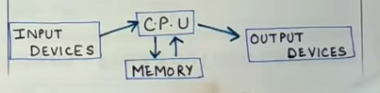
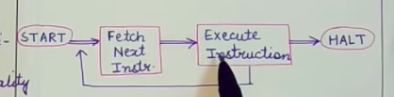

# Computer Organization & Architecture

## 1. Introduction
### **Computer Organization:**
- Encompasses all physical aspects of computer systems.
- Achieve architectural specification
- Concepts that the programmer do not deals directly
- Eg. circuit design, control signal, memory type
- How does a computer work?

### **Computer Architecture:**
- Logical aspects of system implementation as seen by the programmer.
- Defines the system in an abstract manner.
- Concepts that the programmer deals with directly
- Eg. instruction sets, instruction formats, data types, addressing modes.
- How do I design a computer? What does the system do?

### **Basic components of a computer:**
1. Central Processing Unit (CPU):
   - Control Unit (CU): It contains a set of registers & circuits to generates control signals so that every instruction executed will be interpreted correctly and corresponding functionality is delievered. Also known as instruction interpreter.
   - Arithemetic & Logic Unit (ALU): Responsible for executing arithemetic (+ - * /) & logic (OR AND NOT) operations.

2. Main Memory:
    - Both instruction & data can be stored here. No difference in memory used to store data & instruction.
    - It is a temporary storage like data instruction stored in ram will be cleared after termination.

3. I/O Components:
    - Input Module: Takes data or instruction from user in any form it accepts it and then convert it into some internal form. That form is generally in the form of signals, understood by system.
    - Output Module: It is responsible for reporting the result for a task.
    - Keyboard say is an input device connected to it will be Input Module which will process instruction and report it to the processor then output module will make it presentable to output device monitor. 
    

### **Von Neumann Architecture:**
Almost all computer designs are based on the concepts developed by John Von Neumann. Even today computers are made kept it in mind. 
3 main concepts:
- Data and instructions are stored in a single read-write memory.
- Contents of this memory are addresable by location irrespective of the type of data or instruction present there.
- Execution of instructions always occurs in a sequential manner from one instruction to the next unless changed explicitly (If some instruction states to jump to another instruction)

### **Interactions between various computer components:**
Exchange of data takes place between memory and CPU. The CPU uses 2 of it's internal registers for this purpose.
1) Memory Address Register (MAR): Specifies the address in the memory for the next read/write.
2) Memory Buffer Register (MBR): Contains data to be written into memory or it recieves the data read from the memory.

Likewise I/O Address registers is same as MAR & I/O Buffer Register is same as MBR

> Memory is a set of locations, each location is addressed sequentially. Can store either data or instruction.

### **Program execution and instruction execution:**
The basic function of a computer is the execution (bringing of the program in memory to decode instructions and perform functionality) of a program (set of instructions).

Major steps in instruction processing:
- Fetching: processor reads instructions from memory one at a time.
- Execution: performing the operation specified by the read instruction.

program execution is the repeated process of instruction fetch and execute 

Instruction cycle: processing required for a single instruction. It consists of fetch cycle and execute cycle.

> Program Counter Register (PC) holds the address of the instruction to be fetched next. Different from MAR since it stores instructions. It also have a feature that it get's incremented by 1 after each instruction fetch, unless stated otherwise (means +1 is default +n can be anything in case of instruction jump)

> Instruction Register (IR): Stores the fetched instructions

### **Types of actions performed by instruction:**
1. **Processor-Memory:** Data transfer from processor to memory or vice versa.
2. **Processor-I/O:** Data transfer from input device to CPU or from CPU to output device.
3. **Data Processing:** Includes arithematic & logical actions performed by CPU.
4. **Control:** Instructions that alters the sequential execution of instructions. (jump statements loops)

### **Accumulator Register:**
- Data register
- Used by arithemetic & logical unit
- Used to store intermediate data/results

### **Steps of an instruction cycle:**
1. **Instruction Address Calculation (IAC):** Find/Determine the address of next instruction to be executed. In sequential execution, add a fixed number of address of previous instruction. 
Say instruction length is 16 bit and memory length is also 16 bit then new_address = prev_address + 1(x16 bits). If memory length was 8 bit then prev_address + 2(x8 bits)
2. **Instruction Fetch (IF):** Read the instruction from memory location into processor
3. **Instruction Operation Decoding (IOD):** Analyze the instruction to find which operation to perform and what kinds of operands to use.
4. **Operand Address Calculation (OAC):** Find address of operand if it will be obtained from memory or I/O device.
5. **Operand Fetch (OF):** Read the operand from memory or I/O device.
6. **Data Operation (DO):** Perform the operation specified by the instruction on the operands.
7. **Operand Store (OS):** Write results to memory or specified output device.

 

### **Intruppts:**
It is a mechanism by which modules like I/O or memory may intrrupt the normal processing of CPU such that some other task can be completed. They are required to improve efficiency of the processor. It minimizes CPU ideal time and hence improves efficiency reducing CPU cycles.

Most external devices are slower than CPU. If no interrupts then the processor would waste a lot of time (wastage of CPU time, wastage of instruction cycles, continuous checking to find the task completion - jese hi task hoye tab aage ka kare) waiting for these external devices to match up with the speed of CPU.

Without Interrupts:
- CPU instructs printer to print
- While CPU does it task, CPU waits for task completion
- User program stopped
- Repeated checking of CPU
- When task done, CPU proceeds

With Intrrupts:
- CPU instructs printer to print
- While printer does it's task, CPU engaged in executing other instructions
- User program proceeds concruently with printing
- When task done, printer tells CPU

### **Interrupt Request & Interrupt Handler:**
- CPU executing some task
- User uses the keyboard to issue a high-priority command
- This issues an interrupt request to the CPU
- CPU suspends the current execution of the task
- CPU executes the code written to handle/implement this command (Interrupt Handler)
- CPU resumes it's previous execution after this command has been served 

Advantages: Efficiency of CPU improves 
Disadvantages: Overhead required to service the interrupt request. Processor ko current context save karna hota he and pick next step from program counter for further resume of previous task toh kaam karna padta he processor ko stack empty fill and all. Deciding of code to handle and switch back also adds overhead.

### **Types Of Interrupts:**
1) Program Interrupt: It occurs when some instructions within the program creates a situation or condition that leads to an interrupt. 
example- divide by zero, arithematic overflow, attempt to access an illegal memory location.

2) Timer Interrupt: Generated by the timer that is present within the processor. OS sets the timer to perform certain operations on regular basis. 
example- update check (at every day midnight)

3) I/O Interrupt: Generated by I/O devices. Signal successful task completion or error conditions. 
example- I/O device ko kuch kaam dia and wo complete hogaya

4) Hardware Interrupt: Failure related to hardware. 
example- memory parity error

### **Modification to the instruction cycle:**
- Add interrupt cycle to the instruction cycle.
- CPU checks if any interrupts has occured - indicates interrupt signal

If Interrupt
1) Suspend the execution of current program
2) Saving the context (current contents of program counter, register values, stack content)
3) Determine the interrupt handler
4) Set program counter to the starting address of interrupt handler
5) Fetch and execute the instruction of interrupt handler.
6) After execution of Instruction handler complete, resume processing of the interrupted code.

If No Interrupt
1) CPU proceed to fetch execute cycle.

### **Handling Multiple Interrupts:**
What will happen if there's one interrupt running and another one also occur. 
1) Disable Multiple Interrupt: When an interrupt is being processed. Ignore the interrupt request for the time when interrupts are disabled. The interrupt occuring during this time remains pending and will be checked by processor after it has enabled interrupts. Sequential execution of interrupts occur. 
> Disadvantage is sequential execution. Say during interrupt execution two other interrupts occur with some delay later the first one will be executed (sequentially) not taking in account the priority.

2) Give Priorities to Interrupts: Allow higher prioirity interrupts to cause lower priority interrupt to interrupted.

### **Interconnection Structure:**
Interconnection Structure refers to collection of paths connecting various components of system.

> "Word size" refers to the number of bits processed by a computer's CPU in one go (these days, typically 32 bits or 64 bits). Data bus size, instruction size, address size are usually multiples of the word size.

1) Memory: 
- N words of equal length - Locations
- Each word has a unique address
- Read/Write a word of data (Two signals read & write are there)
- Type of operation is indicated by a read/write control signal
- Contents are reffered through address

2) I/O Module: 
- Basic operation - read, write
- A single I/O module is capable of controlling multiple I/O modules
- Can send interrupts to CPU

3) Processor 
- Read data & Instructions
- Writes results after processing
- Generate control signals
- Recieve interrupts

Type of Connection required:
- CPU -> Memory : Write data
- Memory -> CPU : Read data
- I/O -> Processor : Read data from I/O
- Processor -> I/O : Write/Send data to I/O
- I/O -> Memory : Exchange of data without CPU
- Memory -> I/O : Exchange of data without CPU

### **BUS Strucutre:**
- It is a communication pathway connecting multiple devices.
- It is a shared transmission medium.
- Multiple devices are connected to bus and any signal transmitted by any 1 device is recieved by all devices connected to the bus.
- Only a single transmission is possible at a time. Multiple signals are gargled/destroyed (when present on bus at same time)
- A bus has multiple paths in it, each is called a line. These lines are used to carry signals (binary 0 or 1)
- Multiple lines transmit their signals parallerly

System Bus: 
- It is a bus that connects the 3 major components of the system (I/O, CPU, Memory). It has Control Lines, Data Lines & Address Lines. These lines acts like a sub-bus. (control bus, data bus, address bus)

### **Data Lines:**
They provide a path for moving data among system modules. 
- These lines are collectively known as data bus
- The number of lines in data bus is called width of data bus - 16, 32, 64, 128
- Each line carries 1 bit at a time, so the number of lines in data bus determine how many bits can be transferred parallerly
- Data bus width determines overall system performance

### **Address Lines:**
Specify where to store the data/from where to retrieve the data (present on the data bus) 
- Collectively, address lines are also known as address bus
- Address bus width determines the memory capacity (like 16, 32, 64 but n if 16 means 2^16 possible addresses so means higher range of address for higher width) - total number of unique addresses/locations.
- The same address lines can refer to I/O ports (Designate high order bits to specify module that we wan't to access, while low order bit specifies the location within the memory or a particular port)

### **Control Lines:**
They are used to control the access to the address bus and data bus and monitor their use. They are required because address bus and data bus are shared between components & a mechanism to control their use is required. Control bus generates control signals. These control signals transmit two type of instructions - timing information & command information.
- Timing signals tell validity of data & address on Data bus & Address bus
- Command signals specify the operations to be performed

Major Control Signals:
- Memory Write: Data -> Memory
- Memory Read: Memory -> Data Bus
- I/O Write: Data Bus -> I/O Port
- I/O Read: I/O Port ->(data)-> Data bus
- Transfer ACK: Indicates Success (data)
- Bus Request: Request to gain control of bus
- Bus Grant: Control granted
- Interrupt Request: Pending Interrupt
- Interrupt ACK: Pending INTR recognised
- Clock: Synchronization of operation
- Reset: Initialization of modules

### **Types Of Bus:**
**Dedicated Bus:** A dedicated bus is permanently assigned either to a particular function or to a physical subset of computer components.
> Functional dedication means a seperate bus for each different function.

> Physical Dedication means use of seperate busses connecting different system components (some functionality)

- Advantage: High throughput since task can be performed parallerly.
- Disadvantage: More cost (larger bus size)

**Multiplexed Bus:** Common bus used for both data and address transmission. Presence of a control line (Address Valid line).

- Activate address valid control lines
- Place address on multiplexed bus
- Modules check if the adderes refers them
- After some time, address removed
- Data is now sent on this bus

Advantage: Use of fewer lines -> Less cost, space 
Disadvantage: Reduced Performance, More complex circuit

### **Method Of Arbitration In A Bus:**
It is required to decide which component can transmit over bus when multiple components want to gain control of the bus.
- Centralized Method: A single hardware device allocates time and control of bus to other devices. It may be a seperate module or a part of processor. It is also known as Bus controller / Arbiter.
- Distributed Method: No central authority. Each module has a code for access control and modules act together to share the bus. Master initiates a read/write operation with some other device (slave)

Both these methods aim to assign one device (I/O Module or processor not memory) as master.

### **Bus Timings:**
It refers to the way in which events are carried out on the bus such that all task perform smoothly without overlaping or gargling.
- Synchronus Way: (in sync with system clock) The system clock determines the time of occurence of events on bus. 
 
Bus has a clock lines on which a continuous of alternationg 0 and 1 is transmitted by clock. (0 1 are at equal duration). All events start at the beginning of the clock cycle (single 0-1 transmission & it defines a single time slot) - agar event time slot ke middle me end hoga toh next clock ke begining me start hoga. Less flexible. It's simple to implement.

- Asynchronus Way: Occurence of any 1 event on bus follows and depends on the occurence of the previous event on bus. No clock. This is more flexible than it's counterpart because synchronus me hume wait karna hota he for clock cycle begining. It's not much simple to implement.

### **Elements Of Machine Instrunction:**
It contains information required by the processor to deliver different kinds of functionalities.
1) Operation Code: Set of bits that represents what operation to perform (Opcode) - for arithematic logic ops, movement of data between 2 registers, movement of data between 2 memory locations, movement of data between register and memory locations, I/O operation, control operations.
2) Source operand reference: data that is an input to the operation.
3) Result operand reference:
    - Memory location - Address of memory location is specified
    - Processor Register - The unique id of the register is specified in instrunction
    - Immediate Operand - The value of the operand is itself present in instrunction. No need to fetch from any address.
    - I/O device - The instrunction must specify the I/O device for the operands.
4) Next Instrunction Reference: har instrunction ki responsibility hoti he ki ye complete ke baad kaha jaaye. mostly sequentially hoti he execution. Explicit reference required by mentioning main memory address.

### **Instruction Types:**
1) Data processing instructions:
   - Arithmetic Operations
   - Logical Operations
2) Data Storage instructions: Hum humesha registers pe move karke operation perform karte he infact register me bhi kai baar we move to accumulator that's why this instruction comes in role.
   - Deals with data transfer memory to memory or register to register or register to memory.
3) I/O Instructions:
   - User (I/P) -> System
   - System (O/P) -> User
4) Control:
   - Test instruction (like test for zero instruction check if value goes 0)
   - Branch instruction

> ADD X, A, B : This adds A & B and makes result to X this is 3 address instruction. Uses long instruction format (disadvantage) Less no. of instructions (advantage)

> ADD X, A : This adds X + A (or X - A in SUB) then puts value in X. Two address instruction. Opposite adv and disadv.