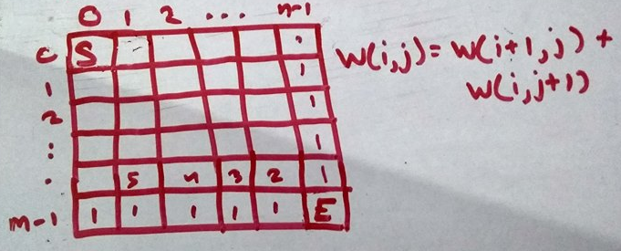

# DS Algorithms - Backtracking & Dynamic Programming
## 1. Backtracking:
It is a form of recurssion.<br>
It is a general algorithm for finding all solutions to some comutational problems<br>
Backtracking is often faster than brute force enumeration of all complete candidates because it eliminates candidates if it's not completed to a valid solution.<br>
Candidates can be represented in tree where leaf(s) are eliminatede candidates. Backtracking is like DFS traversal of that tree.<br>
<br><br>
So considering we chose A solution then C and we analyze it's bad so we backtrack to node A see another solution.

1) **N Queens Problem:**<br>
We're given a chess board of N X N size and we need to place N queens on it such that no queen can attack each other.
<br><br>
```c++
#include <bits/stdc++.h>
using namespace std;

bool isSafe(int* solution, int count)
{
    if (count == 0)
        return true;
    
    for (int i = 0; i < count; i++)
    {
        //x = count
        //y = solution[count]
        //x' = i
        //y' = solution[i]
        if ((solution[i] == solution[count]) ||
            (solution[i] + i) == (solution[count] + count) || 
            (solution[i] - i) == (solution[count] - count))
        {
            return false;
        }
    }

    return true;
}

bool performNQueen(int n, int solution[], int count = 0)
{
    if (count == n)
    {
        for (int i = 0; i < n; i++)
            cout << solution[i] << " ";
        return true;
    }
    
    for (int i = 0; i < n; i++)
    {
        solution[count] = i;
        if (isSafe(solution, count))
        {
            if (performNQueen(n, solution, count + 1))
                return true;
        }
    }

    return false;
}

int main()
{
    int n;
    cin >> n;
    int solution[n];
    performNQueen(n, solution);

    return 0;
}
```

2) **Detecting Hamiltonian Cycles:**<br> Hamiltonian path is a path of graph in which we visit every node exactly once. Detecting it is simple. We start with a node and traverses it's child also see if it's safe to go there (It's not visited) we keep doing this until start node is reached.

3) **Colouring Problem:** We are given a graph and some colors. We need to color every node/vertex such that no two adjacent vertex have same color.<br>
One of the application is to check if the graph is Bipartite or not if it's bipartite the graph must be able to represent through 2 colors.<br>
It's a theory that any graph can be represented through 4 colors.
```c++
#include <bits/stdc++.h>
using namespace std;

bool isSafe(vector<int> adj[], int n, int node, string solution)
{
    int size = solution.length();
    for (int i = 0; i < adj[node].size(); i++)
    {
        int to = adj[node][i];

        if (size > to)
        {
            if (solution[to] == solution[node])
                return false;
        }
    }

    return true;
}

void coloringProblem(vector<int> adj[], int n, int c, char colors[], int node = 0, string solution = "")
{
    if (node == n)
    {
        cout << solution << endl;
        return;
    }

    for (int i = 0; i < c; i++)
    {
        string newSolution = solution + colors[i];
        if (isSafe(adj, n, node, newSolution))
            coloringProblem(adj, n, c, colors, node + 1, newSolution);
    }
}

int main()
{
    int n, e;
    cin >> n >> e;
    vector<int> adj[n];
    for (int i = 0; i < e; i++)
    {
        int a, b;
        cin >> a >> b;
        adj[a].push_back(b);
        adj[b].push_back(a);
    }
    int c;
    cin >> c;
    char colors[c];
    for (int i = 0; i < c; i++)
        cin >> colors[i];
    
    coloringProblem(adj, n, c, colors);
    
    /*
    5 7
    0 1
    1 2
    2 3
    3 4
    4 0
    4 1
    4 2
    3
    R G B
    */
    return 0;
}
```

4) **Knight's Tour Problem:**<br>
A knight (ghora) in a chess board can move in such a way that it will make to a unique non visited place everytime and can traverse whole hamilton cycle visiting every place.
```c++
#include <bits/stdc++.h>
using namespace std;

int arr[8][8];
int xMove[8] = { 2, 1, -1, -2, -2, -1,  1,  2 };
int yMove[8] = { 1, 2,  2,  1, -1, -2, -2, -1 };

bool isSafe(int x, int y)
{   
    return (x >= 0 && y >= 0 && x < 8 && y < 8 && arr[x][y] == -1);
}

bool performKnightTour(int x, int y, int count = 1)
{
    arr[x][y] = count;

    if (count == 64)
    {
        for (int i = 0; i < 8; i++)
        {
            for (int j = 0; j < 8; j++)
                cout << arr[i][j] << " ";
            cout << endl;
        }
        return true;
    }

    for (int i = 0; i < 8; i++)
    {
        int newX = x + xMove[i];
        int newY = y + yMove[i];
        if (isSafe(newX, newY))
        {
            if (!performKnightTour(newX, newY, count + 1))
                arr[newX][newY] = -1;
            else
                return true;
        }
    }

    return false;
}

int main()
{
    int x, y;
    cin >> x >> y;
    for (int i = 0; i < 8; i++)
    {
        for (int j = 0; j < 8; j++)
            arr[i][j] = -1;
    }
    
    performKnightTour(x, y);

    return 0;
}
```

All the above mentioned problems are NP Complete problems. NP stands for non deterministic polynomial. In all above and usually every NP problems the running time is exponential which is extremly slow so instead of finding the exact value we look for approximation.

## 2. Dynamic Programming:
Breaking complex problem it into simpler simmilar sub problems and then solving it. Also memoizing sub problems for faster re-calculation.<br>
Simplest example is calculating fibonaaci series we use F(n) = F(n-1) + F(n-2) this is breaking into simillar sub problems. We can do memoization to optimize it.

1) **Staircase Problem:** <br>
We have N stairs and we can either climb by 1 step or 2 step. Find how many ways possible.
<br><br>
W(n) = W(n-1) + W(n-2)
```c++
int memo[30];
int staircaseProblem(int n)
{
    if (memo[n - 1] == -1)
        memo[n - 1] = staircaseProblem(n - 1);
    if (memo[n - 2] == -1)
        memo[n - 2] = staircaseProblem(n - 2);
    
    return memo[n - 1] + memo[n - 2];
}
```

2) **On the way home:** <br>
We need to go from start to end which is bottom right most. Other way can be using backtracking but this is way more optimized then it.
<br><br>
```c++
int n, m;

int onTheWayHomeProblem()
{
    int ways[m][n];

    for (int i = 0; i < m; i++)
        ways[i][n-1] = 1;

    for (int i = 0; i < n; i++)
        ways[m-1][i] = 1;
    
    for (int i = m-2; i >= 0; i--)
    {
        for (int j = n-2; j >= 0; j--)
            ways[i][j] = ways[i + 1][j] + ways[i][j + 1];
    }

    return ways[0][0];
}
```
If we were given condition to move in any 4 direction then there would have been infinite possibilities.

3) **Rod Cutter:** <br>
We are given a rod of some length and we can cut it in any number of pieces. We are given an array that tells us price for rod piece of that size. We need to find rod maximum selling price cuts.
```c++
#include <bits/stdc++.h>
using namespace std;

int rodCutter(int cost[], int n)
{
    int maxCost[n+1];
    fill(maxCost, maxCost + n + 1, -9999);
    maxCost[0] = 0;
    for (int i = 1; i <= n; i++)
    {
        for (int j = 1; j <= i; j++)
            maxCost[i] = max(maxCost[i], cost[j] + maxCost[i - j]);
    }

    return maxCost[n];
}

int main()
{
    int n;
    cin >> n;
    int cost[n + 1];
    for (int i = 0; i <= n; i++)
        cin >> cost[i];
    
    cout << rodCutter(cost, n);
    return 0;
}
```
DP relation will be: Max Cost of rod = (Cost of 1 Rod + Max cost of remaining rod) + (Cost of 2 Rod + Max cost of remaining rod) + ...
