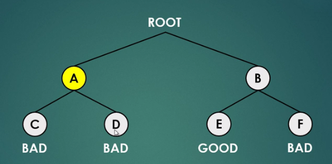
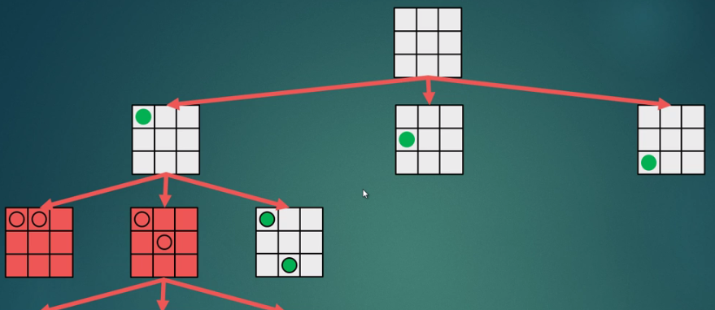
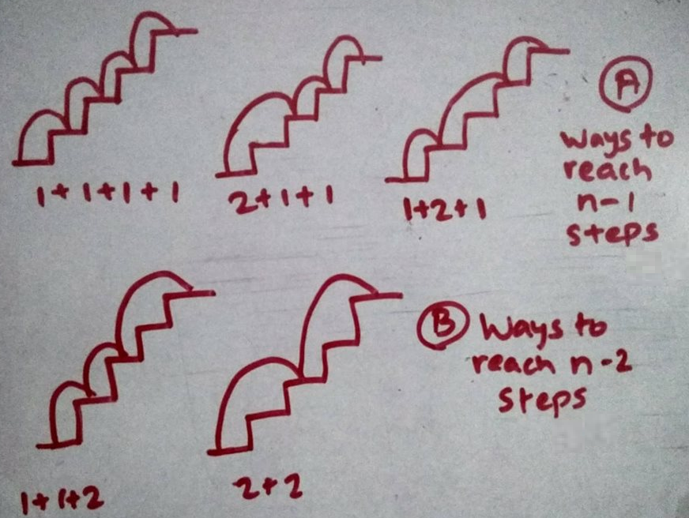
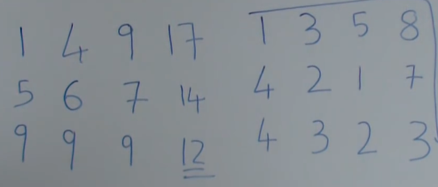
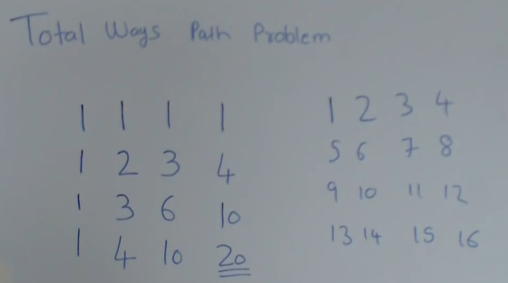
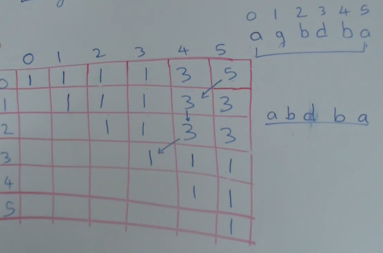

# DS Algorithms - Backtracking & Dynamic Programming
## 1. Backtracking:
It is a form of recurssion.<br>
It is a general algorithm for finding all solutions to some comutational problems<br>
Backtracking is often faster than brute force enumeration of all complete candidates because it eliminates candidates if it's not completed to a valid solution.<br>
Candidates can be represented in tree where leaf(s) are eliminatede candidates. Backtracking is like DFS traversal of that tree.<br>
<br><br>
So considering we chose A solution then C and we analyze it's bad so we backtrack to node A see another solution.

1) **N Queens Problem:**<br>
We're given a chess board of N X N size and we need to place N queens on it such that no queen can attack each other.
<br><br>
```c++
#include <bits/stdc++.h>
using namespace std;

bool isSafe(int* solution, int count)
{
    if (count == 0)
        return true;
    
    for (int i = 0; i < count; ++i)
    {
        //x = count
        //y = solution[count]
        //x' = i
        //y' = solution[i]
        if ((solution[i] == solution[count]) ||
            (solution[i] + i) == (solution[count] + count) || 
            (solution[i] - i) == (solution[count] - count))
        {
            return false;
        }
    }

    return true;
}

bool performNQueen(int n, int solution[], int count = 0)
{
    if (count == n)
    {
        for (int i = 0; i < n; ++i)
            cout << solution[i] << " ";
        return true;
    }
    
    for (int i = 0; i < n; ++i)
    {
        solution[count] = i;
        if (isSafe(solution, count))
        {
            if (performNQueen(n, solution, count + 1))
                return true;
        }
    }

    return false;
}

int main()
{
    int n;
    cin >> n;
    int solution[n];
    performNQueen(n, solution);

    return 0;
}
```

2) **Detecting Hamiltonian Cycles:**<br> Hamiltonian path is a path of graph in which we visit every node exactly once. Detecting it is simple. We start with a node and traverses it's child also see if it's safe to go there (It's not visited) we keep doing this until start node is reached.

3) **Colouring Problem:** We are given a graph and some colors. We need to color every node/vertex such that no two adjacent vertex have same color.<br>
One of the application is to check if the graph is Bipartite or not if it's bipartite the graph must be able to represent through 2 colors.<br>
It's a theory that any graph can be represented through 4 colors. https://www.youtube.com/watch?v=NgbK43jB4rQ
```c++
#include <bits/stdc++.h>
using namespace std;

bool isSafe(vector<int> adj[], int n, int node, string solution)
{
    int size = solution.length();
    for (int i = 0; i < adj[node].size(); ++i)
    {
        int to = adj[node][i];

        if (size > to)
        {
            if (solution[to] == solution[node])
                return false;
        }
    }

    return true;
}

void coloringProblem(vector<int> adj[], int n, int c, char colors[], int node = 0, string solution = "")
{
    if (node == n)
    {
        cout << solution << endl;
        return;
    }

    for (int i = 0; i < c; ++i)
    {
        string newSolution = solution + colors[i];
        if (isSafe(adj, n, node, newSolution))
            coloringProblem(adj, n, c, colors, node + 1, newSolution);
    }
}

int main()
{
    int n, e;
    cin >> n >> e;
    vector<int> adj[n];
    for (int i = 0; i < e; ++i)
    {
        int a, b;
        cin >> a >> b;
        adj[a].push_back(b);
        adj[b].push_back(a);
    }
    int c;
    cin >> c;
    char colors[c];
    for (int i = 0; i < c; ++i)
        cin >> colors[i];
    
    coloringProblem(adj, n, c, colors);
    
    /*
    5 7
    0 1
    1 2
    2 3
    3 4
    4 0
    4 1
    4 2
    3
    R G B
    */
    return 0;
}
```

4) **Knight's Tour Problem:**<br>
A knight (ghora) in a chess board can move in such a way that it will make to a unique non visited place everytime and can traverse whole hamilton cycle visiting every place.
```c++
#include <bits/stdc++.h>
using namespace std;

int arr[8][8];
int xMove[8] = { 2, 1, -1, -2, -2, -1,  1,  2 };
int yMove[8] = { 1, 2,  2,  1, -1, -2, -2, -1 };

bool isSafe(int x, int y)
{   
    return (x >= 0 && y >= 0 && x < 8 && y < 8 && arr[x][y] == -1);
}

bool performKnightTour(int x, int y, int count = 1)
{
    arr[x][y] = count;

    if (count == 64)
    {
        for (int i = 0; i < 8; ++i)
        {
            for (int j = 0; j < 8; ++j)
                cout << arr[i][j] << " ";
            cout << endl;
        }
        return true;
    }

    for (int i = 0; i < 8; ++i)
    {
        int newX = x + xMove[i];
        int newY = y + yMove[i];
        if (isSafe(newX, newY))
        {
            if (!performKnightTour(newX, newY, count + 1))
                arr[newX][newY] = -1;
            else
                return true;
        }
    }

    return false;
}

int main()
{
    int x, y;
    cin >> x >> y;
    for (int i = 0; i < 8; ++i)
    {
        for (int j = 0; j < 8; ++j)
            arr[i][j] = -1;
    }
    
    performKnightTour(x, y);
    return 0;
}
```

All the above mentioned problems are NP Complete problems. NP stands for non deterministic polynomial. In all above and usually every NP problems the running time is exponential which is extremly slow so instead of finding the exact value we look for approximation.

## 2. Dynamic Programming (optimal substructure and overlapping sub-problems):
Breaking complex problem it into simpler simmilar sub problems and then solving it. Also memoizing sub problems for faster re-calculation.<br>
Simplest example is calculating fibonaaci series we use F(n) = F(n-1) + F(n-2) this is breaking into simillar sub problems. We can do memoization to optimize it (optimize overlapping sub problems)

DP means - a) Memoization (Top down approach) b) Pure DP (Bottom up approach)

Recursive implementation of Fibonaaci even using memo calls stacks for recursive call 2^n times using itteration to fill a linear DP for fibonacci is O(N)

1) **Number Reduce Problem:** <br>
Given a number we can either divide it by 3, 2 or subtract 1. We need to find min operation to make 1 from n.
```c++
int solve(int n)
{
    if (n == 1) return 0;
    int q1 = INF, q2 = INF, q3 = INF;
    if (n%3 == 0) q1 = 1 + solve(n/3);
    if (n%2 == 0) q2 = 1 + solve(n/2);
    q3 = 1 + solve(n-1);
    return min(q1, min(q2, q3));
}
//We can memoize it, or do top down dp
```

2) **Staircase Problem:** <br>
We have N stairs and we can either climb by 1 step or 2 step. Find how many ways possible.
<br><br>
W(n) = W(n-1) + W(n-2)
```c++
int memo[30];
int staircaseProblem(int n)
{
    if (memo[n-1] == -1) memo[n-1] = staircaseProblem(n - 1);
    if (memo[n-2] == -1) memo[n-2] = staircaseProblem(n - 2);
    
    return memo[n - 1] + memo[n - 2];
}
```

**Another variation is Minimum Jump To Reach End**<br>
Given array [2, 3, 1, 1, 2, 4, 2, 0, 1, 1] ans is 0->1->4->5->9 (At any step max we can jump is value on that index). Simple dp problem start filling from rightmost end in dp store minimum jumps to reach end from that point, hence dp will be [4, 3, 4, 3, 2, 1, 2, -1, 1, 0] also keep in track which jump is efficient to take at each step so that we can later backtrack our steps.

3) **Minimum Cost Path:** <br>

right side given matrix we need to go from top left to bottom right we can only go bottom and right otherwise this question would have infinite possibilities.<br>
Left side is the dp each cell having minimum cost till that block. min(dp[i-1][j], dp[i][j-1]) + mat[i][j]<br>
**Another varient problem**


```
If we were given condition to move in any 4 direction then there would have been infinite possibilities.

1) **Wine Problem:** We have n wines with their initial prices given. A wine sells at rate of initial price times year it is old. We can sell one wine only per year. What is max profit. We can sell only from two ends<br>
[2, 3, 5, 1, 4]. Approach is find max after selling both end wines. Using greedy and selling cheap first is wrong
```c++
//We will use 2D DP storing l & r
int dp[1000][1000];
int solve(int arr[], int l, int r, int year)
{
    if (l > r) return 0;
    if (dp[l][r] != -1) return dp[l][r];
    int q1 = arr[l]*year + solve(arr, l+1, r, year+1);
    int q2 = arr[r]*year + solve(arr, l, r-1, year+1);
    int ans = max(q1, q2);
    dp[l][r] = ans;
    return ans;
}
//Without memoization it's complexity was O(2^n) with memoization it is O(N^2)

//Bottom up approach
int solve(int arr[], int n)
{
    int dp[1000][1000] {};
    int year = n;
    for (int i = 0; i < n; ++i) dp[i][i] = year*arr[i];
    --year;
    for (int len = 2; len <= n; ++len)
    {
        int l = 0, r = n-len;
        while (l <= r)
        {
            int temp = l+len-1;
            dp[l][temp] = max(arr[l]*year + dp[l+1][temp],
                arr[temp]*year + dp[l][temp-1]);
            ++l;
        }
        -year;
    }
    return dp[0][n-1];
}

/* For [2, 3, 5, 1, 4]
    2       3       5       1       4
2   10      23      43      45      50
3   0       15      37      40      48
5   0       0       25      29      41
1   0       0       0       5       24
4   0       0       0       0       20
*/
```

5) **Burst Balloon Problem:**<br>
```c++
/*
Given values of balloons: 3 1 5 8
Each bursting means that value * left * right value
We need to burst them such that max val: like in order-5 1 3 8 (1*5*8 + 3*1*8 + 3*8 + 8 = 96)

Diagonals represents first balloon which we burst. 0 1 means balloons within 0 to 1
    0   1   2   3
0   3  30  159  167
1      15  135  159
2          40   48
3               40

For [0, 2] value left [0, 1] denotes what if we choose [0, 1] to burst first then we will burst 2 so for ever cell it's
dp[i][j] = max(dp[i][j-1] + arr[j]*arr[j+1], dp[i+1][j] + arr[0]*arr[j+1])
*/
```

6) **Rod Cutter (Optimization Problem):** <br>
We are given a rod of some length and we can cut it in any number of pieces. We are given an array that tells us price for rod piece of that size. We need to find rod maximum selling price cuts.<br>
https://medium.com/@pratikone/dynamic-programming-for-the-confused-rod-cutting-problem-588892796840
```c++
#include <bits/stdc++.h>
using namespace std;

int rodCutter(int cost[], int n)
{
    int dp[n+1];
    fill(dp, dp + n + 1, -9999);
    dp[0] = 0;
    for (int len = 1; len <= n; ++len)
    {
        for (int cut = 1; cut <= len; ++cut)
            dp[len] = max(dp[len], cost[cut] + dp[len - cut]);
    }

    return dp[n];
}

int main()
{
    int n;
    cin >> n;
    int cost[n + 1];
    for (int i = 0; i <= n; ++i) cin >> cost[i];    
    cout << rodCutter(cost, n);
    return 0;
}
```
DP relation will be: Max Cost of rod = (Cost of 1 Rod + Max cost of remaining rod) + (Cost of 2 Rod + Max cost of remaining rod) + ...

7) **Edit Distance:**
Given a string we can perform insertion, deletion, replacement to convert to another string find min operations.
```
              i-->
    ""  S   A   T   U   R   D   A   Y
""  0   1   2   3   4   5   6   7   8
S   1   0   1   2   3   4   5   6   7
U   2 
N   3
D   4
A   5
Y   6

We want to make saturday -> sunday
each cell represents min operations reqd. to convert inp. to out.

At any point this DP represents say for i=3, j=1
We want to make S from SAT this means 2 deletion. so 2 min operations.
replacement: 1 + dp[i-1][j-1]
deletion: 1 + dp[i-1][j]
insertion: 1 + dp[i][j-1]
+ 1 if character of i & j matches
min of all three is ans of that cell
```

8) **Find Longest Increasing subsequence:**
Whenever question says longest, maximum, highest out of subsequences then chances are more of DP
```c++
/*
[3, 10, 2, 1, 20] = [3, 10, 20] = 3
[3, 2] = [3] or [2] = 1
[50, 3, 10, 7, 40, 50] = [3, 7, 40, 50] or [3, 10, 40, 50] = 4
*/
int solve(int arr[], int n)
{
    int dp[1000];
    fill(dp, dp+n, 1);
    int ans = -1;
    for (int i = 1; i < n; ++i)
    {
        for (int j = 0; j < i; ++j)
        {
            if (arr[j] < arr[i])
                dp[i] = max(1 + dp[j], dp[i]);
        }
        ans = max(ans, dp[i]);
    }
    return ans;
}

/*
If the problem was Find Long Increasing Bitonic subsequence, bitonic means a subsequence which first increases and then decreases. Idea is find LIS from Left 2 Right and Right 2 Left and then add both array then -1.

2 -1  4  3  5 -1  3  2       [Array]
1  1  2  2  3  1  2  2       [L2R LIS]
2  1  3  2  3  1  2  1       [R2L LIS]
2  1  4  3  5  1  3  2       [Longest Increasing bitonic sequence]
*/

/*
Application - Box Stacking Problem
Suppose we are given boxes with their l, b & h. we need to stack them as maximum as possible. upper box should be smaller then lower.

Find all 3 orientation of each box and sort them according to their base area
1 2 4   -   [1 2 4] (2), [4 1 2] (4), [4 2 1] (8)
3 2 5   -   [3 2 5] (6), [2 5 3] (10), [5 3 2] (15)
[5, 3, 2] -> 0
[5, 2, 3] -> 1
[4, 2, 1] -> 2
[3, 2, 5] -> 3
[4, 1, 2] -> 4
[2, 1, 4] -> 5

 j  i
[2, 3, 1, 5, 2, 4]
we will check can i go on top of j if yes then best we can do at i is best we can do at both

 j     i
[2, 3, 1, 5, 2, 4]
yes this is possible so arr[i] = 2 + 1 = 3

Also in a different array maintain every time if it's possible to stack at i the corresponding j

[2, 3, 3, 7, 5, 11]
[0, 1, 0, 0, 1, 3]
11 is max value and we get that by 5<-3<-0

Maximum Sum Increasing Subsequence
Like in 4 6 1 3 8 4 6 LIS will be 1 3 4 6 but SIS will be 4 6 8 because it's sum is max
Implementation is same just we will keep track of sum for every array aswell in a different array and to find answer we will see max of that array
https://www.youtube.com/watch?v=99ssGWhLPUE
*/
```

9) **Longest Palindromic Subsequence:**<br>
Simply if sequence begining and end matches then it's max(dp[i-1][j], dp[i][j-1]) otherwise max with + 2. To find the sequence backtrack from topmost if it's start end are same print start end to string beginning and end then go i-1, j-1 that over here has start and end different so go max side check again since it has same start end append to result again go to i-1, j-1 if it's last simply put it in middle

https://www.youtube.com/watch?v=lDYIvtBVmgo

10)  **Maximum Subset Problem:**
Here the return function two operation will give entire possibilities for the recurssion.
```c++
bool isSubsetSum(ull n, ull arr[], ull sum)
{
    if (sum == 0) return true;
    if (n == 0 && sum != 0) return false;
    if (arr[n - 1] > sum) return isSubsetSum(n-1, arr, sum);
    return isSubsetSum(n-1, arr, sum) || isSubsetSum(n-1, arr, sum-arr[n-1]);
}
```
<br><br>
```c++
bool isSubsetSum(int n, int arr[], int sum)
{
    bool m[n][sum + 1];
    for (int i = 0; i < n; ++i) m[i][0] = true;
    for (int i = 1; i < sum + 1; ++i) m[0][i] = (arr[0] == i) ? true : false;
    for (int j = 1; j < sum + 1; ++j)
    {
        for (int i = 1; i < n; ++i)
        {
            if (j - arr[i] > 0) m[i][j] = m[i-1][j] || m[i-1][j-arr[i]];
            else m[i][j] = m[i-1][j];
        }
    }
    return m[n-1][sum];
}
```

11) **Longest Common Subsequence:**
```
X = nematode
Y = empty
ans is 3 i.e. emt
This algorithm has application in biological field. If biologist discovers a DNA AGTABAG he wants to find which closest organism does DNA resembles

if (x[i] == y[j]) 1 + LCS(x[i+1], y[j+1])
otherwise max of LCS(x[i], y[j+1]) & LCS(x[i+1], y[j])

basically try matching if current i and j matches with i if not then either other n-i matches with other array or vice versa. We need to find max so max of both

DP Table
              i-->
    ""  A   G   G   T   A   B
""  0   0   0   0   0   0   0
G   0   0   1   1   1   1   1
X   0   0   1   1   1   1   1
T   0   0   1   1   2   2   2
X   0
T   0
A   0
B   0

dp[i][j] = 1+dp[i-1][j-1] or max(dp[i-1][j], dp[i][j-1])
depending upon (x[i] == y[j])

Longest Common Substring is different say in abcdaf & zbcdf. bcd is longest common substring whearas bcdf is longest common subsequence.
Now dp[i][j] = 1 + dp[i-1][j-1] if same otherwise 0

    ""  A   B   C   D   A   F
""  0   0   0   0   0   0   0
Z   0   0   0   0   0   0   0
B   0   0   1   0   0   0   0
C   0   0   0   2   0   0   0
D   0   0   0   0   3   0   0
F   0   0   0   0   0   0   1
In the end see max of entire matrix it's 3 that's ans to find substring go to the element 3 is D then i-1, j-1 it's C then B so BCD is ans
```

12) **Knapsack Problem:**
```c++
/*
Total Weight: 7
Items (weight-val): 1-1, 3-4, 4-5, 5-7
Val (Weight)    0   1   2   3   4   5   6   7
    ""          0   0   0   0   0   0   0   0
    1 (1)       0   1   1   1   1   1   1   1
    4 (3)       0   1   1   4   5   5   5   5
    5 (4)       0   1   1   4   5  *6*  6   9
    7 (5)       0   1   1   4   5   7   8   9
At any point say [3, 5]: We want to know if we should put object giving val 5 having weight 4.
So max(dp[i-1][j], val[i] + dp[i-1][j-weight[i]])
[i-1, j] is when we do not add that item, other one is if we add that item then we are left with total weight - that item weight left so choose that item.

In the end ans is 9. If we want to find out what all items we picked we need to simply backtrack starting at last ans position of 2d array.

It's same as [i-1, j] means we must have not included this item but the before one. then again at new pos. 9 is not 5 so we included that item then we will subtract 7-4 means next check at [i-1, j-weight[i]]
*/

#include <bits/stdc++.h>
using namespace std;

int s, n, weights[2005], vals[2005], dp[2005][2005];
int main()
{
    scanf("%d %d", &s, &n);
    for (int i = 0; i < n; ++i) scanf("%d %d", &weights[i], &vals[i]);
    for (int i = 0; i < n; ++i) dp[i][0] = 0;
    for (int i = 0; i <= s; ++i) dp[0][i] = 0;
    for (int i = 1; i <= n; ++i)
    {
        for (int j = 1; j <= s; ++j)
        {
            int q1 = dp[i-1][j];
            int q2 = vals[i-1] + dp[i-1][j-weights[i-1]];
            if (weights[i-1] <= j) dp[i][j] = max(q1, q2);
            else dp[i][j] = q1;
        }
    }
    printf("%d\n", dp[n][s]);
    return 0;
}
```

13) **Egg Dropping Puzzle:**<br>
Suppose that we need to find from how tall we can drop an egg from a building. We can reuse an egg if it survives the fall. We need to find worst number of steps it will take us to find that. So for only 1 egg we should start from 1st floor going up it will take n steps in worst.
```
                  (floors)
            0   1   2   3   4   5   6
(eggs)    0
          1     1   2   3   4   5   6
          2     1   2   2   3   3   3

dp[2, 2] means if we try to fall it from 1st floor if it works then 1 is ans otherwise we have 1 egg left and 1 floor to check so 1+dp[1, 1] we need to make max of both so 2. If we try to fall it from 2nd floor if it works then 1 is ans otherwise we have 1 egg left and 1 floor to check like before.

dp[2, 3] means if we drop from 1 then max(1, 3). drop from 2 means max(1+1, 1+1) if it breaks then still we need to check for smaller floor which is 1 if it breaks there. Drop from 3 means max(1+2, 1). Minimum of all three [3, 2, 3] is 2
```

14) **Matrix Chain Multiplication:**<br>
```
Given A (10x30) B (30x5) C (5x60) then we need to find order of multiplication such that operations are minimized

(AB)C = (10×30×5) + (10×5×60) = 4500 operations
A(BC) = (30×5×60) + (10×30×60) = 27000 operations.
```
https://www.youtube.com/watch?v=vgLJZMUfnsU<br>
*SPOJ MIXTURES*

15) **Maximum Size Rectangle/Square Of All 1s**<br>
```
Given a matrix with either 0s or 1s we need to find size of maximum sub matrix which has all 1s in it.

If we need to find squares then we should fill our dp table first row and first column matching to the actual matrix for rest if it's 1 then dp[i, j] = min(dp[i-1, j], dp[i, j-1], dp[i-1, j-1]) + 1 otherwise 0

To find max such rectangle we will create histogram for each column and then keep finding it's area.

   Matrix            Histogram      Max Area
1 0 0 1 1 1         1 0 0 1 1 1         3
1 0 1 1 0 1         2 0 1 2 0 2         2
0 1 1 1 1 1         0 1 2 3 1 3         5
0 0 1 1 1 1         0 0 3 4 2 4         8

So ans is 8
In case of colmns are more then rows then we can sweep in column fashion instead of row so that space complexity reduces
```

```
Maximum Subsquare with sides X in matrix it doesn't matter what's filled inside the square

dp
0, 0    0, 0    0, 0    0, 0    1, 1
1, 1    0, 0    1, 1    1, 2    2, 3
2, 1    0, 0    2, 1    0, 0    3, 1
3, 1    1, 2    3, 3    1, 4    4, 5
0, 0    0, 0    4, 1    2, 2    5, 3

Now we will just traverse entire dp from bottom right or anywhere actually we will see like if it's 5, 3 we will go min of 5 & 3 which is 3 check both up and left if that position is no 0, 0 then again check from that place forming a square
```

16) **Maximum Sum Sub Rectangle:**<br>
```c++
/*
 2    1   -3  -4    5               2   3   0  -4    1
 0    6    3   4    1               0   6   9   13   14
 2   -2   -1   4   -5               2   0  -1   3    -2
-3    3    1   0    3              -3   0   1   1    4
                                Find max subarray of the array
                                Using Kadane's Algorithm in O(N)
                                [Max of all these sub arrays
                                within all itteration is ans]

After this next itteration from 2nd column till last then 3rd column till last and so on it will result in final max 
*/
//Kadane's Algorithm basically it says if we are finding ith max subarray sum then either it is sum of current a[i] and previous or just previous max
int maxSubArraySum(int a[], int n)
{
    int x = -1, y = 0;
    for (int i = 0; i < n; ++i)
    {
        y += a[i];
        if (x < y) x = y;
        if (y < 0) y = 0;
    }
    return x;
}
```

https://www.youtube.com/watch?v=a9-NtLIs1Kk

17) **Optimal Game Strategy:**<br>
Given an array two players play optimally and pick from either side to maximize value.
```
[3, 9, 1, 2]
    1           2           3           4
1   (3, 0)      (9, 3)      (4, 9)      (11, 4)
2               (9, 0)      (9, 1)      (10, 1)
3                           (1, 0)      (2, 1)
4                                       (2, 0)

Fill diagonals first
dp[i][j].first = max(dp[i+1][j].second + val[i], dp[i][j-1].second + val[j])
dp[i][j].second = max(dp[i+1][j].first + val[i], dp[i][j-1].first + val[j])
```

18) **Text Justification:**<br>
Given text and width of screen arrange it such that spaces are evenly distributed
```
Given: Tushar Roy likes to code
Width: 10
              spaces
Tushar Roy  ->   0
likes to    ->   2
code        ->   6

              spaces
Tushar      ->   4
Roy likes   ->   1
to code     ->   3

we check badness of arrangement by space left squared sum so 40 & 26. Greedy approach of fitting as many words will fail.

This dp represents badness of picking i-j elements to display on one line of given width
    0   1   2   3   4
0   16  0   INF INF INF
1       49  1   INF INF
2           25  4   INF
3                   9
4                   36

Now we will create another dp table that will keep track of minimum badness for each new word we put
[16, 0, 17, 4, 26]
last index has the answer of total badness
```

19) **Weighted Job Scheduling Problem:**<br>
Given jobs along with their weights we need to choose such that we get max weight out of it. It's different from greedy BUSYMAN because in that no weight was given and we just want to select most jobs possible.
```
first sort on the bases of end time
weights [5, 6, 5, 4, 11, 2]
dp:
(1, 3)    (2, 5)    (4, 6)    (6, 7)    (5, 8)     (7, 9)
   5         6        10        14        17         16
We get this dp by moving i & j (j<i) if it's possible to do both jobs then do it for example in 3rd job j = 0 i = 2 then it's possible to do both job so 5+5 = 10 update it to 10 likewise keep max value in dp
```

20) **Regex & Wildcard matching:**<br>
https://www.youtube.com/watch?v=3ZDZ-N0EPV0<br>
https://www.youtube.com/watch?v=l3hda49XcDE

21) **K Ordered LCS (HE)**<br>
```
we need 3D DP
if (a[i] = b[j]) 1 + solve(i+1, j+1, k)
else 1 + solve(i+1, j+1, k-1) || solve(i, j+1, k) || solve(i+1, j, k) - whichever gives best the ans (max of all three)
```
