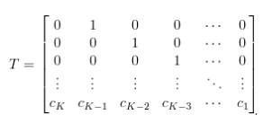
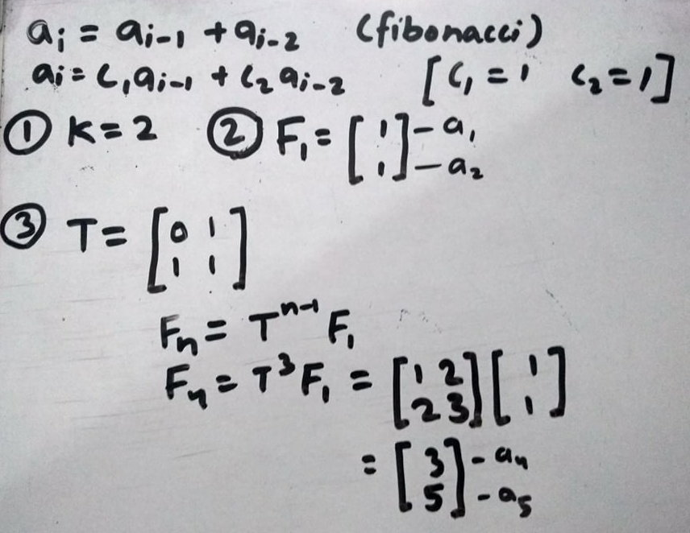
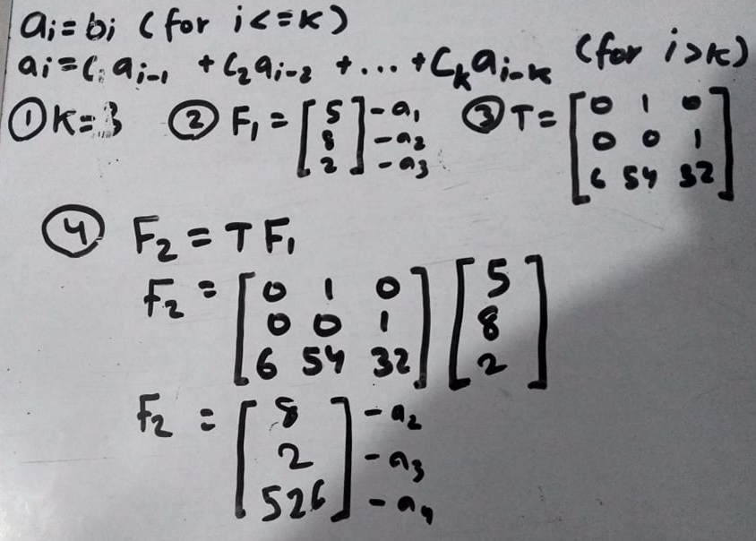
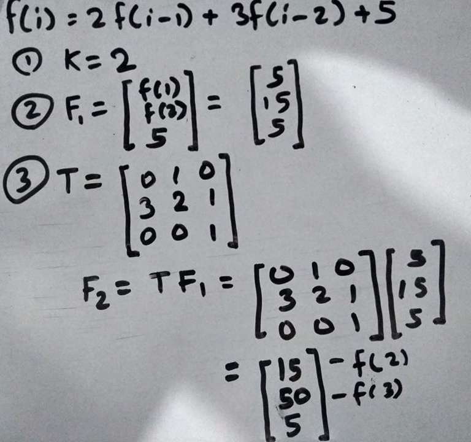
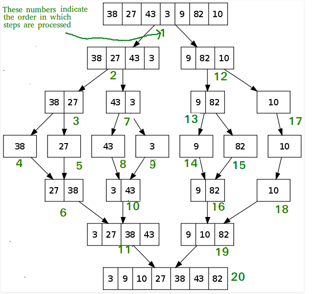
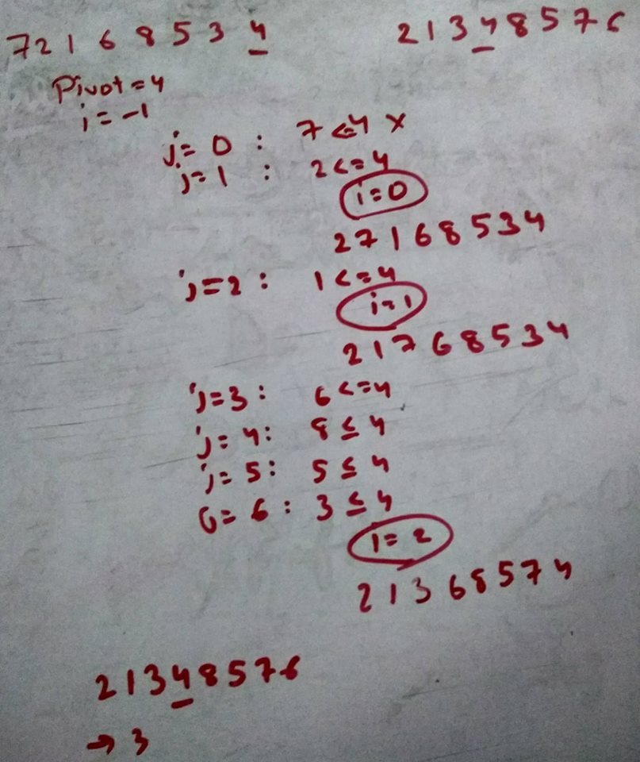
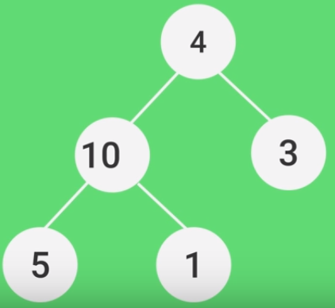
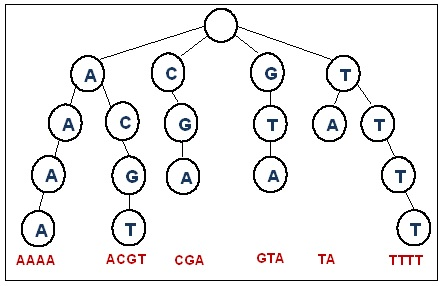

# DS Algorithms - Basics
## 1. Introduction:
Algorithm is a set of steps to complete a task. 

**An algorithm should** - take input, give output, Definiteness (each instruction clear), Finiteness (algorithm terminates after finite operations), Effectiveness(Good result shows).

Effectiveness & Efficiency are different. Effectiveness is the ability to produce desired result. Efficiency means how fast.

**Expectations from an algorithm** - Correctness, Approximation Algorithm if exact solution is not found then use approximation for optimization, less resource usage.

Running program on test cases to check it's correctness in called testing. Debugging is fixing any issue including compiler or even logical issues. There are two methods - Black box and white box testing. In black box testing the tester has no knowledge of the internal implementation of the program he may not even have the programming knowledge whereas in white box testing it's carried out by the developer who has knowledge of implementations.

## 2. Asymptotic Analysis:
To analyse a program's performance we have to measure it somehow. A naive way is to implement algorithm then calculate the duration of time taken in execution but the execution time will vary so it won't give clear result. That's where Asymptotic Analysis comes in role.

It talks about the time and space complexity. However in this we ignore constant so it may not be the best way to compute performance.

1) Big-Oh Notation (O) : Worst Case : Upper Bound
   <br>
   f(n) ≤ c * g(n)

2) Big-Omega Notation (Ω) : Best Case : Lower Bound
   <br>
   f(n) ≥ c * g(n)

3) Big-Theta Notation (Ω) : Average Case
   <br>
   c<sub>1</sub> * g(n) ≤ f(n) ≤ c<sub>2</sub> * g(n)

```c++
for (int i = 0; i < n; i++)
{
    for (int j = 0; j < n; j++)
        c[i][j] = a[i][j] + b[i][j];
}
```

In this:<br>
The condition i < n & j < n will execute (n + 1)<sup>2</sup> times <br>
Next all c[i][j] operation will execute (n)<sup>2</sup> times<br>
And 2 * 4 bytes for storing int<br>
Which equals to 2n<sup>2</sup> + 2n + 2

## 3. Recursion:
Dividing problem in sub problems and make a function call recursively to solve it. There will be a base case to terminate the infinite recursion. Recursion can be visualized through stack. There are two types of recursion -
```c++
void head(int n)
{
    //Recursion stack: 5, 4, 3, 2, 1, cout 2, cout3, cout 4, cout 5
    if (n == 1)
        return;
    head(n-1);
    cout << n << endl;
}
```
```c++
void tail(int n)
{
    //Recursion stack: cout 5, cout 4, cout 3, cout 2
    if (n == 1)
        return;
    cout << n << endl;
    tail(n-1);
}
```
Every itteration can be transformed to recursion and vice versa. Recursion is time costlier than itteration.

**Problem #1 (GCD Problem)**
```c++
int gcdItter(int a, int b)
{
    while (b != 0)
    {
        int temp = b;
        b = a % b;
        a = temp;
    }

    return a;
}

int gcdRecur(int a, b)
{
    if (b == 0)
        return a;
    return gcdRecur(b, a % b);
}
```

**Problem #2 (Hanoi Problem)**
```c++
void solveHanoi(int n, char rodFrom, char rodMiddle, char rodTo)
{
    if (n == 1)
    {
        cout << "Plate: " << n << " from " << rodFrom << " to " << rodTo << endl;
        return;
    }
    solveHanoi(n-1, rodFrom, rodTo, rodMiddle);
    cout << "Plate: " << n << " from " << rodFrom << " to " << rodTo << endl;
    solveHanoi(n-1, rodMiddle, rodFrom, rodTo);
}

//solveHanoi(3, 'A', 'B', 'C');
```

**<u>Solving Linear Recurrences:</u>**<br>
1) Determing K:<br>
f(i-1) + f(i-2) **K = 2**<br>
2f(i-2) + f(i-4) = 0f(i-1) + 2f(i-2) + 0f(i-3) + 1f(i-4) **K = 4**<br>
K is on how many terms relation depends on
2) Determine initial values:<br>
First K terms should be initialized in a Kx1 matrix F<sub>i</sub>
3) Determing transformation matrix<br>
A matrix with last row as reverse of matrix initialized above. Rest diagonals above element are 1 rest are 0.
<br><br>
4) Now finally:<br>
F<sub>2</sub> = TF<sub>1</sub><br>
F<sub>3</sub> = TF<sub>2</sub> = T<sup>2</sup>F<sub>1</sub><br>
F<sub>n</sub> = T<sup>n-1</sup>F<sub>1</sub><br>
Use fast exponention algorithm to calculate power in O(logn) instead of brute force O(n) multiplying.
```c++
//pow(a, b) of math library uses fast exponention
int expo(int a, int b)
{
    if (b==1) return a;
    if (b==2) return a*a;

    if (b%2==0)
        return expo(expo(a,b/2),2);
    else
        return a*expo(expo(a,(b-1)/2),2);
}
```
Fibonacci Series Solve
<br><br>
https://www.spoj.com/problems/SEQ/
<br><br>
In case of some constant in relation
<br><br>

### Common Problems:
**1 ) LCM & GCD:**<br>
a x b = LCM(a, b) * GCD(a, b)<br>
LCM(a, b) = (a x b) / GCD(a, b)

```c++
int gcd(int a, int b)
{
    while (b != 0)
    {
        int temp = b;
        b = a % b;
        a = temp;
    }

    return a;
}
```
LCM(a, b, c) ≠ (a x b x c) / GCD(a, b, c)<br>
GCD(a, b, c) = GCD(a, gcd(b, c))
```c++
long long findlcm(int arr[], int n)
{
    long long ans = arr[0];
 
    for (int i = 1; i < n; i++)
        ans = (((arr[i] * ans)) / (gcd(arr[i], ans)));
 
    return ans;
}
```

## 4. Searching:

**Problem #1 (Linear Search)**
<br>Time: O(n)
```c++
int search(int arr[], int n, int x)
{
    for (int i = 0; i < n; i++)
    {
        if (arr[i] == x)
            return i;
    }
    return -1;
}
```

**Problem #2 (Binary Search)**
<br>Applies on sorted array. divides the arr to check which side it can belong then recursively checks that subarray.<br>
Time: O(logn)
```c++
int search(int arr[], int l , int r, int x)
{
    // l = 0 & r = n-1
    if (r >= l)
    {
        int mid = (l + r) / 2;
        if (arr[mid] == x)
            return mid;
        else if (arr[mid] > x)
            return search(arr, l, mid - 1, x);
        else
            return search(arr, mid + 1, r, x);
    }
    return -1;
}
```
Ternary Search is also there which is same as binary search except instead of dividing in 2 parts we divide it in 3 parts.

Binary search is better than ternary search because in binary search: log<sub>2</sub>n complexity while in ternary search: 2log<sub>3</sub>n calculating mathematically binary search is better.

**Problem #3 (Jump Search)**
<br>Applies on sorted array. Performs linear search but in a form of group of √n
<br>Time: O(√n)
```c++
int search(int arr[], int n, int x)
{
    int left = 0;
    int right = sqrt(n);

    while (arr[right] <= x && right < n)
    {
        left = right;
        right += sqrt(n);

        if (right > length - 1)
            right = length;
    }

    for (int i = left; i < right; i++)
    {
        if (arr[i] == x)
            return i;
    }
    return -1;
}
```

**Problem #4 (Interpolation Search)**
<br>An Interpolation Search is a type of searching algorithm. An Interpolation Search is an improvement over Binary Search for scenarios where the values in a sorted array are uniformly distributed.

Binary Search goes to the middle element to check. On the other hand, Interpolation Search may go to different locations according to the value of the key being searched.

Time: O(loglogn) however in case of value not in the array the time will be O(n)
```c++
int search(int arr[], int l, int r, int x)
{
    if (l <= r)
    {
        pos = left + (((double)(right - left) / (arr[right] - arr[left])) * (x - arr[left]))
        if (arr[pos] == x)
            return pos;
        else if (x > arr[pos])
            return search(arr, pos + 1, r, x);
        else
            return search(arr, l, pos - 1, x);
    }

    return -1;
}
```

**Problem #5 (Exponential Search)**
<br>It finds a range within which the number can be found. by performing exponential check. First from 1 to 2 then 2 to 4 then 4 to 8... and then it performs binary search on the range.<br>
Time: O(logn)
```c++
int search(int arr[], int n, int x)
{
    if (arr[0] == x)
        return 0;
    
    int i = 1;
    while (i < n && arr[i] <= x)
        i *= 2;
    
    return binarySearch(arr, i/2, min(i, n), x);
}
```

**Problem #6 (Fibonacci Search)**
<br>In fibonacci Search, the idea is like Binary search (sorted) to divide the array but not by 2 instead we find the fibonacci number which is just greater or equal to length of array. We use (m-2)’th Fibonacci number as index let i. we compare arr[i] with x, if x is same, we return i. Else if x is greater, we recur for subarray after i, else we recur for subarray before i.<br>
Time: O(logn)
```c++
int search(int arr[], int n, int x)
{
    int fibMMm2 = 0;
    int fibMMm1 = 1;
    int fibM = fibMMm2 + fibMMm1;

    while (fibM < n)
    {
        fibMMm2 = fibMMm1;
        fibMMm2 = fibM;
        fibM = fibMMm2 + fibMMm1;
    }

    //Offset is the eliminated range
    int offset = -1;

    while (fibM > 1)
    {
        int i = min(offset + fibMMm2, n-1);
        if (arr[i] < x)
        {
            fibM  = fibMMm1;
            fibMMm1 = fibMMm2;
            fibMMm2 = fibM - fibMMm1;
            offset = i;
        }
        else if (arr[i] > x)
        {
            fibM  = fibMMm2;
            fibMMm1 = fibMMm1 - fibMMm2;
            fibMMm2 = fibM - fibMMm1;
        }
        else return i;
    }
 
    if(fibMMm1 && arr[offset+1]==x)
        return offset+1;
 
    return -1;
}
```

**Other important things**<br>
std::rotate (in algorithm): 1 2 3 4 5 6 7 8 9 -> 4 5 6 7 8 9 1 2 3 <br>
std::rotate(vec.begin(), vec.begin() + 3, vec.end());<br>
1 2 3 4 5 6 7 8 9 -> 6 7 8 9 1 2 3 4 5 <br>
std::rotate(vec.begin(), vec.begin() + vec.size() - 4, vec.end());<br>

std::lower_bound(vec.begin(), vec.end(), 5) will return an itterator to the first occurence of 5 in vector like wise there is std::upper_bound

Lexiographic order is alphabetical order: 0, 1, 10, 2, 21, 3

```c++
//compare function: Descending order
sort(ar.begin(), ar.end(), [](const class& a, const class& b) -> bool
{
    return a.x > b.x;
});
```
>>> TODO: unbounded binary search, two pointers

## 5. Sorting:
**Problem #1 (Selection Sort)**
<br>Itterate [0..n-1] find minimum element let it be at first then Itterate [1..n-1] find minimum element and so on<br>
Time: O(n<sup>2</sup>)
```c++
void sort(int arr[], int n)
{
    for (int i = 0; i < n-1; i++)
    {
        int minIndex = i;
        for (int j = i+1; j < n; j++)
        {
            if (arr[j] < arr[minIndex])
                minIndex = j;
        }
        swap(&arr[minIndex], &arr[i]);
    }
}
```

**Problem #2 (Bubble Sort)**
<br>In bubble sort we make the max element to the right first by swapping the pair of two elements  and itterating throughout.<br>
Time: O(n<sup>2</sup>)
```c++
void sort(int arr[], int n)
{
    for (int i = 0; i < n-1; i++)
    {
        for (int j = 0; j < n-i-1; j++)
        {
            if (arr[j] > arr[j+1])
                swap(&arr[j], &arr[j+1]);
        }
    }
}
```

There's unstable & stable sorting: eg: 5 9 3 9 8 4 here there are duplicate item (9s) if we sort in an unstable sorting the second 9 will not come after the first 9. The relative ordering will change.

**Problem #3 (Insertion Sort)**
<br>In insertion sort we keep a partion of sorted and unsorted parts of array. initially first element is sorted and rest are unsorted. Then we take element from unsorted and insert it on sorted by traversing from right to left.
<br><u>20</u> 35 -15 7 55 1 -22     [key: 35]
<br><u>20 35</u> -15 7 55 1 -22     [key: -15]
<br><u>20 35</u> 35 7 55 1 -22     [key: -15]
<br><u>-15 20 35</u> 7 55 1 -22     [key: 7]
<br><u>-15 20 20</u> 35 55 1 -22     [key: 7]
<br><u>-15 7 20 35</u> 55 1 -22     [key: 7]
<br>...
<br>Time: O(n<sup>2</sup>)

```c++
void sort(int arr[], int n)
{
    for (int i = 1; i < n; i++)
    {
        int key = arr[i];
        int j = i-1;
        //Iterate in sorted array checking if that element is greater than key
        while (j >= 0 && arr[j] > key)
        {
            arr[j+1] = arr[j];
            j--;
        }
        arr[j+1] = key;
    }
}
```

**Problem #4 (Shell Sort)**
<br>Shell sort is an extension to Insertion sort. In insertion sort if the array is sorted then it will take O(n) to shift elements to sorted partition while this can be optimized using shell sort.
<br>gap is size / 2 means 7 / 2 = 3 then 3 / 2 = 1 There can be more gap variety (see wikipedia) they will change complexity.
<br><u>20</u> 35 -15 7 55 1 -22     [key: 7]
<br><u>20</u> 35 -15 20 55 1 -22    [key: 7]
<br><u>7 35</u> -15 20 55 1 -22     [key: 7]
<br><u>7 35</u> -15 20 55 1 -22     [key: 55]
<br><u>7 35 -15</u> 20 55 1 -22     [key: 1]
<br><u>7 35 -15</u> 20 55 1 -22     [key: 1]
<br><u>7 35 -15 20</u> 55 1 -22     [key: -22]
<br><u>7 35 -15 20</u> 55 1 20      [key: -22]
<br>-22 35 -15 7 55 1 20            [key: -22]
<br>Then gap 1 will be pure insertion sort
<br>...
<br>Time: O(n<sup>2</sup>)
```c++
void sort(int arr[], int n)
{
    for (int gap = n/2; gap > 0; gap /= 2)
    {
        for (int i = gap; i < n; i++)
        {
            int temp = arr[i];
            for (int j = i; j >= gap && arr[j - gap] > temp; j -= gap)
                arr[j] = arr[j - gap];
            
            arr[j] = temp;
        }
    }
}
```

**Problem #5 (Merge Sort)**
<br><br>
We use divide and conquer to divide entire array (half to then other half) into individual array. Then we merge while sorting it. Here 27 38 - 3 43 we loop through n of both these merge sets at each iteration check 27 < 3 so 3 comes first then 27 then again check 38 < 43 hence final is 3 27 38 43.
<br>Time: O(nlogn)
<br>Space: O(n)
```c++
void merge(int arr[], int l, int m, int r)
{
    //Setting temp arrays for two merges
    int n1 = m - l + 1;
    int n2 =  r - m;
    int L[n1], R[n2];
    for (i = 0; i < n1; i++)
        L[i] = arr[l + i];
    for (j = 0; j < n2; j++)
        R[j] = arr[m + 1+ j];

    int i = 0;  //Initial index of first subarray
    int j = 0;  //Initial index of second subarray
    int k = 1;  //Initial index of merged subarray
    while (i < n1 && j < n2)
    {
        if (L[i] <= R[j])
        {
            arr[k] = L[i];
            i++;
        }
        else
        {
            arr[k] = R[j];
            j++;
        }
        k++;
    }

    while (i < n1)
    {
        arr[k] = L[i];
        i++;
        k++;
    }
    while (j < n2)
    {
        arr[k] = R[j];
        j++;
        k++;
    }
}
void sort(int arr[], int l, int r)
{
    if (l < r)
    {
        int m = (l + r) / 2;
        sort(arr, l, m);
        sort(arr, m+1, r);
        merge(arr, l, m, r);
    }
}
```

**Problem #6 (Quick Sort)**
<br>In quick sort we partition the array and make sure all elements in left subarray is smaller than all elements in right sub array. Then again we will chose a pivot and partition. Unlike merge sort all things are done inplace (constant space complexity) so no need to create temporary variables. So not large memory required.
<br>7 2 1 6 8 5 3 <u>4</u> -> 2 1 3 <u>4</u> 8 5 7 6
<br>Then we will divide and conquer left and right part
<br>Time: O(n<sup>2</sup>) worst case in average case we get O(nlogn) the worst case senerio is avoided usually by a randmised version of quick sort.
<br><br>
```c++
void partition(int& arr[], int l, int r)
{
    int pivot = arr[r];
    int x = l - 1;
    for (int i = l; i < r - 1; i++)
    {
        if (arr[i] <= pivot)
        {
            x++;
            swap(&arr[x], &arr[i]);
        }
    }
    swap(&arr[x + 1], &arr[r]);
    return(x + 1);
}

void sort(int arr[], int l, int r)
{
    if (l < r)
    {
        int partitionIndex = partition(arr, l, r);
        sort(arr, l, partitionIndex - 1);
        sort(arr, partitionIndex + 1, r);
    }
}
```
Quick select algorithm is just like Quick Sort in this we partion based on pivot then we again recursively partition left side of pivot (If we want to select minimum of array) or right side of picot (If we want to select maximum of array).<br>
Worst case senerio for both Quick select and Quick sort can be O(N<sup>2</sup>) if we choose first element as pivot and the list is already sorted.<br>To optimize it upto linear time we need to select a good pivot which should be such that it discards half or more element with each itteration. Sometimes the values are bad that we cannot rely on any pivot approximation technique in that case it will be better if we find the median and then use it as pivot.

**Problem #7 (Heap Sort)**
In heap sort the algorithm idea is to take array and build heap out of it.
<br><br>
Then depending on ascending or descending we make max or min heap this is called heapify.
<br>After heapifying top element will be max or min we swap it with last node and then delete it putting in our sorted array. Then we again do heapify
<br>We keep repeating this until heap is completely deleted.
<br>Time: Heapify takes logn time and then traversing all elements takes n so time complexity will be nlogn. However that's not the case and that is because heapify time will shorten with time as the elements will decrease making it O(n)
https://www.geeksforgeeks.org/time-complexity-of-building-a-heap/

**Problem #8 (Counting Sort)**
<br>Counting sort work within a specific range. Range should be reasonable not huge like 1 to million. In this we don't do any comparison instead we count.
<br>9 4 10 8 2 4
<br>We find min and max element of array and then prepare an array holding the range.
<br>2 3 4 5 6 7 8 9 10
<br>1 0 2 0 0 0 1 1 1       [count of elements]
<br>2 4 4 8 9 10
<br>Time: O(n + k) n+k is total range here m
<br>Space: O(n + k)
```c++
void sort(int arr[], int n)
{
    int min = arr[0];
    int max = arr[0];
    for (int i = 1; i < n; i++)
    {
        if (max < arr[i])
            max = arr[i];
        if (min > arr[i])
            min = arr[i];
    }

    int m = max - min + 1;
    int count[m];
    fill(count, count + m, 0);
    for (int i = 0; i < n; i++)
        count[arr[i] - min]++;

    int counter = 0;
    for (int i = 0; i < m; i++)
    {
        while (count[i] > 0)
        {
            arr[counter] = min + i;
            counter++;
            count[i]--;
        }
    }
}
```

**Problem #9 (Radix Sort)**
<br>In Radix sort we count sort (or any other stable sort) each digit. It is applied when data is within big range directly applying counting sort will be worse.
<br>17<u>0</u> 4<u>5</u> 7<u>5</u> 9<u>0</u> 80<u>2</u> 2<u>4</u> <u>2</u> 6<u>6</u>
<br>1<u>7</u>0 <u>9</u>0 8<u>0</u>2 <u>0</u>2 <u>2</u>4 <u>4</u>5 <u>7</u>5 <u>6</u>6
<br><u>8</u>02 <u>0</u>02 <u>0</u>24 <u>0</u>45 <u>0</u>66 <u>1</u>70 <u>0</u>75 <u>0</u>90
<br>2 24 45 66 75 90 170 802

## 6. Data Structures:
ADT (Abstract Data Type) It tells about the behaviour (interface)

1) List:
<br>
Dynamic list will create an array reserved with some initial blocks if we add an element and the array is full another array of double block will be created.
<br>In java both ArrayList and Vector provide this functionality however vector is thread safe. Means that it is safe (no conflicts) to access or modify a vector from different threads at same time. Vectors came first though but arraylist kind of implementation is still required. ArrayList is hence faster as well.

2) Linked List
<br>It's a dynamic list in which each entity is stored in nodes connected to one another. There are two types of linked list - Singly Linked List (value + head) or Doubly Linked List (value + head + tail)
```c++
#include <iostream>

using namespace std;

template<typename T>
class LinkedList
{
private:
    struct Node
    {
        T data;
        Node* next = NULL;
    };
    void PrintElementsRecurssion(Node* curHead) const
    {
        if(curHead == NULL)
            return;
        
        cout << curHead -> data << " ";
        PrintElementsRecurssion(curHead -> next);
    }
    void PrintElementsReverseRecurssion(Node* curHead) const
    {
        if(curHead == NULL)
            return;
        
        PrintElementsReverseRecurssion(curHead -> next);
        cout << curHead -> data << " ";        
    }
    void ReverseListRecurssion(Node* curHead, Node* prevHead)
    {
        if(curHead -> next == NULL)
        {
            prevHead -> next = NULL;
            curHead -> next = prevHead;
            head = curHead;
            return;
        }
        
        ReverseListRecurssion(curHead -> next, curHead);
        if(prevHead == NULL)
            return;
        prevHead -> next = NULL;
        curHead -> next = prevHead;
    }
    Node* head;
    Node* tail;
    int size;
    
public:
    LinkedList() : head(NULL), size(0) { };

    void Insert(T value, int index)
    {
        Node* node = new Node;
        node -> data = value;

        if(head == NULL && index == 0)
        {
            head = node;
            tail = node;
            return;
        }

        Node* curHead = head;
        Node* changedHead = head;
        int i = 0;
        while(curHead != NULL)
        {
            if(i == index - 1)
            {
                changedHead = curHead -> next;
                curHead -> next = node;                
            }
            else if(i == index)
            {
                if(index == 0)
                    head = node;
                
                if(node -> next == NULL)
                    tail = changedHead;
                node -> next = changedHead;
                size++;
                break;
            }

            i++;
            curHead = curHead -> next;
        }
    }

    void PushFront(T value)
    {
        Node* node = new Node;
        node -> data = value;
        node -> next = head;

        if(head == NULL)
        {
            head = node;
            tail = node;
            return;
        }

        head = node;
    }

    T TopFront()
    {
        return head -> data;
    }

    void PopFront()
    {
        Node* delNode = head;
        head = head -> next;
        delNode -> next = NULL;
        delete delNode;
    }

    void PushBack(T value)
    {
        //For pop back we must implement doubly linked list
        //A doubly linked list will have reference of next and previous node
        //This will help in certain operations like push back, reverse, etc.
        //Here it will help in keeping track of tail once pop is performed
        Node* node = new Node;
        node -> data = value;
        node -> next = NULL;

        if(head == NULL)
        {
            head = node;
            tail = node;
            return;
        }

        tail -> next = node;
        tail = tail -> next;
        size++;
    }

    void Remove(int index)
    {
        Node* curHead = head;
        int i = 0;

        if(index == 0)
        {
            head = head -> next;
            curHead -> next = NULL;
            delete curHead;
            return;
        }

        while(curHead != NULL)
        {
            if (i == index - 1)
            {
                head = head -> next;
                curHead -> next = NULL;
                delete curHead;
                break;
            }
            i++;
            curHead = curHead -> next;
        }
    }

    void PrintElementsUsingItteration() const
    {
        Node* curHead = head;
        while(curHead != NULL)
        {
            cout << curHead -> data << " ";
            curHead = curHead -> next;
        }
        cout << endl;
    }

    void PrintElementsUsingRecurssion() const
    {
        PrintElementsRecurssion(head);
        cout << endl;
    }

    void PrintElementsReverseUsingRecurssion() const
    {
        PrintElementsReverseRecurssion(head);
        cout << endl;
    }

    void ReverseListUsingItteration()
    {
        Node* curNode = head;
        Node* nextNode = NULL;
        Node* prevNode = NULL;
        tail = head;

        while(curNode != NULL)
        {
            nextNode = curNode -> next;
            curNode -> next = prevNode;
            prevNode = curNode;
            curNode = nextNode;
        }
        head = prevNode;
    }

    void ReverseListUsingRecurssion()
    {
        tail = head;
        ReverseListRecurssion(head, NULL);
    }

    ~LinkedList()
    {
        Node* curHead = head;
        while(curHead != NULL)
        {
            Node* tempNext = curHead -> next;
            curHead -> next = NULL;
            delete curHead;
            curHead = tempNext;
        }
    }
};

int main()
{
    {
        LinkedList<int> linkedList;
        linkedList.PushBack(5);
        linkedList.PushBack(9);
        linkedList.PushBack(7);
        linkedList.Insert(1, 2);
        linkedList.PrintElementsUsingRecurssion();
        linkedList.Remove(0);
        linkedList.PrintElementsUsingItteration();
        linkedList.PushBack(1);
        linkedList.PushBack(2);
        linkedList.PushBack(3);
        linkedList.PrintElementsUsingRecurssion();
        linkedList.Insert(4, 4);
        linkedList.PrintElementsUsingItteration();
        linkedList.ReverseListUsingItteration();        
        linkedList.PrintElementsUsingRecurssion();
        linkedList.PrintElementsReverseUsingRecurssion();
        cout << "--------" << endl;
        linkedList.PrintElementsUsingRecurssion();
        linkedList.ReverseListUsingRecurssion();
        linkedList.PrintElementsUsingRecurssion();
        cout << "--------" << endl;
        linkedList.PushFront(0);
        linkedList.PrintElementsUsingRecurssion();
        linkedList.PopFront();
        linkedList.PopFront();
        linkedList.PushFront(8);
        linkedList.PrintElementsUsingRecurssion();
        cout << linkedList.TopFront() << endl;
    }

    return 0;
}
```

3) Stacks
<br>
(FIFO) First In First Out<br>
Push (Insert at the entry of stack), Pop (Remove from entery) & Top (Gets entry element)<br>
All stack operations are performed in constant time<br>
Applications: Undo operation, paranthesis are balanced by compiler using stack, Recurssion stack.
```java
//Infix to postfix
> Push left paranthesis on stack, add right paranthesis to expression.
> Scan left to right and repeat.
> If operand then append in postfix expression otherwise push it on stack.
> If an operator with higher precidence (BODMAS) is already present in stack when pushing above then pop it and append to expression. If paranthesis close then pop and append insides.

//Infix to prefix
> Scan right to left. In the end reverse the expression.

//Prefix to infix
> Scan right to left.
> If operand push on stack otherwise s1 = pop s2 = pop push (s1 operator s2) on the stack again.

//Postfix to prefix
> Scan left to right.
> If operand push on stack otherwise s1 = pop s2 = pop push (operator s2 s1) on the stack again.

//Prefix to postfix
> Scan right to left.
> If operand push on stack otherwise s1 = pop s2 = pop push (s1 s2 operator) on the stack again.

//Evaluation of postfix
> Scan left to right
> If operand push on stack otherwise s1 = pop s2 = pop push evaluation of (s2 operator s1) on the stack again.
```

4) Queues
<br>
(LIFO) Last In First Out<br>
Used in case where requests are sent like to a printer for print requests.<br><br>
Priority Queue is in which there is a priority assosiated with every value. It can be implemented through Binary Heap.<br>
Applications of Priority Queue - CPU Scheduling, Graph Algorithms like Dijikstra, Prim's Minimum Spanning Tree.<br><br>
In a queue there's one disadvantage that if we do deletion it will happen in front shifting all elements taking O(n). This can be avoided by using circular queue.
<br><br>

5) Sets
<br>
Stores values in sorted order. Stores only unique. Elements can be only inserted and removed (not modified). Sets are implemented as BST. A multiset allows storage of multiple elements.

6) Maps
<br>
Map, Multimap, Unordered map, Unordered multimap<br>
In a hashmap or unordered_map the data input (key) is hashed to convert in some hash value which modulo is then taken<br>
To make that big hash number fit into a list. It is a linked list so if any other data gets the same modulo it gets appended to the linked list.<br><br>
In ordered map data gets stored in sorted manner<br>
In map one value for a key wheras multimap can have many values for a key<br>
Unordered map are stored as hash map whearas map are balanced binary tree. A multimap can store multiple values for a key.<br>
Hash tables suffer from O(n) worst time complexity due to two reasons:<br>
If too many elements were hashed into the same key: looking inside this key may take O(n) time.
Once a hash table has passed its load balance - it has to rehash [create a new bigger table, and re-insert each element to the table].<br>
A hashmap maps giving direct access by hashing the key to a value now two keys may have same hash in that case collision happens. In that case a linked list will be maintain and then ittiration through linked list will be done.<br>
There is also Load Factor which tells how full is our array which stores hashtable. Now we don't want it too low because that will mean our space getting waste and also we don't want it too hight because that will mean that collision will happen more. 
<center>

| Task              | Map           | Unordered_Map  |
| ----------------- |:-------------:| --------------:|
| Ordering          | Increasing order <br> by default | No ordering          |
| Implementation    | Self balancing tree <br> like Red Black Tree      |   Hash Table          |
| Search Time       | log(n)      |    O(1) -> Average <br>O(n) -> Worst          |
| Insertion Time       | log(n) + Rebalance      |    Same as search         |
| Deletion Time       | log(n) + Rebalance      |    Same as search          |

</center>

7) Trees
8) Graphs
9)  Heaps
10)   Disjoint Sets<br>
Disjoint sets are seperate sets which are represented by 1 identity. Example - 1, 2, 3, 4 initially all 4 are dijoint sets. If we apply make union to 1 & 2 we get (1 2), 3, 4 in (1 2) the identity of both 1 & 2 on calling findSet will be same.

```c++
template<typename T>
class DisjointSet
{
private:
    struct Node
    {
        T data;
        Node* parent;
        int rank;
    };
    unordered_map<T, Node*> map;

public:
    void makeSet(T _data)
    {
        Node* node = new Node();
        node->data = _data;
        node->parent = node;
        node->rank = 0;
        map.insert(make_pair<T, Node*>((T)_data, (Node*)node));
    }

    void makeUnion(T _data1, T _data2)
    {
        Node* parent1 = findSet(map.find(_data1) -> second);
        Node* parent2 = findSet(map.find(_data2) -> second);

        if (parent1->data == parent2->data)
            return;
        else if (parent1->rank >= parent2->rank)
        {
            parent1->rank = (parent1->rank == parent2->rank) ? parent1->rank + 1 : parent1->rank;
            parent2->parent = parent1;
        }
        else
            parent1->parent = parent2;
    }

    Node* findSet(Node* _node)
    {
        Node* parent = _node->parent;
        if (parent == _node)
            return parent;
        _node->parent = findSet(_node->parent);
        return _node->parent;
    }

    T find(T _data) { return findSet(map.find(_data) -> second)->data; }
};
```

11) Tries<br>
It's an information retrieval data structure also known as radix/prefix tree.
<br><br>
```c++
struct node
{
    char data;
    unordered_map<char, node*> next;
    bool isTerminal;
    node(char d)
    {
        data = d;
        isTerminal = false;
    }
};

class Trie
{
    node* root;
public:
    Trie()
    {
        root = new node('\0');
    }
    void addWord(string word)
    {
        node* temp = root;
        for (int i = 0; word[i] != '\0'; i++)
        {
            char ch = word[i];
            if (temp -> next.count(ch) == 0)
            {
                node* child = new node(ch);
                temp -> next[ch] = child;
                temp = child;
            }
            else
                temp = temp -> next[ch];
        }
        temp->isTerminal = true;
    }
    bool search(string word)
    {
        node* temp = root;
        for (int i = 0; word[i] != '\0'; i++)
        {
            char ch = word[i];
            if (temp -> next.count(ch))
                temp = temp -> next[ch];
            else
                return false;
        }
        return temp -> isTerminal;
    }
};
```