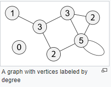
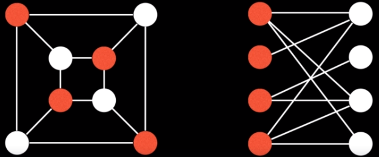
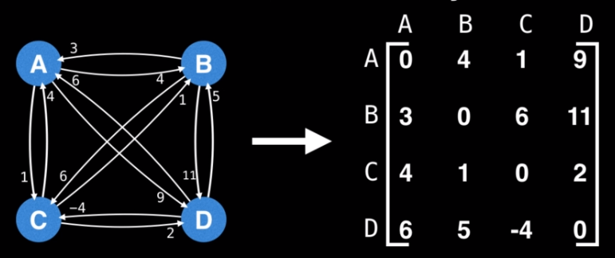
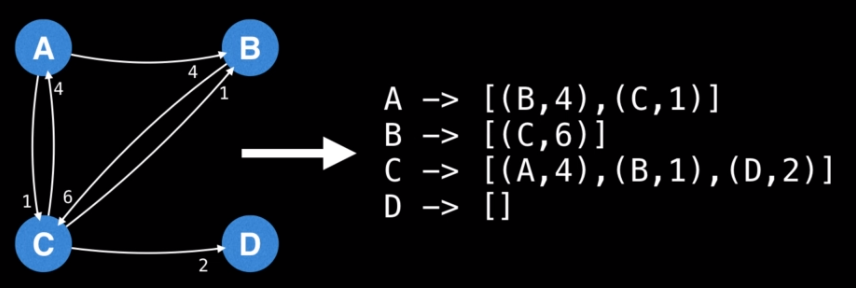
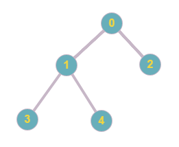
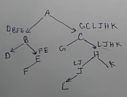
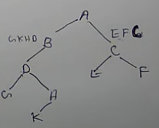
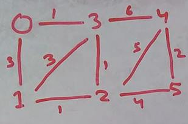
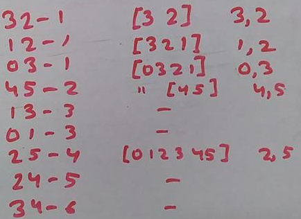
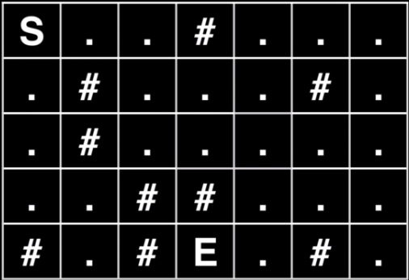

# DS Algorithms - Graph Theory
## 1. Introduction:
In a tree there is n-1 edges for n node whearas in a Graph there is no such restriction.

    In a graph V is the vertices array then we have edges array which is the link between edges like 0-1 2-3<br>
0 < |E| < n(n-1) [Directed or Digraphs]<br>
0 < |E| < n(n-1)/2 [Undirected]<br>
Directed means directional. direction matters

A graph is called dense if it is close to maximum edges otherwise it is sparse. We use adjancy matrix for dense graph and adjancy list for sparse graph. Most of situtaions are for sparse.

Binary Tree is a tree with not more than two child nodes.<br>
If it has 0 or exactly 2 nodes then it is a strict binary tree.<br>
**If children is zero then it is a leaf node<br>**
A tree with n nodes will have n-1 edges, **A tree never has a cycle**<br>
Depth of a node is path length from root to that node<br>
**The depth of a node** is the number of edges from the node to the tree's root node.
A root node will have a depth of 0.

**The height of a node** is the number of edges on the longest path from the node to a leaf.
A leaf node will have a height of 0.

Complete Binary Tree is a binary tree in which it is completely filled except fot the last level<br> Last level has to be as left as possible.
So h = floor(log<sub>2</sub>n)<br>
If all are filled then it is called a perfect binary tree<br>
Maximum number of nodes in a perfect binary tree = 2<sup>0</sup> + 2<sup>1</sup> + 2<sup>2</sup> + 2<sup>3</sup> + ... + 2<sup>h</sup> = 2<sup>(h+1)</sup> - 1<br>
So h = log<sub>2</sub>(n+1) - 1

Cost of serching and other operations depends upon the height of binary tree so we want to keep our binary tree less in height but broad.

Trees can be In-Trees in which node connects from node to root. Out-Trees are opposite.

DAG (Directed Acyclic Graphs) these are directed graphs with no cycles. In compiler dependencies and other computer architectures these are used.

Binary trees can be stored dynamically using a struct and class or by using an Array<br>
like 1 2 3 4 5 6 7 in array will be 1 root with 2 & 3 child then 4 & 5 child of 2 and 6 & 7 child of 3.<br>
This is used for perfect balanced binary tree. A balanced binary tree has left node data lesser or equal to the current node and right has greater.

To differentiate between tree and graph also we can do sum of all degrees = 2(n-1) for tree - Handshaking lemma
<br><br>

A bipartite graph is one whose vertices can be split into two independent groups U, V such that every edge connects between U and V. Other definations exists such as: The graph is two colourable or there is no odd length cycle.
<br><br>
A bipartite graph is basically divided in two branches so it's BFS traversal is more efficient.

**GRAPH APPLICATIONS:**
1) Shortest Path
2) Web Crawler
3) Social Network
4) Cycle Detection & Negative cycle detection
5) To test if a graph is bipartite
6) Broadcasting in network
7) Maximum Flow Problem
8) Strongly Connected Components (If there is a path to all vertices)
<br><br>

9) Finding Bridges in a Graph (Weak points of the grap)
10) Detecting articulation points (Removing those will disconnect the graph)
11) Finding minimum spanning tree (A tree from a graph that has minimum weight) - Designing a least cost network, or in many approximation algorithms

## 2. Representation:
**Adjancy Matrix** is good for dense graph where each node is much connected to each other.
<br><br>
Time is O(1) for accessing any link

**Adjancey List** is good for sparse matrix since in adjancey Matrix for sparse graph most cell will be emtpy.
<br><br>
```c++
int nodes, edges;
vector<int> adjList[nodes];
cin >> nodes >> edges;
for (int i = 0; i < edges; i++)
{
    int x, y;
    cin >> x >> y;
    adjList[x].push_back(y);
}
```
Time can be O(E) for accessing link since traversal on list is required.

**Edge List** in this we store the edge in a form of unordered_list with key as the node. Drawkback is again accessing is slow O(E)

## 3. Traversal:
<br>
**Postorder:** 3, 4, 1, 2, 0<br>
**Inorder:** 3, 1, 4, 0, 2<br>
**Preorder:** 0, 1, 3, 4, 2<br>

```c++
void print(struct Node* node)
{
    if (node == NULL)
        return;
    //Postorder
    print(node->left);
    print(node->right);
    cout << node->data << " ";
    //Inorder
    print(node->left);
    cout << node->data << " ";
    print(node->right);
    //Preorder
    cout << node->data << " ";
    print(node->left);
    print(node->right);
}-
```

To construct a binary tree we need either 
1) **Preorder + Inorder:**<br>
   ABCDEFCGHJLK, DBFEAGCLJHK

   In preorder left most is the root node. (A)<br>
   Then see it in Inorder (DBFE) left - (GCLJHK) right
   <br><br>
   Again recursively check left most of DBFE then see it in Inorder. to solve the entire tree.

2) **Postorder + Inorder:**<br>
   Here everything will be simillar as 1) except the rightmost is the root node.

3) **Preorder + Postorder:**<br>
   ABDGHKCEF, GKHDBEFCA
   A is root node, B is left to A<br>
   B in post order has B-EFC-A so B is left EFC is right to A<br>
   <br>

## 4. Algorithms:
1) **Depth First Search:** Time: O(V + E) [V is vertices E is edges] - It keeps exploring neighbours going in depth

```c++
#include <bits/stdc++.h>
using namespace std;

void DFS(vector<int> *adj, bool *visited, int node)
{
    if (!visited[node])
    {
        cout << node << " ";
        visited[node] = true;
        for (int i = 0; i < adj[node].size(); i++)
            DFS(adj, visited, adj[node][i]);
    }
}

int main()
{
    ios_base::sync_with_stdio(false);
    cin.tie(NULL);

    int n, e;
    cin >> n >> e;
    vector<int> adj[n];
    bool visited[n];
    fill(visited, visited + n, false);
    for (int i = 0; i < e; i++)
    {
        int x, y;
        cin >> x >> y;
        adj[x].push_back(y);
    }

    for (int i = 0; i < n; i++)
    {
        if (!visited[i])
            DFS(&adj[0], &visited[0], i);
    }

    return 0;
}
```

2) **Breadth First Search:** Time: O(V + E) [V is vertices E is edges] - It explores all neighbours first before going in depth
```c++
void BFS(vector<int> *adj, bool *visited, queue<int> *nodeVisited, int node)
{
    if (!visited[node])
    {
        cout << node << " ";
        
        visited[node] = true;
        for (int i = 0; i < adj[node].size(); i++)
        {
            if (!visited[adj[node][i]])
            {
                nodeVisited.push(adj[node][i]);
                cout << adj[node][i] << " ";
            }
        }

        while(!nodeVisited.empty())
        {
            int top = nodeVisited.front();
            nodeVisited.pop();
            BFS(adj, visited, top);
        }
    }
}
```

3) **Topological Sort:** It is a sorting of graph. In a package manger a package has a dependencie with another so the package manager makes a graph of all the pacakages and perform a topological sort to get linear list of packages to be compiled in order.<br><br>
To implement we take two thing a stack & a visited set. We choose any node which is not visited, put it to visited set. Then check it's child if it's not visited. if a parent is totally visited we put it in our stack. In the end pop all elements from stack and the graph is topologically sorted.

4) **Kosaraju's Algorithm (for strongly connected components):** Given this graph we need to find strongly connected components. It means if there is a path to all vertices.<br>
Apply DFS to all unvisited nodes. As the node get's exit put it in a stack. Then find transpose of graph, transpose simply means reverse the graph arrows. Apply DFS again to the stack as per new visited set. DFS on nodes from stack. Output: 7, 8, 0-3-2-1, 4-6-5
<br><br>

5) **Cycle detection:** [Directed Graph] Apply DFS and maintain a visited set. If during traversing DFS we encounter an already visited node then it means the graph has cycle. [Undirected Graph] We also need to maintain a complete visited set and for cycle the node should be in visited but not in completely visited set.<br><br>
Another way is with the help of Disjoint Sets. We make disjoint sets for all nodes and then for each connections we make union. If we found that before making union both edges already belong in same disjoint set means there is a cycle.
```c++
int main()
{
    int n, e;
    cin >> n >> e;
    DisjointSet<int> ds;
    for (int i = 0; i < n; i++)
        ds.makeSet(i);

    for (int i = 0; i < e; i++)
    {
        int a, b;
        cin >> a >> b;
        if (ds.find(a) == ds.find(b))
        {
            cout << "CYCLE FOUND"
            return;
        }
        ds.makeUnion(a, b);
    }

    cout << "CYCLE NOT FOUND";
    return;
}
```

6) **Counting number of simple cycles:** Out of adjancey matrix let's say 0 -> 1, 2, 3 we make pairs of i, j & k = (0, 0, 1) (0, 0, 2) (0, 1, 2) then correspondingly we increment that cell of matrix A[ adj[i][j]] [adj[i][k] ]
```c++
//https://www.hackerearth.com/practice/algorithms/graphs/graph-representation/practice-problems/algorithm/utkarsh-in-gardens-february-easy/

#include <bits/stdc++.h>
using namespace std;

int main()
{
    ios_base::sync_with_stdio(false);
    cin.tie(NULL);
    
    int n;
    cin >> n;
    vector<int> adj[n];
    int A[n][n];
    memset(A , 0 , sizeof(A));
    
    int val;
    for(int i = 0; i < n; i++)
    {
        for(int j = 0; j < n; j++)
        {
            cin >> val;
            if(val)
                adj[i].push_back(j);            
        }            
    }

    for(int i = 0; i < n; i++)
    {    
        int len = adj[i].size(); 
        for(int j = 0; j < len; j++)
        {
            for(int k = j+1 ; k < len ; k++)
                A[adj[i][j]][adj[i][k]]++;
        }        
    }
    
    long long ans = 0;
    //j is i+1 so as to get only top right diagonal part of the matrix
    for(int i = 0 ; i < n ; i++)
    {
        for(int j = i+1; j < n; j++)
            ans += ( (long long)A[i][j] * (long long)(A[i][j] - 1) ) / 2;
    }

    cout << (ans / 2) << endl;
    return 0;
}
```

7) **Shortest Path Using BFS:** <br>
Represent the given grid map in form of a graph using nodes (all the walkable cells of grid) and edges (connecting paths). Apply BFS at start position and keep traversing until end node is aquired. Keep storing the recursive path while traversing. Finally print it. Time: O(V+E) <br>**See Dungeon problem below.**

8) **Dijikstra Algorithm:** 

9)  **A-Star Algorithm:**

10) **Kruskal's Algorithm (for minimum spanning tree):**<br>
<br><br>
<br><br>
[Greedy Algorithm]<br>
We first create disjoint sets for all nodes. We store path in a set and sort it in ascending order based on weight. Traverse this new sorted list and apply find set to see if two nodes of path are different then do union. Also print the connection because that is our final minimum spanning tree.
```c++
int e, v;
cin >> e >> v;

DisjointSet<int> ds;

for (int i=0; i<e; i++)
    ds.makeSet(i);

vector<int> vertex[e];
vector<Path> path(v);
for (int i=0; i<v; i++)
{
    int a, b, c;
    cin >> a >> b >> c;
    vertex[a].push_back(b);
    vertex[b].push_back(a);
    path[i] = {a, b, c};
}

sort(path.begin(), path.end(), [](Path i, Path j){
    return (i.length < j.length);
}]);

cout << "-------" << endl;

for (int i=0; i<v; i++)
{
    int a = ds.find(path[i].nodeA);
    int b = ds.find(path[i].nodeB);
    if (a != b)
    {
        ds.makeUnion(a, b);
        cout << path[i].nodeA << " " << path[i].nodeB << " - " << path[i].length << endl;
    }
}
```

11) **Prim's Algorithm (for minimum spanning tree):**<br>
[Greedy Algorithm]<br>

12) **Tarjan's Algorithm (for articulation point):**

13) **Bellman Ford Algorithm:**

14) **Floyd Warshall Algorithm:**

15) **Ford-fulkerson algorithm (for maximum flow problem):**

16) **Dinci's algorithm (for maximum flow problem):**

## 5. Problems:
1) **Dungeon Problem:** 
<br><br>
```c++
#include <bits/stdc++.h>
using namespace std;

struct Position
{
    int x;
    int y;
    inline bool operator==(const Position& a) { return a.x == x && a.y == y; }
};

struct Path
{
    Position nextPos;
    string prevPath;
};

bool FindObstacle(Position pos, Position obstacles[], int obstacleCount)
{
    for (int i = 0; i < obstacleCount; i++)
    {
        if (obstacles[i] == pos)
            return true;
    }
    return false;
}

void FindPath(int xMax, int yMax, Position pos, Position end, queue<Path> &quePos,
    bool *visited, Position obstacles[], int obstacleCount, string path = "")
{
    if (pos == end)
    {
        cout << path << endl;
        return;
    }

    if (!visited[(pos.y * xMax) + pos.x])
    {
        visited[(pos.y * xMax) + pos.x] = true;

        int nextPosCount = 0;
        Position nextPos[4];
        if (pos.x - 1 >= 0 && !visited[(pos.y * xMax) + pos.x - 1])
        {
            Position cur{pos.x - 1, pos.y};
            if (!FindObstacle(cur, obstacles, obstacleCount))
            {
                nextPos[nextPosCount] = cur;
                nextPosCount++;
            }
        }
        if (pos.y - 1 >= 0 && !visited[((pos.y - 1) * xMax) + pos.x])
        {
            Position cur{pos.x, pos.y - 1};
            if (!FindObstacle(cur, obstacles, obstacleCount))
            {
                nextPos[nextPosCount] = cur;
                nextPosCount++;
            }
        }
        if (pos.x + 1 < xMax && !visited[(pos.y * xMax) + pos.x + 1])
        {
            Position cur{pos.x + 1, pos.y};
            if (!FindObstacle(cur, obstacles, obstacleCount))
            {
                nextPos[nextPosCount] = cur;
                nextPosCount++;
            }
        }
        if (pos.y + 1< yMax && !visited[((pos.y + 1) * xMax) + pos.x])
        {
            Position cur{pos.x, pos.y + 1};
            if (!FindObstacle(cur, obstacles, obstacleCount))
            {
                nextPos[nextPosCount] = cur;
                nextPosCount++;
            }
        }

        for (int i = 0; i < nextPosCount; i++)
            quePos.push({nextPos[i], path});

        while(!quePos.empty())
        {
            Path tempPath = quePos.front();
            Position tempPos = tempPath.nextPos;
            quePos.pop();
            FindPath(xMax, yMax, tempPath.nextPos, end, quePos, visited, obstacles, obstacleCount,
                tempPath.prevPath + "(" + to_string(tempPath.nextPos.x) + ", " + to_string(tempPath.nextPos.y) + ") ");
        }
    }
}

int main()
{
    ios_base::sync_with_stdio(false);
    cin.tie(NULL);

    int xMax, yMax;
    cin >> xMax >> yMax;
    Position start, end;
    cin >> start.x >> start.y;
    cin >> end.x >> end.y;
    int obstacleCount;
    cin >> obstacleCount;
    Position obstacles[obstacleCount];
    for (int i = 0; i < obstacleCount; i++)
        cin >> obstacles[i].x >> obstacles[i].y;
    bool visited[xMax * yMax];
    fill(visited, visited + (xMax * yMax), false);
    queue<Path> quePos;

    FindPath(xMax, yMax, start, end, quePos, &visited[0], obstacles, obstacleCount);
    return 0;
}

/*
7 5
0 0
3 4
9
3 0
1 1
5 1
1 2
2 3
3 3
0 4
2 4
5 4
*/
```

>>> TODO Self balancing tree (Red Black Tree), AVL Tree, AVL Sort, Segment Tree