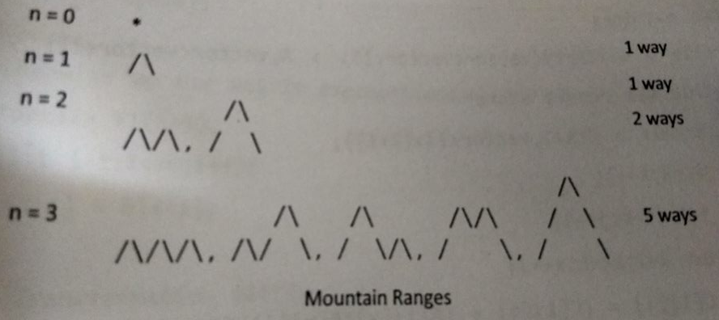

# DS Algorithms - Number Theory & Bit Manipulation
## 1. Number Theory:
**<u>Bernauli Trial:</u>** A dice thrown n times and we want probability for 6 exactly x times. so: <sup>n</sup>C<sub>x</sub> (1/6)<sup>x</sup> (5/6)<sup>n - x</sup><br>
The expected number of trials for ith success is 1/p

>**Coupon Collector Problem: A certain brand of cereal always distributes a coupon in every cereal box. The coupon chosen for each box is chosen randomly from a set of n distinct coupons. A coupon collector wishes to collect all n distinct coupons. What is the expected number of cereal boxes must the coupon collector buy so that the coupon collector collects all n distinct coupons.**<br><br>
Probability of collecting first coupon is 1 since the collector has none. Later on for P<sub>i</sub> = (n - (i-1)) / n<br>
E(x) = 1/P (follows geometric distribution) we need to calculate summation of E[x]<br>
= E(1) + E(2) + E(3) + E(4) + ... + E(n)<br>
= n/n + n/n-1 + n/n-2 + n/n-3 + ... + + n/2 + n/1<br>
= n (1/n + 1/n-1 + 1/n-2 + 1/n-3 + ... + 1/2 + 1)<br>
Apply expansion

Unsigned long long int can store max till 18 places so we can Big Integers in java for C++ we can use arrays.

**<u>SEQUENCE FINDER</u>** https://oeis.org/

**<u>Catalan Numbers:</u> 1, 1, 2, 5, 14, 42**<br> Cat(n) = <sup>2n</sup>C<sub>n</sub>/(n+1) And Cat(0) = 1<br>
1) Number of possible BST with n keys
2) {a, b, c, d} can be parenthesized with Cat(4) ways: (ab)(cd), a(b(cd)), ((ab)c)d, (a(bc)(d)), a((bc)d)
3) A polygon with n + 2 sides can split into Cat(n + 2) triangles
4) No of ways to form mountain ranges with n upstrokes<br>
<br><br>

**<u>Pigeonhole Principle:</u>**<br>
If there are (Kn + 1) pigeons and n pigeon holes then 1 pigeonhole will have 2 pigeons.

>**#1:** **Prove that if 6 ints are selected {3, 4, 5, 6, 7, 8, 9, 10, 11, 12} there must be 2 ints whose sum is 15.**<br>
3-12, 4-11, 5-10, 6-9, 7-8 These are pigeon holes.<br>
Now we wil select 6 ints from our list those 6 will be pigeons. So by two will lie on same group hence proved.

>**#2:** **Prove that if 10 points are placed in a 3x3 cm square then 2 points must be less than or equal to √2 cm apart.**

>**#3:** **At a buisness meeting no one shakes their own hand and no one shakes another person's hand more than once. Prove that there are 2 people who have shaken hands same number of times.**<br>
If there are n peoples then one person can have 0 handshakes or 1, 2... n-1 since no one shakes own hand. now if there's a person with n-1 handshakes (he has shaken hands with everyone) then a person with no handshake will not exist. So there will be n-1 total cases. They are pigeonholes. so two persons will have same number of handshakes.

Divisible Subset Problem  (C4)(https://www.codechef.com/problems/DIVSUBS)<br>
Example: 3 4 3 5 2 3<br>
Naive approach is by exponential time finding pairs with 1 element only then 2 element only and so on.<br>
Any such problem can be illustrated as (1+x<sup>3</sup>)(1+x<sup>4</sup>)(1+x<sup>3</sup>)(1+x<sup>5</sup>)(1+x<sup>2</sup>)(1+x<sup>3</sup>) solving this will give terms having powers of all subsets we just need to apply % N = 0.<br>
It can be solved in O(NlogN) by Fast Fourier Transform or simply in O(N<sup>2</sup>)
https://www.youtube.com/watch?v=QQQpOa3aXew
```
Itterate all array elements and apply % N and record it in the array of vector below.
0   1   2   3   4   5
            0
Then 4
0   1   2   3   4   5
                1
Then in 4 to 3 so 4 + 3 % N
0   1   2   3   4   5
    0,1     0   1
and so on.

a[]     =      3    4    3    5    2    3
b[]     = 0    3    7    10   15   17   20
b[]     = 0    3    1    4    3    5    2
temp[]  =      2    6    1,4  3    5  
This is pigeonhole senerio in every case any temp arr will have two element. end - start i.e. 4 - 1 = 3 so 3 elements that are 2nd 3rd and 4th (4 + 3 + 5) % 6 = 0
```

### Properties Of Modulo
> (a+b)%M = (a%M + b%M) % M

> (a-b)%M = (a%M - b%M + M) % M

> (a*b)%M = (a%M * b%M) % M

> (a/b)%M = (a%M * b<sup>-1</sup>%M) % M

b<sup>-1</sup>%M is multiplicative inverse: (b*y)%M = 1 [y val]
### Very large string input to ll when % m
```c++
ll string2Int(string a, ll m)
{
    ll ans = 0ll;
    for (int i = 0; i < a.size(); ++i)
        ans = (((ans * 10) % m) + (a[i] - '0')) % m;
    return ans;
}
```

### ModPower
```c++
//logN
ll powMod(ll a, ll b, ll m)
{
    ll x = 1;
    while (b > 0)
    {
        if (b&1) x = (x*a) % m;
        a = (a*a) % m;
        b >>= 1;
    }
    return x;
}
```

### ModMul
```c++
ll mul(ll a, ll b, ll m)
{
    ll res = 0;
    while(b)
    {
        if (b&1)
        {
            res += a;
            if (res >= m) res -= m;
        }
        b >>= 1;
        a = (a << 1);
        if (a >= m) a-= m;
    }
    return res;
}
```

### nCr calculations (<sup>n</sup>C<sub>r</sub> % p):
1) One way is using DP to store entire Pascal table O(nr)
2) Lucas Theorem O(p<sup>2</sup> Log<sub>p</sub> n)
```c++
ll cal_nCr_mod_p(ll n, ll r, ll p)
{
    ll C[r+1];
    memset(C, 0, sizeof(C));
    C[0] = 1;
    for (ll i = 1; i <= n; ++i)
    {
        for (ll j = min(i, r); j > 0; --j)
            C[j] = (C[j] + C[j-1]) % p;
    }
    return C[r];
}

ll lucasTheorem(ll n, ll r, ll p)
{
    if (r == 0) return 1;
    else
    {
        ll n_i = n%p, r_i = r%p;
        ll result = (lucasTheorem(n/p, r/p, p) * cal_nCr_mod_p(n_i, r_i, p)) % p;
        return result;
    }
}
```
3) Fermat’s little theorem:
```c++
ll nCr(ll n, ll r, ll p)
{
    if (n < r) return 0;
    ll res = 1, rem = 1;
    for (ll i = n - r + 1; i <= n; i++) res = (res * i) % p;
    for (ll i = 2; i <= r; i++) rem = (rem * i) % p;
    return (res * powMod(rem, p - 2, p)) % p;
}
```

### GCD using Euclid's Algorithm:<br>
> GCD (A, B) = GCD (B, A % M) BaseCase: B gets 0

> GCD (A, B) * LCM (A, B) = A * B

O(Log max(a, b))

### Extended Euclid's Algorithm:<br>
ax + by = GCD (a,b)<br>
Here x & y can be calculated using extended euclid's algrithm. There has to exist some x & y for all a & b to satisfy the above condition according to Bezout's Theorem.
https://www.youtube.com/watch?v=6KmhCKxFWOs

> Ax + By = GCD(A, B)

> Ax' + (A%B)y' = GCD(A, B)

> Ax' + (A - floor(A/B))y' = GCD(A, B)<br>
Bx' + Ay' - floor(A/B)By'  = GCD(A, B)<br>
B(x' - floor(a/b)y') + Ay' = GCD(A, B)

> Comparing coeficients:<br>
x = y'<br>
y = x' - floor(A/B)y'
```c++
//18x + 30y = GCD(18, 30)
//30x + 18y = GCD(30, 18)
//18x + 12y = GCD(18, 12)
//12x + 6y = GCD(12, 6)
//6x + 0y = GCD(6, 0)           BASE CASE always have x = 1, y = 0
int gcdExtended(int a, int b, int *x, int *y) 
{
    if (a == 0)
    {
        *x = 1;
        *y = 0;
        return b;
    }
    int x1, y1;
    int gcd = gcdExtended(b%a, a, &x1, &y1);
    *x = y1;
    *y = x1 - (a/b) * y1;
    return gcd; 
} 
```
Ax + By = C<br>
Here C is not GCD(A, B) This is called Linear Diophantine Equation<br>
let g = gcd(A, B)<br>
k<sub>1</sub>gx + k<sub>2</sub>gy = c<br>
k<sub>1</sub>x + k<sub>2</sub>y = c/g<br>
This c/g must be an int this means c is a multiple of gcd<br>
k<sub>1</sub>x + k<sub>2</sub>y = k gcd(a,b)<br>

So now using extended eucledian find for ax + by = gcd(a, b) let it's ans be x<sub>o</sub> & y<sub>o</sub> Then later x becomes k.x<sub>o</sub> & y becomes k.y<sub>o</sub>

(x, y) = 
K may have other possible values too

### Fermat's Little Theorem:
> a<sup>p</sup> = a (mod p) Here p is a prime number

> ( a<sup>p</sup> - a ) % p = 0

> (a<sup>p-1</sup> - 1) % p = 0

> a<sup>p-1</sup> % p = 1

### Multiplicative modulo inverse:
Naive approach try all numbers from 1 to m for every check (a * x) % m = 1
```c++
ll modInverse(ll a, ll m) 
{
    a = a % m;
    for (ll x = 1; x < m; x++)
    {
        if ((a * x) % m == 1)
            return x;
    }
}
```
Other approach is Extended GCD it will work only if a & m are coprime.
> (a.x)%m = 1

> (a.x - 1)%m = 0

> ax - 1 = qm

> ax - qm = 1       GCD(a, q) should be 1 to work

Now use Extended Eucledian to find value of x & q. Here x is inverse modulo provided that a & m are co prime i.e. GCD (a, m) = 1
```c++
//m added to handle negative, -1 means inverse doesn't exist
if (gcdExtended(a, m, &x, &y)) return (x%m + m) % m;
else return -1;
```

Other equally efficent approach used when only m is prime is using Fermat's Little Theorem

> a<sup>m-1</sup> = 1 (mod m)

> a<sup>-1</sup> = a<sup>m-2</sup> % m

```c++
powMod(a, m-2, m);
```

### Find all prime factors:
If a number is divisible by 2 divide it by 2 and show 2. Then loop from <u>3 to √n</u> Since n is odd (n % 2 != 0 so we can skip an element i.e. <u>i+=2</u>). Last check is if n > 2 otherwise n can be 1 then we just show.<br>
Time: O(√n)<br>
A check till √n is sufficient because prime numbers lie in pairs (1, 100) (2, 50) (4, 25)...
```c++
void primeFactors(int n)
{
    while (n % 2 == 0)
    {
        cout << 2 << " ";
        n = n/2;
    }
 
    for (int i = 3; i <= sqrt(n); i += 2)
    {
        while (n % i == 0)
        {
            cout << i << " ";
            n = n/i;
        }
    }
 
    if (n > 2)
        cout << n << " ";
}
```
Find all divisors of a number n from 1. We will itterate from 1 to n checking modulo O(n) a better way is see pattern.<br>
For 100: 1 2 4 5 10 20 25 50 100<br>
(1, 100) (2, 50) (4, 25) (5, 20) they form pairs with product n. Now O(√n).<br>
Proper divisors are all divisors except number itself.

Politeness of a number i.e. number of ways a number can be expressed as consecutive numbers sum.<br>
15 : 1 + 2 + 3 + 4 + 5, 4 + 5 + 6, 7 + 8 hence 3<br>
It is equivalent to number of all odd prime factors excluding 1. 15 : 1, 3, 5, 15 (so 3)

### Sieve Of Eratosthanese:
Time: O(nloglogn)
```c++
ll sieve[MAXN];
void makeSieve() 
{
    fill(sieve, sieve + MAXN, 1);
    sieve[0] = 0;
    sieve[1] = 0;
    for (int i = 2; i < MAXN; ++i)
    {
        if (sieve[i] == 1)
        {
            for (int j = i*2; j < MAXN; j+=i)
                sieve[j] = 0;
        }
    }
}
```

A number always have divisors in pair wise manner: 20 = 1, 2, 4, 5, 10, 20 in this 1 & 20 are pair, 2 & 10 are pair, 4 & 5 are pair.

Further optimizations can be done by ignoring even number since they can never be prime also. Initially say we check 2 we mark it's multiple false then 3 the idea is we start marking divisible from N<sup>2</sup> so in 5 start from 25
### Prime Factorization using Sieve Of Erastosthanese:
Time: O(logn)<br>
spf stores the smallest prime factors for each number
```c++
ll spf[MAXN];
void sieve() 
{ 
    for (int i=1; i<MAXN; ++i) spf[i] = i;
    for (int i=4; i<MAXN; i+=2) spf[i] = 2;
    for (int i=3; i*i<MAXN; ++i)
    {
        if (spf[i] == i)
        {
            for (int j=i*i; j<MAXN; j+=i)
            {
                if (spf[j]==j)
                    spf[j] = i;
            }
        }
    }
}

vector<ll> factorize(ll x)
{
    vector<ll> factors;
    while (x != 1)
    {
        factors.push_back(spf[x]);
        x = x / spf[x];
    }
    return factors; 
}
```

### Sum of all divisors
```
suppose n has 3 prime factors
n = (a ^ x) * (b ^ y) * (c ^ z)
where a, b, c are prime factors of n
and that is prime factorisation
then sum of all divisors are
(1 + a + a^2 + ... + a^x) *  (1 + b + b^2 + ... + b^y) *  (1 + c + c^2 + ... + c^z)
```

### Segmented Sieve:
If we want to calculate prime numbers between a range say 10<sup>8</sup> to 10<sup>9</sup>(L to R)<br>
We will create a sieve for 2 to root R and then we will make every number within it's sieve along with it's multiple as non-prime in resulted sieve (containing R-L elements)
```c++
vector<ll> primes;
void findPrimes(ll n)
{
    ll i;
    ll sqrtn = sqrt(n);
    vector<bool> is_prime(n+1, true);

    for (i = 3; i <= sqrtn; i += 2)
    {
        if (is_prime[i])
        {
            ll increment = i+i;
            primes.push_back(i);
            for (int j = i * i; j <= n; j += increment)
                is_prime[j] = false;
        }
    }
    for (; i <= n; i += 2)
    {
        if (is_prime[i])
            primes.push_back(i);
    }
}
void segmentedSeive(ll m, ll n)
{
    ll range = n - m;
    vector<bool> is_prime(range + 1, true);

    for (ll prime : primes)
    {
        ll increment = prime + prime;
        ll start = max(((m + prime - 1) / prime) * prime, prime * prime);
        if ((start & 1) == 0)
            start += prime;
        start -= m;
        for (int i = start; i <= range; i += increment)
            is_prime[i] = false;
    }

    if (m <= 2 && n >= 2) printf("2\n");
    for (int k = (m & 1) ? 0 : 1; k <= range; k += 2)
    {
        if (is_prime[k])
            printf("%d\n", m + k);
    }
}
```

### Chinease Remainder Theorem:
Problems like find number when divided by 2 leaves 1, divided by 3 leaves 2, divided by 7 leaves 5.
> x = 1 (mod 2) = 2 (mode 3) = 5 (mod 7)

First thing is check all pairs of mod i.e. 2, 3, 7 have pair-wise GCD 1 so GCD (2, 3) = GCD (3, 7) = 1 and so on... And we need to find minimum possible value of that number.

A naive approach is start by 1 and keep incrementing x checking if the condition matches.
```c++
//Naive approach
ll findMinPossible(ll num[], ll rem[], ll n)
{
    ll x = 1;
    while (true) 
    {
        for (ll j = 0; j < k; ++j)
        {
            if (x % num[j] != rem[j])
               break;
        }
        if (j == k) return x;
        x++;
    }
    return x;
}
```

Chinease Remainder Theorem works by this formula:
> x = { 0 <= i <= n-1 } (rem[i] * pp[i] * inv[i]) % prod

Here prod is product of all numbers, pp[i] is prod / num[i]. inv[i] is Modular Multiplicative Inverse of pp[i] with respect to num[i]

```c++
ll chineaseRemainderTheorem(ll num[], ll rem[], ll n) 
{
    ll prod = 1ll;
    for (ll i = 0; i < k; ++i) prod *= num[i]

    ll res = 0;
    for (ll i = 0; i < k; ++i)
    {
        ll pp = prod / num[i];
        res += rem[i] * modInverse(pp, num[i]) * pp;
    }
    return result % prod;
}
```

### Euler Phi Function:
φ is a function on natural number that gives the count of positive integers coprimes to that number. φ(8) = 4, φ(9) = 6

φ(50) i.e. 2.5.5<br>
= 50(1 - 1/5)(1 - 1/2) = 20
```c++
ll phi[] = new int[n+1];
for (ll i = 2; i <= n; ++i) phi[i] = i;
for (ll i = 2; i <= n; ++i)
{
    if (phi[i] == i)
    {
        for (ll j = i; j <= n; j += i)
            phi[j] = (phi[j] / i) * (i - 1);
    }
}
```
1. If P is prime φ(p<sup>k</sup>) = (p-1)p<sup>(k-1)</sup>
2. φ(ab) = φ(a)φ(b)
3. φ(d1) + φ(d2) + ... = n : here d1, d2 ... are all divisors of n

### Wilson's Theorem:
If p is prime then (p-1)! = -1 (mod p)
> for p as 5 : 4! = -1 (mod 5)

> 24 mod 5 = 4 = -1 Hence it has to be prime

### Miller - Rabin Primality Test:
> Step 1 : Find n-1 = 2<sup>k</sup>m

Example n as 53. 52/2 = 26, 52/4 = 13, 52/8 = 6.5 so we will stop at 8. now k values will be 0, 1 & 2 corresponding m are 52, 26 & 13.

> Step 2 : Choose a such that 1 < a < n-1

Pick any number between 1 < a < n-1 for a it doesn't really matter. A smaller number just means less calculation.

> b<sub>o</sub> = a<sup>m</sup>mod m, b<sub>i</sub> = b<sup>2</sup><sub>i-1</sub> mod m

Calculate b<sub>o</sub> if it's +1 or -1 (Prime) else count b<sub>1</sub> from now on if it's +1 (composite) -1 (prime) if none then count b<sub>2</sub> again same condition. If the conditions goes on forever means the number is probably composite

https://www.youtube.com/watch?v=vPum8EqmFz0&t=3231s

## 2. Bit Manipulation:
N = 6163<sub>10</sub> = (6×10<sup>3</sup>) + (1×10<sup>2</sup>) + (6×10<sup>1</sup>) + (3×10<sup>0</sup>)<br>
In base 2 (binary) instead of 10's power we represent in 2's power. To convert keep dividing number by two and append remainder to a string. In the end reverse the string.

AND = A.B<br>
OR = A + B<br>
NOT = 1 - A = !A<br>
XOR = A!B + !AB<br>

Moore's Law: <br>
!(A + B) = A!.B!<br>
!(A.B) = A! + B!

XNOR = !XOR = (A + B!).(A! + B)<br>
NOR = !OR = A!.B!<br>
NAND = !AND = A! + B!<br>

> If XOR of two numbers/string/any data is 0 then both are same.

> XOR with 0 is the number itself

If between two number there's a bit difference of exactly one by XOR then it is called Gray Code. It is used in signal detection to check if there's any wrong signal.
<center>

| Type          | Size (bit)   | Range                              |
| ------------- |:-------------|:-----------------------------------|
| Bit           | 1            | 0 or 1                             |
| Nibble        | 4            | 0 to 2<sup>4</sup>-1               |
| Byte          | 8            | 0 to 2<sup>8</sup>-1               |
| Word          | 16           | 0 to 2<sup>16</sup>-1              |
| Double        | 32           | 0 to 2<sup>32</sup>-1              |
| Qword         | 64           | 0 to 2<sup>64</sup>-1              |

</center>

Gb (Gigabits), GB (Gigabytes), Gib (10<sup>3</sup> bits), GiB (10<sup>3</sup> bytes)

Hexadecimals: **0x<span style="color:blue">AA</span><span style="color:red">BB</span><span style="color:green">CC</span><span style="color:orange">DD</span>**<br>
Different colors represent a byte (AA 1 byte). Nibble has 4 bits i.e. 2<sup>4</sup> so a hexadecimal value which is from 0-15 (10 - A, B, C, D, E, F)

Least Significant Bit (LSB) & Most Significant Bit (MSB): 99 in binary (MSB part)01100011(LSB part) so in MSB 01100011 in LSB 11000110<br>
Endiness (Storing data in memory) : Little Endian (LSB), Big Endian (MSB)
>We use LSB

Finding i<sup>th</sup> bit:<br>
```c++
X(1<<4) >> 4
output:
010x00
00010x
000x00
x
```

1's Complement: Toggling every bit ~<br>
2's Complement:<br>
-X = ~X + 1<br>
X = ~(-X-1)

```c++
//If last bit is 0 then number is even if 1 then odd
if (number&1) cout << "odd" << endl;
else cout << "even" << endl;
```

```
n & (-n) will give last bit value since -n = ~n+1

5: (1001) & (0111) = 0001
7: (1010) & (0110) = 0000
```

<center>

| Decimal       | Binary       | Hexadecimal  | Decimal       | Binary       | Hexadecimal  |
| ------------- |:-------------|:-------------| :------------ |:-------------|:-------------|
| 0             | 0000         | 0x0          | 0             | 0000         | 0x9          |
| 1             | 0001         | 0x1          | -1            | 1111         | 0xA          |
| 2             | 0010         | 0x2          | -2            | 1110         | 0xB          |
| 3             | 0011         | 0x3          | -3            | 1101         | 0xC          |
| 4             | 0100         | 0x4          | -4            | 1011         | 0xD          |
| 5             | 0101         | 0x5          | -5            | 1011         | 0xE          |
| 6             | 0110         | 0x6          | -6            | 1010         | 0xF          |
| 7             | 0111         | 0x7          | -7            | 1001         | 0x7          |
| 8             | 1000         | 0x8          | -8            | 1000         | 0x8          |

1 in 8th first value means it's a negative number which is not true so range is -8 to 7 only
</center>

```c++
0000111110110011
// << 3 yields:
0111110110011000
// >> 3 yields:
0000000111110110

// Multiplication
i * 8; // normal
i << 3; // bitwise [8 = 2^3, so use 3]
 
// Division
i / 16; // normal
i >> 4; // bitwise [16 = 2^4, so use 4]
 
// Modulus
i % 4; // normal
i & 3; // bitwise [4 = 1 << 2, apply ((1 << 2) - 1), so use 3]
i % 2^i = n & (2^i - 1)

Bitwise shifts << >> shouldn't be used on negative numbers.
```
```c
/*
Booth's Multiplication Algo: (01011 x 01011)
   01011 x 1 =    01011
  010110 x 1 =   010110
 0101100 x 0 =  0000000
01011000 x 1 = 01011000
                1111001
*/

int mul(int a, int b)
{
    int ans = 0;
    for (int i = 0 ; i < 32; ++i)
    {
        if (b & 1) ans += a;
        b = b>>1;
        a = a<<1;
    }
    return ans;
}
```

### Swap two numbers using XOR (Without using temp variable)
```
int x = 10, y = 5;
x = x ^ y;
y = x ^ y;      //y = (x ^ y) ^ y = (y ^ y) ^ x = 0 ^ x = x
x = x ^ y;      //x = (x ^ y) ^ x = y
```

### Repeating elements of Array Problems
Given array [1, 2, 4, 2, 1] finding xor 1^2^4^2^1 = xor(1^1)^(2^2)^(4) = 0^0^4 = 4

Given Array [1, 1, 2, 2, 4, 5] we need to find both 4 & 5<br>
If we simply xor all numbers we will get 4^5 which will definitely be non zero. (100)^(101)=(001) Now if we divide the array elements into two one having 1 at unit place other having 0. [1, 1, 5], [2, 2, 4] take xor of both to get the ans<br>
If 100(4) & 110(6) are non repeating numbers we need to divide the array based on tense (check rightmost set bit pos) place set or unset
```c++
int arr[] = {1, 1, 2, 2, 3, 9};
int n = sizeof(arr) / sizeof(int);
int xors = 0;
for (int i = 0; i < n; ++i) xors ^= arr[i];

int temp = 0;
while(xors > 0)
{
    if (xors&1) break;
    ++temp;
    xors >>= 1;
}
int mask = 1<<temp;

int num1 = 0, num2 = 0;
for (int i = 0; i < n; ++i)
{
    if (((arr[i]&mask)>>temp)&1) num1 ^= arr[i];
    else num2 ^= arr[i];
}
cout << num1 << " " << num2 << endl;
```

Given array [7, 7, 3, 4, 2, 4, 3, 3, 4, 7] all numbers except one is occuring thrice we need to find that number.<br>
add binary position values (111 + 111 + 011 + 100 + 010 + 100 + 011 + 011 + 100 + 111) = 676 %3 all digit = 010 = 0.2<sup>0</sup> + 1.2<sup>1</sup> + 0.2<sup>2</sup> = 2
```c++
int arr[] = {7, 11, 3, 4, 9, 4, 3, 3, 4, 7, 9, 9, 7};
    int n = sizeof(arr) / sizeof(int);

    int count[32] {};
    for (int i = 0; i < n; ++i)
    {
        int cur = arr[i], pos = 0;
        while (cur > 0)
        {
            if (cur&1) ++count[pos];
            ++pos;
            cur >>= 1;
        }
    }
    int ans = 0;
    for (int i = 0; i < n; ++i) ans += pow(2, i) * (count[i] % 3);
    cout << ans << endl;
```

### Calculating number of set bits
```c++
int countBits(int n)
{
    //Time: O(number of bits)
    int count = 0;
    while (n > 0)
    {
        count += (n&1);
        n = n>>1;
    }
    return count;

    //Time: O(number of set bits)
    int count = 0;
    while(n)
    {
        ++count;
        n = n&(n-1);
    }

    // __builtin_popcount(n); or __builtin_popcountl or __builtin_popcountll
}
```

### Get Set ith bit
```c++
int getIthBit(int n, int i)
{
    return (n&(1<<i)) == 0 ? 0 : 1;
}
void setIthBit(int &n, int i)
{
    n = n|(1<<i);
}
void clearBit(int &n, int i)
{
    n = n&(~(1<<i));
}
```

### Subsequences of array
```c++
ll arr[] = {1, 2, 3};
ll n = sizeof(arr) / sizeof(ll);
for (ll i = 0; i < (1<<n); ++i)
{
    ll mask = i, pos = 0;
    while (mask > 0)
    {
        if (mask&1) cout << arr[pos] << " ";
        mask >>= 1;
        ++pos;
    }
    cout << endl;
}

output:

1 
2 
1 2 
3 
1 3 
2 3 
1 2 3 
```

### Inclusion Exclusion Problems
| A ∪ B ∪ C | = | A | + | B | + | C | - | A ∩ B | - | B ∩ C | - | C ∩ A | + | A ∩ B ∩ C|<br>
| A ∪ B ∪ C ∪ ... | = { SINGLE SUMS } - { DOUBLE PAIRS SUM } + { TRIPLE PAIRS SUM } - { FOUR PAIRS SUM } + ...

Find numbers less than 1000 divisible by 2, 3 & 5<br>
Numbers less then N divisible by m are floor((N - 1) / m) So:<br>
Divisible by 2 = 449<br>
Divisible by 3 = 333<br>
Divisible by 5 = 199<br>
Divisible by 2.5 = 99<br>
Divisible by 3.5 = 66<br>
Divisible by 2.3 = 166<br>
Divisible by 2.3.5 = 33<br>
| 2 ∪ 3 ∪ 5 | = 499 + 133 + 199 - 99 - 66 - 166 + 33 = 733

Numbers between 1 and n which are divisible by any of the prime numbers less than 20
```c++
ll t;
cin >> t;
while (t--)
{
    ll num;
    cin >> num;
    ll arr[] = { 2, 3, 5, 7, 11, 13, 17, 19 };
    ll n = sizeof(arr) / sizeof(ll);
    ll result = 0;
    for (ll i = 1; i < (1<<n); ++i)
    {
        ll mask = i, temp = 1, pos = 0, product = 1ll, bits = __builtin_popcount(mask);
        while (mask > 0)
        {
            ll lastBit = (mask&1);
            if (lastBit) product *= arr[pos];
            mask >>= 1;
            ++pos;
        }
        if (bits&1) result += num/product;
        else result -= num/product;
    }
    cout << result << endl;
}
```

### N Queens using Bitshift
IsSafe function of backtracking checks the placement in O(n) time using bitshift it can be O(1)<br>
Concept is we need to check column and diagonals for each placement. We can have different boolean arrays for that. Say we put a queen in one column we then mark corresponding column (i) in column array, diagonal1 (i-j) diagonal2(i+j) later to check IsSafe we just simply need to see if all three arrays are unset.
> We are basically maping both diagonals and columns, column corresponds to i values. diagonals have i+j or i-j const
```c++
//solve(0, 4, ans);
bitset<30> col, d1, d2;
void solve(int r, int n, int &ans)
{
    if (r == n)
    {
        ++ans;
        return;
    }
    for (int c = 0; c < n; ++c)
    {
        if (!col[c] && !d1[r-c+n-1] && !d2[r+c])
        {
            col[c] = d1[r-c+n-1] = d2[r+c] = 1;
            solve(r+1, n, ans);
            col[c] = d1[r-c+n-1] = d2[r+c] = 0;
        }
    }
}
```
Another even faster approach, it will not go to non safe positions
```
say a 4x4 chessboard
our initial pos we wish to find safe place based on this
    0100
left shift it & also right shift it by 1 then OR all three
    0100
    1000
    0010
   =1110
   ~0001
So now only 4th is the safe place

Sometimes it may even fall outside array so we AND the shifts
    1000
   10000 & 01111 = 00000
    0100
   =1100
   ~0011
```