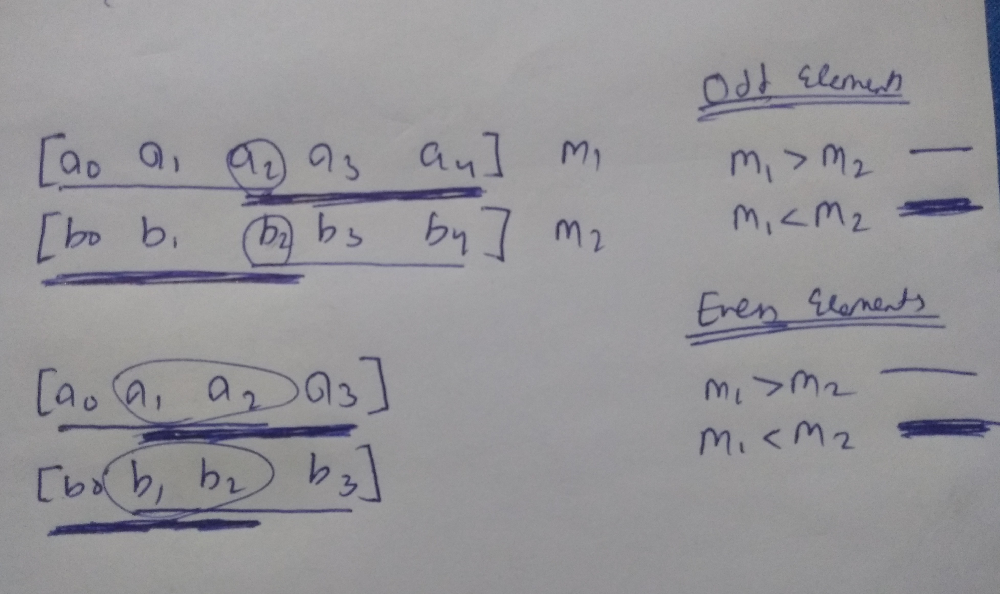

# Binary Search

## 16. Matrix Median
https://www.interviewbit.com/problems/matrix-median/
```c++
//We are basically finding desired value (desired as in which index on sorted array is middle)
int Solution::findMedian(vector<vector<int> > &A)
{
    int n = A.size(), m = A[0].size();
    int _min = INT_MAX, _max = INT_MIN, desired = (n*m+1)/2;
    for (int i = 0; i < n; ++i)
    {
        _min = min(_min, A[i][0]);
        _max = max(_max, A[i][m-1]);
    }
    while (_min < _max)
    {
        int mid = _min + (_max-_min)/2;
        int place = 0;
        for (int i = 0; i < n; ++i)
            place += upper_bound(A[i].begin(), A[i].end(), mid) - A[i].begin();

        if (place < desired) _min = mid+1;
        else _max = mid;
    }
    return _min;
}
```

## 17. Square Root Of Integer
https://www.interviewbit.com/problems/square-root-of-integer/
```c++
int Solution::sqrt(int A)
{
    if (A == 0 || A == 1) return A;
    int l = 0, r = A, ans;
    while(l <= r)
    {
        int mid = l + (r-l)/2;
        // having mid*mid <= A was giving TLE
        if (mid <= A/mid) l = mid+1, ans = mid;
        else r = mid-1;
    }
    return ans;
}
```

## 18. Rotated Sorted Array Search
https://www.interviewbit.com/problems/rotated-sorted-array-search/
```c++
int search(const vector<int> &arr, int l, int r, int x)
{
    if (l > r) return -1;
    int mid = l + (r-l)/2;
    if (arr[mid] == x) return mid;

    if (arr[l] <= arr[mid])
    {
        if (arr[l] <= x && arr[mid] >= x) return search(arr, l, mid-1, x);
        else return search(arr, mid+1, r, x);
    }
    else if (arr[mid] <= arr[r])
    {
        if (arr[mid] <= x && arr[r] >= x) return search(arr, mid+1, r, x);
        else return search(arr, l, mid-1, x);
    }
}
```

## 19. Median of Array
https://www.interviewbit.com/problems/median-of-array/<br>
```c++
// MEDIAN OF ARRAY OF SAME SIZE
// Median of two sorted array O(N) we are merging both sorted array to get one sorted
// array using merge sort. Media will be middle two element since it has even elements
int findMedian(vector<int> arr1, vector<int> arr2)
{
    int n = arr1.size() + arr2.size();
    vector<int> arr(n);
    int i = 0;
    int j = 0;
    int k = 0;
    while (i < arr1.size() && j < arr2.size())
    {
        if (arr1[i] < arr2[j]) arr[k] = arr1[i], ++i;
        else arr[k] = arr2[j], ++j;
        ++k;
    }
    while (i < arr1.size()) arr[k] = arr1[i], ++i;
    while (j < arr2.size()) arr[k] = arr2[j], ++j;

    return (arr[n/2] + arr[n/2 - 1])/2;
}
// O(logN) solution
// calculate medians of arr1 and arr2.
// If m1 == m2 then return it
// If m1 > m2 then repeat looking for in [0...n/2] of arr1 and [n/2...n-1] of arr2
// If m1 < m2 then repeat looking for in [n/2...n-1] of arr1 and [0...n/2] of arr2
// If size of both array is 2 then Median = (max(ar1[0], ar2[0]) + min(ar1[1], ar2[1]))/2
```

```c++
int findMedian(vector<int> arr1, vector<int> arr2, int l1, int l2, int n)
{
    if (n == 1)
        return (arr1[l1] + arr2[l2]) / 2;
    else if (n == 2)
        return (max(arr1[l1], arr2[l2]) + min(arr2[l1+1], arr2[l2+1])) / 2;

    int m1 = (n%2 == 0) ? (arr1[l1 + n/2 - 1] + arr1[l1 + n/2]) / 2 : arr1[l1 + n/2];
    int m2 = (n%2 == 0) ? (arr2[l2 + n/2 - 1] + arr2[l2 + n/2]) / 2 : arr2[l2 + n/2];

    if (m1 == m2)
        return m1;
    else if (m1 > m2)
    {
        if (n%2 == 0) return findMedian(arr1, arr2, l1, l2 + n/2 - 1, n/2 + 1);
        else return findMedian(arr1, arr2, l1, l2 + n/2, n/2 + 1);
    }
    else
    {
        if (n%2 == 0) return findMedian(arr1, arr2, l1 + n/2 - 1, l2, n/2 + 1);
        else return findMedian(arr1, arr2, l1 + n/2, l2, n/2 + 1);
    }
}
```
```
FIND MEDIAN OF DIFFERENT SIZE ARRAY: O(N) solution is same using merge sort O(N)
For O(logN) solution it will be same though size is not same so we have to take care of many base cases
N = 0, M : return median of arr2
N = 1, M = 1 : return avg of arr1[0] arr2[0]
N = 1, M = odd : then new cases for ex: {5, 10, 12, 15, 20}
                 if (arr1[0] < 10) return avg 10 12
                 if (arr1[0] is b/w 10 12) return avg arr1[0] and 12
                 if (arr1[0] is b/w 12 15) return avg 12 and arr1[0]
                 if (arr1[0] > 15) return avg 12 15
N = 1, M = even : then new cases for ex: {5, 10, 12, 15}
                 if (arr1[0] < 10) return 10
                 if (arr1[0] is b/w 10 12) return arr1[0]
                 if (arr1[0] > 12) return 12
N = 2, M = 2 : find median of all 4
N = 2, M = odd : then new cases for ex: {5, 10, 12, 15, 20}
                 median of - arr2[M/2], max(arr1[0], B[M/2 - 1]), min(arr1[1], B[M/2 + 1])
N = 2, M = even : then new cases for ex: {5, 10, 12, 15}
                 median of - arr2[M/2], arr2[M/2 - 1], max(arr1[0], B[M/2 - 2]), min(arr1[1], B[M/2 + 1])
Rest do the implementation of same size
```

## 20. Painter Partition Problem
```c++
/*
Given boards and we have 3 painters: 100 200 300 400 500 | 600 700 | 800 900
This way each painter would have to: 1500 | 1300 | 1700 so variance is less

Way like calculating total paint and then dividing by k and trying to match each partition as close to it could not evaluate all possibilities systematically and thus do not always produce the correct solution.
*/

int partition(vector<int> arr, int n, int k)
{
    if (k == 1) return accumulate(arr.begin(), arr.begin() + n, 0);
    if (n == 1) return arr[0];

    int best = INT_MAX;
    for (int i = 1; i <= n; i++)
        best = min(best, max(partition(arr, i, k - 1), accumulate(arr.begin() + i, arr.begin() + n, 0)));

    return best;
}
// using memoziation will reduce complexity to O(k N cube) we can also avoide accumulate by precomputing it reducing complexity to O(K N square)
// Binary Search Approach O(N log(sum of arr))
/*
example - [1, 2, 3, 4, 5, 6, 7, 8, 9]

 9-------45
low     high
low is when there are n painters. high is when there is 1 painter
find mid = 27
find what mid corresponds to
1+2+3+4+5+6 and 7+8+9 this way array partitions such that parts sum is less then mid. (2 parts)

 6------2------1
low    mid   high
apply binary search on low and mid
*/
int no_of_painters(vector<int> arr, int n, int maxLen)
{
    int total = 0, numPainters = 1;
    for (int i = 0; i < n; ++i)
    {
        total += arr[i];
        if (total > maxLen)
        {
            total = arr[i];
            numPainters++;
        }
    }
    return numPainters;
}

int partition(vector<int> arr, int n, int k)
{
    int lo = *max_element(arr.begin(), arr.end());
    int hi = accumulate(arr.begin(), arr.end(), 0);
    while (lo < hi)
    {
        int mid = lo + (hi - lo) / 2;
        int reqd_painters = no_of_painters(arr, n, mid);
        if (reqd_painters <= k) hi = mid;
        else lo = mid+1;
    }
    return lo;
}
```
Simmilar question Allocate Books - https://www.youtube.com/watch?v=Ss9ta1zmiZo

# Bit Manipulation
## 21. Min XOR Value
https://www.interviewbit.com/problems/min-xor-value/
```c++
// O(nlog) solution
int Solution::findMinXor(vector<int> &A)
{
    sort(A.begin(), A.end());
    int ans = INT_MAX;
    for (int i = 0; i < A.size()-1; ++i)
        ans = min(ans, A[i]^A[i+1]);
    return ans;
}
```
> Repeating elements of Array Problems from DSAlgo_NumberTheory&BitManipulation.md

## Divide Integers
```c++
int Solution::divide(int dividend, int divisor)
{
    int sign = 1;
    if (dividend < 0) sign = -sign;
    if (divisor < 0) sign = -sign;

    unsigned long long tmp = abs((long long) dividend);
    unsigned long long tmp2 = abs((long long) divisor);

    unsigned long c = 1;
    while (tmp2 < tmp)
    {
        tmp2 <<= 1;
        c <<= 1;
    }

    long long res = 0;
    while (tmp >= abs((long long)divisor))
    {
        while (tmp2 <= tmp)
        {
            tmp -= tmp2;
            res = res+c;
        }
        tmp2 >>= 1;
        c >>= 1;
    }

    return (sign*res >= INT_MAX ||  sign*res < INT_MIN) ? INT_MAX : sign*res;
}
```

## 22. Different Bits Sum Pairwise
https://www.interviewbit.com/problems/different-bits-sum-pairwise/
```c++
int Solution::cntBits(vector<int> &A)
{
    long long int ans = 0;
    int count;

    for(int i = 0; i < 31; i++)
    {
        count = 0;
        for(int j = 0; j < A.size(); j++)
        {
            if(A[j] & (1 << i))
                count++;
        }
        ans = (ans + (2*count*(A.size()-count))) % 1000000007;
    }

    return (int)ans;
}
```

# Strings
## 23. Amazing Subarrays
https://www.interviewbit.com/problems/amazing-subarrays/
```c++
const int MOD = 10003;
bool isVowel(char A)
{
    bool res = true;
    switch (A)
    {
        case 'a':
        case 'A':
        case 'e':
        case 'E':
        case 'i':
        case 'I':
        case 'o':
        case 'O':
        case 'u':
        case 'U':
            res = true;
            break;
        default:
            res = false;
            break;
    }
    return res;
}

int Solution::solve(string A)
{
    int count = 0;
    size_t N = A.length();
    for (size_t i = 0; i < N; ++i)
    {
        if (isVowel(A[i]))
            count += N - i;
    }
    return count%MOD;
}
```
[Vague question asking interviewer]<br>
https://www.interviewbit.com/problems/atoi/<br>
https://www.interviewbit.com/problems/valid-number/

See string addition, subtraction, multiplication, division, modulo, exponentation. Also big integer implementation

# Two Pointers
## 24. Minimize the absolute difference
https://www.interviewbit.com/problems/minimize-the-absolute-difference/
```c++
int Solution::solve(vector<int> &A, vector<int> &B, vector<int> &C)
{
    int i = A.size()-1, j = B.size()-1, k = C.size()-1;
    int ans = abs(max(A[i], max(B[j], C[k])) - min(A[i], min(B[j], C[k])));
    while (i != -1 && j != -1 && k != -1)
    {
        ans = min(ans, abs(max(A[i], max(B[j], C[k])) - min(A[i], min(B[j], C[k]))));
        int max_term = max(A[i], max(B[j], C[k]));
        if (A[i] == max_term) i--;
        else if (B[j] == max_term) j--;
        else k --;
    }
    return ans;
}
```

## 25. 3 Sum
https://www.interviewbit.com/problems/3-sum/
```c++
int Solution::threeSumClosest(vector<int> &A, int B)
{
    sort(A.begin(), A.end());
    int ans = 0, diff = INT_MAX;
    for (int i = 0; i < A.size()-2; ++i)
    {
        int j = i+1, k = A.size()-1;
        while (j < k)
        {
            int cur = A[i] + A[j] + A[k];
            if (diff > abs(cur - B)) ans = cur, diff = abs(cur - B);
            if (cur > B) --k;
            else ++j;
        }
    }
    return ans;
}
```

## 26. DiffK
https://www.interviewbit.com/problems/diffk/
```c++
int Solution::diffPossible(vector<int> &A, int B)
{
    int p = 0, q = 0;
    while (q < A.size())
    {
        if (p == q) ++q;
        else if (A[q]-A[p] == B && q != p) return 1;
        else if (A[q]-A[p] > B) ++p;
        else if (A[q]-A[p] < B) ++q;
    }
    return 0;
}
```

## 27. Max Continuous Series Of 1
https://www.interviewbit.com/problems/max-continuous-series-of-1s/
```c++
vector<int> Solution::maxone(vector<int> &A, int B)
{
    int wL = 0, wR = 0;
    int nZero = 0;
    int bestWindowWidth = -1;
    vector<int> result;
    int start = 0, end = 0;
    while (wR < A.size())
    {
        // Expand to the right, update 0 count
        if (nZero <= B)
        {
            if (A[wR] == 0) ++nZero;
            ++wR;
        }
        // Shrink from left, update 0 count;
        if (nZero > B)
        {
            if (A[wL] == 0) --nZero;
            ++wL;
        }
        if (wR-wL+1 > bestWindowWidth)
        {
            bestWindowWidth = wR-wL+1;
            start = wL;
            end = wR;
        }
    }
    for (int i = start; i < end; ++i) result.push_back(i);
    return result;
}
```

## 28. Array 3 Pointers
https://www.interviewbit.com/problems/array-3-pointers/
```c++
int getMax(int a, int b, int c) { return max(a, max(b,c)); }

int Solution::minimize(const vector<int> &A, const vector<int> &B, const vector<int> &C)
{
    int i = 0, j = 0, k = 0;
    int sol = INT_MAX;
    int temp, temp1, temp2, temp3;
    while(i < A.size() || j < B.size() || k < C.size())
    {
        sol = min(sol, getMax(abs(A[i]-B[j]), abs(B[j]-C[k]), abs(C[k]-A[i])));

        temp1 = (i+1 < A.size()) ?
            getMax(abs(A[i+1]-B[j]), abs(B[j]-C[k]), abs(C[k]-A[i+1])) : INT_MAX;
        temp2 = (j+1 < B.size()) ?
            getMax(abs(A[i]-B[j+1]), abs(B[j+1]-C[k]), abs(C[k]-A[i])) : INT_MAX;
        temp3 = (k+1 < C.size()) ?
            getMax(abs(A[i]-B[j]), abs(B[j]-C[k+1]), abs(C[k+1]-A[i])) : INT_MAX;
        temp = min(temp1, min(temp2, temp3));

        if(temp == INT_MAX) return sol;
        else if(temp == temp1) i++;
        else if(temp == temp2) j++;
        else k++;
    }
    return sol;
}
```

## 29. Container With Most Water
https://www.interviewbit.com/problems/container-with-most-water/
```c++
int Solution::maxArea(vector<int> &A)
{
    int i = 0;
    int j = A.size()-1;
    int ans = 0;
    while (i < A.size())
    {
        int cur = 0;
        if (A[i] < A[j])
        {
            cur = (j-i) * A[i];
            ++i;
        }
        else
        {
            cur = (j-i) * A[j];
            --j;
        }
        if (cur > ans) ans = cur;
        if (i == j) break;
    }
    return ans;
}
```