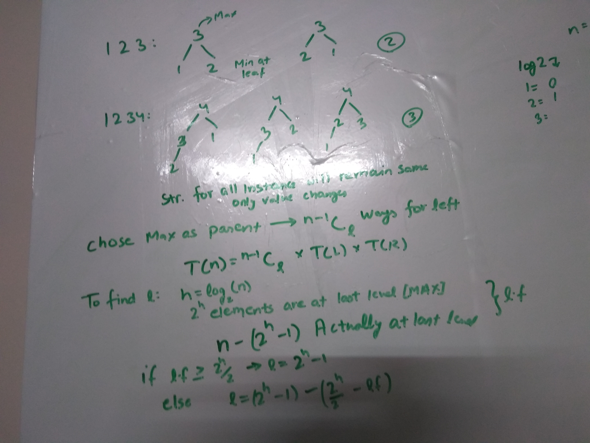

# Heaps and Maps
## 53. N Max Pair Combinations
https://www.interviewbit.com/problems/n-max-pair-combinations/
```c++
vector<int> Solution::solve(vector<int> &A, vector<int> &B)
{
    // priority_queue<int, int> my_max_heap;
    // priority_queue<int, vector<int>, greater<int> > my_min_heap;
    priority_queue<pair<int, pair<int, int> > > hp;
    set<pair<int, int> > S;
    int n = A.size();
    sort(A.begin(), A.end());
    sort(B.begin(), B.end());

    hp.push(make_pair(A[n-1]+B[n-1], make_pair(n-1, n-1)));
    S.insert(make_pair(n-1, n-1));

    vector<int> ans;
    int k=n;
    while(k--)
    {
        pair<int, pair<int, int> > top = hp.top();
        hp.pop();
        ans.push_back(top.first);
        int L = top.second.first;
        int R = top.second.second;

        if( R>0 && L>=0  && S.find(make_pair(L,R-1)) == S.end() )
        {
            hp.push(make_pair(A[L]+B[R-1], make_pair(L,R-1)));
            S.insert(make_pair(L,R-1));
        }
        if( R>=0  && L>0 && S.find(make_pair(L-1, R))==S.end())
        {
            hp.push(make_pair(A[L-1]+B[R], make_pair(L-1,R)));
            S.insert(make_pair(L-1, R));
        }
    }
    return ans;
}
```

## 54. Ways To Form Max Heap
https://www.interviewbit.com/problems/ways-to-form-max-heap/<br>
https://www.geeksforgeeks.org/number-ways-form-heap-n-distinct-integers/<br>

```c++
#define MAXN 105
int dp[MAXN];

int getLeft(int n)
{
    if (n == 1) return 0;

    int h = log2f(n);
    int numh = (1 << h);
    int last = n - ((1 << h) - 1);
    if (last >= (numh / 2)) return (1 << h) - 1;
    else return (1 << h) - 1 - ((numh / 2) - last);
}
int numberOfHeaps(int n)
{
    if (n <= 1) return 1;
    if (dp[n] != -1) return dp[n];

    int left = getLeft(n);
    int ans = (nCk(n - 1, left) * numberOfHeaps(left)) * (numberOfHeaps(n - 1 - left));
    dp[n] = ans;
    return ans;
}
```

## 55. Merge K Sorted List
https://www.interviewbit.com/problems/merge-k-sorted-lists/
```c++
ListNode* Solution::mergeKLists(vector<ListNode*> &A)
{
    map<int, int> myMap;
    for (int i = 0; i < A.size(); ++i)
    {
        ListNode* cur = A[i];
        while (cur != NULL)
        {
            myMap[cur->val]++;
            cur = cur->next;
        }
    }

    ListNode* head = NULL;
    ListNode* cur = NULL;
    for (auto it = myMap.begin(); it != myMap.end(); ++it)
    {
        while (it->second != 0)
        {
            ListNode* list = new ListNode(it->first);
            if (head == NULL)
                head = list, cur = list;
            else
                cur->next = list, cur = cur->next;
            it->second--;
        }
    }
    return head;
}
```

## 56. LRU Cache
https://www.interviewbit.com/problems/lru-cache/
```c++
/*
LRU = Least Recently Used Cache
say a cache of size 4 we insert 0 then 1 then 2 then 3 i.e our cache becomes 3 2 1 0
if we insert another item size becomes 5 we can only have a capacity of 4 so while insertion least recently used gets deleted i.e. 4 3 2 1 [0 gets deleted]
If we access say 2 then it becomes 2 4 3 1 Now if we insert 5, 1 gets removed i.e. 5 2 4 3

this get & set function should be in O(1)
*/
struct Node { int val; Node *next, *prev; };
unordered_map<int, int> myMap;
int maxI, current;
Node *first, *lru;  //Doubly linked list stores key which needs to lookup from hashmap

LRUCache::LRUCache(int capacity)
{
    myMap.erase(myMap.begin(), myMap.end());
    maxI = capacity;
    current = 0;
    first = NULL;
    lru = NULL;
}
int LRUCache::get(int key)
{
    if (current > 0)
    {
        auto it = myMap.find(key);
        if (it != myMap.end())
        {
            int val = it->first;
            int temp = it->second;
            Node *cur = first;
            while (cur->val != val) cur = cur->next;
            Node *prev = cur->prev;
            Node *next = cur->next;
            if (prev != NULL)
            {
                prev->next = next;
                if (next == NULL) lru = prev;
                else next->prev = prev;
                cur->next = first;
                cur->prev = NULL;
                first->prev = cur;
                first = cur;
            }
            return temp;
        }
    }
    return -1;
}
void LRUCache::set(int key, int value)
{
    if (myMap.find(key) == myMap.end())
    {
        Node *temp = new Node{key, NULL, NULL};
        myMap.insert({key, value});
        if (current != maxI)
        {
            current++;
            if (current == 1)
            {
                lru = temp;
                first = lru;
            }
            else
            {
                temp->next = first;
                first->prev = temp;
                first = temp;
            }
        }
        else
        {
            int t = lru->val;
            myMap.erase(myMap.find(t));
            if (lru->prev != NULL)
            {
                Node *toDelete = lru;
                lru = lru->prev;
                lru->next = NULL;
                temp->next = first;
                first->prev = temp;
                first = temp;
                delete(toDelete);
            }
            else
            {
                lru = temp;
                first = lru;
            }
        }
    }
    else
    {
        myMap[key] = value;
        Node *cur = first;
        while (cur->val != key) cur = cur->next;
        Node *prev = cur->prev;
        Node *next = cur->next;
        if (prev != NULL)
        {
            prev->next = next;
            if (next == NULL) lru = prev;
            else next->prev = prev;
            cur->next = first;
            cur->prev = NULL;
            first->prev = cur;
            first = cur;
        }
    }
}
```

# Tree Data Structure
## 57. Hotel Reviews
https://www.interviewbit.com/problems/hotel-reviews/
```c++
struct node
{
    char data;
    unordered_map<char, node*> next;
    bool isTerminal;
    node(char d)
    {
        data = d;
        isTerminal = false;
    }
};

class Trie
{
    node* root;
public:
    Trie()
    {
        root = new node('\0');
    }
    void addWord(string word)
    {
        node* temp = root;
        for (int i = 0; word[i] != '\0'; ++i)
        {
            char ch = word[i];
            if (temp -> next.count(ch) == 0)
            {
                node* child = new node(ch);
                temp -> next[ch] = child;
                temp = child;
            }
            else
                temp = temp -> next[ch];
        }
        temp->isTerminal = true;
    }
    bool search(string word)
    {
        node* temp = root;
        for (int i = 0; word[i] != '\0'; ++i)
        {
            char ch = word[i];
            if (temp -> next.count(ch))
                temp = temp -> next[ch];
            else
                return false;
        }
        return temp -> isTerminal;
    }
};

vector<string> tokenize(string x)
{
    vector<string> res;
    string temp = "";
    for (int i = 0; i < x.size(); ++i)
    {
        if (x[i] == '_')
        {
            res.push_back(temp);
            temp = "";
        }
        else temp += x[i];
    }
    res.push_back(temp);
    return res;
}

vector<int> Solution::solve(string A, vector<string> &B)
{
    Trie trie;
    vector<string> goodWords = tokenize(A);
    for (string x : goodWords) trie.addWord(x);
    vector< pair<int, int> > ans;
    for (string x : B)
    {
        vector<string> words = tokenize(x);
        int score = 0;
        for (string y : words) score += (trie.search(y)) ? 1 : 0;
        ans.push_back(make_pair(score, ans.size()));
    }
    sort(ans.begin(), ans.end(), [](const pair<int, int> &a, const pair<int, int> &b)
    {
        if (a.first == b.first) return a.second < b.second;
        else return a.first > b.first;
    });
    vector<int> out;
    for (auto x : ans) out.push_back(x.second);
    return out;
}
```

## 58. Identical Binary Tree
https://www.interviewbit.com/problems/identical-binary-trees/
```c++
int checkSame (TreeNode* A, TreeNode* B)
{
    if (A == NULL && B == NULL) return 1;
    else if ((A == NULL && B != NULL) || (A != NULL && B == NULL)) return 0;
    else if (A->val == B->val) return min(checkSame(A->left, B->left), checkSame(A->right, B->right));
    return 0;
}
```

## 59. Symmetric Binary Tree
https://www.interviewbit.com/problems/symmetric-binary-tree/
```c++
int check(TreeNode *A, TreeNode *B)
{
    if (A == NULL && B == NULL) return 1;
    else if ((A == NULL && B != NULL) || (A != NULL && B == NULL)) return 0;
    else if (A->val == B->val) return min(check(A->left, B->right), check(A->right, B->left));
    return 0;
}
int Solution::isSymmetric(TreeNode* A)
{
    if (A == NULL) return 1;
    return check(A->left, A->right);
}
```

## 60. Inorder Traversal Of Cartesian Tree
https://www.interviewbit.com/problems/inorder-traversal-of-cartesian-tree/
```c++
int findMax(vector<int> &A, int start, int end)
{
    int max = A[start];
    int index = start;
    for (int i = start; i <= end; ++i)
    {
        if (max < A[i])
        {
            max = A[i];
            index = i;
        }
    }
    return index;
}
TreeNode* makeCart(vector<int> &A, int start, int end)
{
    if (start > end) return NULL;
    int maxIn = findMax(A, start, end);
    TreeNode* root = new TreeNode(A[maxIn]);
    root->left = makeCart(A, start, maxIn-1);
    root->right = makeCart(A, maxIn+1, end);
    return root;
}
TreeNode* Solution::buildTree(vector<int> &A)
{
    return makeCart(A, 0, A.size()-1);
}
```
Simmilarly https://www.interviewbit.com/problems/binary-tree-from-inorder-and-postorder/
```c++
TreeNode* solve(vector<int> &A, unordered_map<int, int> &B, int l, int r)
{
    if (l > r) return NULL;
    int index = l;
    int rightmost = INT_MIN;
    for (int i = l; i <= r; ++i)
    {
        if (B[A[i]] > rightmost)
        {
            rightmost = B[A[i]];
            index = i;
        }
    }
    TreeNode *root = new TreeNode(A[index]);
    root->left = solve(A, B, l, index-1);
    root->right = solve(A, B, index+1, r);
    return root;
}
TreeNode* Solution::buildTree(vector<int> &A, vector<int> &B)
{
    unordered_map<int, int> mp;
    for (int i = 0; i < B.size(); ++i)
        mp[B[i]] = i;

    return solve(A, mp, 0, A.size()-1);
}
```

## 61. 2 Sum Binary Tree
https://www.interviewbit.com/problems/2sum-binary-tree/
```c++
if (!A) return 0;
stack<TreeNode *> s1, s2;
TreeNode* temp1 = A, *temp2 = A;
while (temp1)
{
    s1.push(temp1);
    temp1 = temp1->left;
}
while (temp2)
{
    s2.push(temp2);
    temp2 = temp2->right;
}
temp1 = s1.top(), temp2 = s2.top();
while (temp1 && temp2 && temp1->val < temp2->val)
{
    if (temp1->val + temp2->val == B) return 1;
    if (temp1->val + temp2->val < B)
    {
        s1.pop();
        temp1 = temp1->right;
        while (temp1)
        {
            s1.push(temp1);
            temp1 = temp1->left;
        }
        temp1 = s1.top();
    }
    else
    {
        s2.pop();
        temp2 = temp2->left;
        while (temp2)
        {
            s2.push(temp2);
            temp2 = temp2->right;
        }
        temp2 = s2.top();
    }
}
return 0;
```

## 62. Invert The Binary Tree
https://www.interviewbit.com/problems/invert-the-binary-tree/
```c++
void invert(TreeNode* root)
{
    if (root == NULL) return;
    invert(root->left);
    invert(root->right);

    TreeNode* temp = root->left;
    root->left = root->right;
    root->right = temp;
}
```

## 63. Max & Min Depth
https://www.interviewbit.com/problems/max-depth-of-binary-tree/<br>
https://www.interviewbit.com/problems/min-depth-of-binary-tree/
```c++
int maxdepth(TreeNode* root)
{
    if(root == NULL) return 0;
    return max(1 + depth(root->left), 1 + depth(root->right));
}
int mindepth(TreeNode* root)
{
    if(root == NULL) return 0;
    else if(root->left == NULL && root->right == NULL) return 1;
    else if(root->left == NULL && root->right != NULL) return 1 + depth(root->right);
    else if(root->left != NULL && root->right == NULL) return 1 + depth(root->left);
    return min(1 + depth(root->left), 1 + depth(root->right));
}
```

## 64. Shortest Unique Prefix
https://www.interviewbit.com/problems/shortest-unique-prefix/
```c++
struct Node
{
    char data;
    unordered_map<char, Node*> next;
    Node(char d) { data = d; };
};

class Trie
{
    Node* root;
public:
    Trie() { root = new Node('\0'); }
    void addWord(string word)
    {
        Node *temp = root;
        for (int i = 0; word[i] != '\0'; ++i)
        {
            char ch = word[i];
            if (temp->next.count(ch) == 0)
            {
                Node *child = new Node(ch);
                temp->next[ch] = child;
                temp = child;
            }
            else temp = temp->next[ch];
        }
    }
    string findPref(string word)
    {
        Node* temp = root;
        int merged = 0;
        for (int i = 0; word[i] != '\0'; ++i)
        {
            char ch = word[i];
            if (temp->next.size() > 1) merged = i+1;
            temp = temp->next[ch];
        }
        return word.substr(0, merged);
    }
};

vector<string> Solution::prefix(vector<string> &A)
{
    Trie trie;
    for (string s : A) trie.addWord(s);
    vector<string> sol;
    for (string s : A) sol.push_back(trie.findPref(s));
    return sol;
}
```

## 65. Least Common Ancestor
https://www.interviewbit.com/problems/least-common-ancestor/
```c++
bool find(TreeNode* root, int val)
{
    if (!root) return false;
    if (root->val == val) return true;
    if ((root->left && find(root->left, val)) || (root->right && find(root->right, val))) return true;
    return false;
}
TreeNode* LCA(TreeNode* root, int val1, int val2)
{
    if (!root) return NULL;
    if (root->val == val1 || root->val == val2) return root;
    auto L = LCA(root->left, val1, val2);
    auto R = LCA(root->right, val1, val2);
    if (L && R) return root;
    return L ? L : R;
}
int Solution::lca(TreeNode* A, int B, int C)
{
    if (!find(A, B) || !find(A, C)) return -1;
    auto ancesstor = LCA(A, B, C);
    if (ancesstor) return ancesstor->val;
    return -1;
}
```

## 66. Flatten Binary Tree to Linked List
https://www.interviewbit.com/problems/flatten-binary-tree-to-linked-list/
```c++
TreeNode* Solution::flatten(TreeNode* A)
{
    if (!A) return A;
    TreeNode *root = A;
    while (A)
    {
        if (A->left)
        {
            TreeNode *temp = A->left;
            while (temp->right) temp = temp->right;
            temp->right = A->right;
            A->right = A->left;
            A->left = NULL;
        }
        A = A->right;
    }
    return root;
}
```

## 67. BST Iterator
https://www.interviewbit.com/problems/bst-iterator/
```c++
stack<TreeNode*> path;
void pushAll(TreeNode *root)
{
    while (root)
    {
        path.push(root);
        root = root->left;
    }
}
BSTIterator::BSTIterator(TreeNode *root) { pushAll(root); }
bool BSTIterator::hasNext() { return !path.empty(); }
int BSTIterator::next()
{
    TreeNode *temp = path.top();
    path.pop();
    pushAll(temp->right);
    return temp->val;
}
```

## 68. Recover Binary Search Tree
https://www.interviewbit.com/problems/recover-binary-search-tree/
```c++
vector<int> Solution::recoverTree(TreeNode* A)
{
    vector<int> sol;
    TreeNode *first = NULL, *last = NULL, *prev = NULL, *curr = A;
    stack<TreeNode*> st;
    while (true)
    {
        if (curr)
        {
            st.push(curr);
            curr = curr->left;
        }
        else
        {
            curr = st.top();
            st.pop();
            if (prev)
            {
                if (prev->val > curr->val)
                {
                    if (!first) first = prev;
                    last = curr;
                }
            }
            prev = curr;
            curr = curr->right;
        }
        if (st.empty() &&  !curr) break;
    }
    sol.push_back(first->val);
    sol.push_back(last->val);
    sort(sol.begin(), sol.end());
    return sol;
}
```

## 69. Populate Next Right Pointers Tree
https://www.interviewbit.com/problems/populate-next-right-pointers-tree/
```c++
void Solution::connect(TreeLinkNode* A)
{
    if (A == NULL) return;
    queue< pair<int, TreeLinkNode*> > q;
    q.push({0, A});
    while (!q.empty())
    {
        pair<int, TreeLinkNode*> temp = q.front();
        int level = temp.first;
        q.pop();
        while (!q.empty() && q.front().first == level)
        {
            if (temp.second->left) q.push({level+1, temp.second->left});
            if (temp.second->right) q.push({level+1, temp.second->right});
            temp.second->next = q.front().second;
            temp = q.front();
            q.pop();
        }
        temp.second->next = NULL;
        if (temp.second->left) q.push({level+1, temp.second->left});
        if (temp.second->right) q.push({level+1, temp.second->right});
    }
}
```

https://amortizedminds.wordpress.com/2016/08/25/order-of-people-height-interviewbit/<br>
(No need of segment tree, N square solution also gets accepted. Just the question's language is confusing)