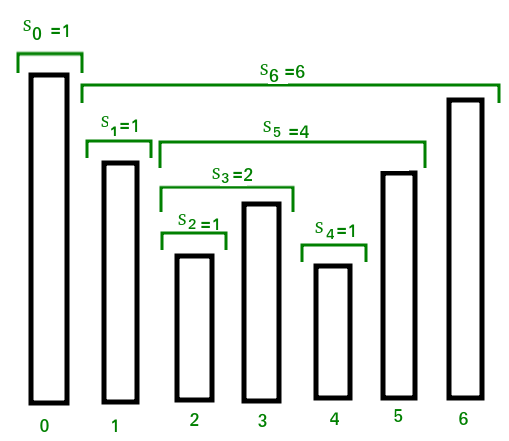
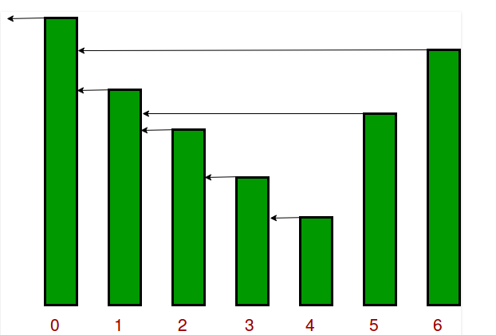

# Stacks
## 1. Implement Queue Using Stack - Adobe, Amazon, DE Shaw, Flipkart, Goldman Sachs, Microsoft, Oracle
Implemented by 2 stacks. Values in stack 1 - A, B, C then push it to stack 2 - C, B, A this way orderized for queue<br>

**Way 1: Making Dequeue Costly** Simply push in stack1 for enqueue. While for dequeue if stack2 is empty transfer from stack1 to stack2. If not empty simply pop. [transfer means poping from stack1 and moving to stack2]


## 2. Implement two stacks in an array - Samsung, Microsoft
Divide n length array to two, however this way is space inefficient. Other space efficient way is to have one array from leftmost part of array and other from rightmost.

## 3. Implement Stack using Queue - Adobe, Amazon, DE Shaw, Grofers, Oracle, Snapdeal
**Way 1: Making Push Costly** Push - Enqueue x to q2. Dequeue from q1 to q2. Swap q1 & q2 names.<br>
Pop - Dequeue from q1 and return.<br>
**Way 2: Making Pop Costly** Push - Enqueue x to q1.<br>
Pop - q1 to q2 except last element dequeue it to return it later. Swap q1 and q2. return.

In case of using only 1 queue, simply in push - enqueue x to q. dequeue and enqueue.

## 4. getMin() in stack - Abobe, Paytm, VMWare
Use another auxillary stack keeping minimum values track in it.
```
PUSH 18
[18]                            [18]
PUSH 19, 19 is > 18(prev stack2 top element) so re add it
[18, 19]                        [18, 18]
PUSH 29, 29 is > 18(prev stack2 top element) so re add it
[18, 19, 29]                    [18, 18, 18]
PUSH 15, 15 is < 18(prev stack2 top element) so add 15
[18, 19, 29, 15]                [18, 18, 18, 15]
POP
POP Top element from both stacks
```

## 6. Stock Span Problem
We need to find Stock at every day [100, 80, 60, 70, 60, 75, 85] Stock is defined as maximum number of consecutive days just before the given day, for which the price of the stock on the current day is less than or equal to its price on the given day
<br><br>
<br><br>
```c
stack<int> st;
st.push(0);
ans[0] = 1;
for (int i = 1; i < n; ++i)
{
    while(!st.empty() && prices[st.top] <= prices[i])
        st.pop();
    ans[i] = (st.empty() ? (i+1) : (i-st.top()));
    st.push(i);
}
```
<u>O(N)</u>

## 7. Next Greater Element - Amazon, Payu, Samsung, Snapdeal

[4, 5, 2, 25]<br>
[4=-1] st=0<br>
[4=-1, 5=-1] st=0, 1        val[1] >= val[0] pop0 before pushing<br>
[4=5, 5=-1, 2=-1] st=1, 2<br>
[4=5, 5=-1, 2=-1, 25=-1] st=1, 2, 3<br>
[4=5, 5=25, 2=25, 25=-1] st=1, 2, 3<br>
```c
stack<int> st;
unordered_map<int, int> ans;
st.push(a[0]);
for (int i = 1; i < n; ++i)
{
    while(!st.empty() && st.top() < a[i])
    {
        ans[s.top()] = a[i];
        st.pop();
    }
    st.push(i);
}
while(!st.empty())
{
    ans[s.top()] = -1;
    st.pop();
}
```