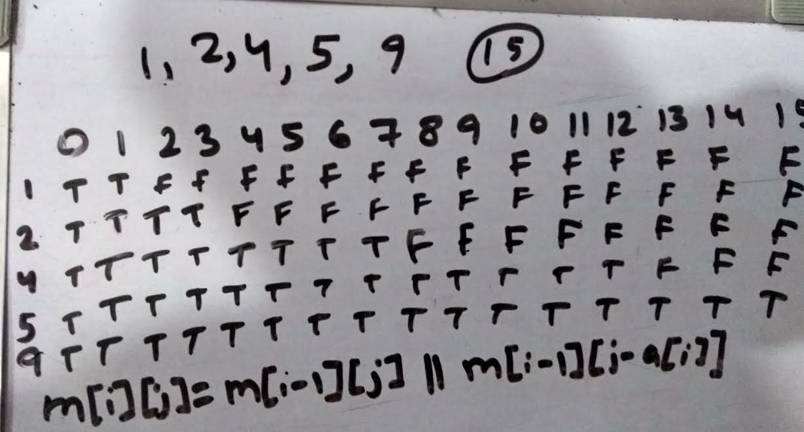
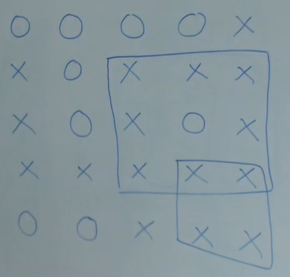

# Level 1 (Arrays, Binary Search, Two Pointer):

## Theory:
Insertion Sort, Stable sort is the sort which keeps the relative ordering of equal elements bubble insertion are stable selection sort is unstable, Merge Sort, Merge Sort (Inplace) It degrades time to N square, Inversion count using merge sort, duplicate value problems in bit manipulation (one variation: https://www.geeksforgeeks.org/find-the-element-that-appears-once-in-a-sorted-array/)

1 1 2 2 3 = logN
```c++
int l = 0, r = n-1;
while (l < r)
{
    int mid = l + (r-l)/2;
    if (mid&1)
    {
        if (arr[mid] == arr[mid-1]) l = mid+1;
        else r = mid-1;
    }
    else
    {
        if (arr[mid] == arr[mid+1]) l = mid+2;
        else r = mid;
    }
}
cout << arr[l] << endl;
```

```c++
//Counting inversion merge sort
int invCount(vector<int> &arr)
{
    int inv_count = 0;
    for (int i = 0; i < arr.size(); ++i)
    {
        for (int j = i+1; j < arr.size(); ++j)
            if (arr[i] > arr[j]) inv_count++;
    }
    return inv_count;
}

int merge(vector<int> &arr, int l, int m, int r)
{
    vector<int> temp = arr;
    int i = l, j = m+1, k = l, inv_count = 0;
    while (i <= m && j <= r)
    {
        if (temp[i] > temp[j]) arr[k++] = temp[j++], inv_count += m-i+1;
        else arr[k++] = temp[i++];
    }
    while (i <= m) arr[k++] = temp[i++];
    while (j <= r) arr[k++] = temp[j++];
    return inv_count;
}

int mergeSort(vector<int> &arr, int l, int r)
{
    int inv_count = 0, m = (l+r)/2;
    if (l < r)
    {
        inv_count += mergeSort(arr, 0, m);
        inv_count += mergeSort(arr, m+1, r);
        inv_count += merge(arr, 0, m, r);
    }
    return inv_count;
}
```

Given array [1, 2, 4, 2, 1] finding xor 1^2^4^2^1 = xor(1^1)^(2^2)^(4) = 0^0^4 = 4

Given Array [1, 1, 2, 2, 4, 5] we need to find both 4 & 5<br>
If we simply xor all numbers we will get 4^5 which will definitely be non zero. (100)^(101)=(001) Now if we divide the array elements into two one having 1 at unit place other having 0. [1, 1, 5], [2, 2, 4] take xor of both to get the ans<br>
If 100(4) & 110(6) are non repeating numbers we need to divide the array based on tense (check rightmost set bit pos) place set or unset
```c++
int arr[] = {1, 1, 2, 2, 3, 9};
int n = sizeof(arr) / sizeof(int);
int xors = 0;
for (int i = 0; i < n; ++i) xors ^= arr[i];

int temp = 0;
while(xors > 0)
{
    if (xors&1) break;
    ++temp;
    xors = xors&(xors-1);
}
int mask = 1<<temp;

int num1 = 0, num2 = 0;
for (int i = 0; i < n; ++i)
{
    if (((arr[i]&mask)>>temp)&1) num1 ^= arr[i];
    else num2 ^= arr[i];
}
cout << num1 << " " << num2 << endl;
```

Given array [7, 7, 3, 4, 2, 4, 3, 3, 4, 7] all numbers except one is occuring thrice we need to find that number.<br>
add binary position values (111 + 111 + 011 + 100 + 010 + 100 + 011 + 011 + 100 + 111) = 676 %3 all digit = 010 = 0.2<sup>0</sup> + 1.2<sup>1</sup> + 0.2<sup>2</sup> = 2
```c++
int arr[] = {7, 11, 3, 4, 9, 4, 3, 3, 4, 7, 9, 9, 7};
    int n = sizeof(arr) / sizeof(int);

    int count[32] {};
    for (int i = 0; i < n; ++i)
    {
        int cur = arr[i], pos = 0;
        while (cur > 0)
        {
            if (cur&1) ++count[pos];
            ++pos;
            cur >>= 1;
        }
    }
    int ans = 0;
    for (int i = 0; i < 32; ++i) ans += pow(2, i) * (count[i] % 3);
    cout << ans << endl;
```

### Calculating number of set bits
```c++
int countBits(int n)
{
    //Time: O(number of bits)
    int count = 0;
    while (n > 0)
    {
        count += (n&1);
        n = n>>1;
    }
    return count;

    //Time: O(number of set bits)
    int count = 0;
    while(n)
    {
        ++count;
        n = n&(n-1);
    }

    // __builtin_popcount(n); or __builtin_popcountl or __builtin_popcountll
}
```

Quick Sort, Counting Sort, Radix Sort, Why Kaden Algorithm Work (https://www.youtube.com/watch?v=86CQq3pKSUw)
```c++
//counting set bit n&(n-1) technique, n&(n-1) means closest set bit
while (n)
{
  ++count;
  n = n&(n-1);
}
```
| A ∪ B ∪ C | = | A | + | B | + | C | - | A ∩ B | - | B ∩ C | - | C ∩ A | + | A ∩ B ∩ C|<br>
| A ∪ B ∪ C ∪ ... | = { SINGLE SUMS } - { DOUBLE PAIRS SUM } + { TRIPLE PAIRS SUM } - { FOUR PAIRS SUM } + ...

Find numbers less than 1000 divisible by 2, 3 & 5<br>
Numbers less then N divisible by m are floor((N - 1) / m) So:<br>
Divisible by 2 = 449<br>
Divisible by 3 = 333<br>
Divisible by 5 = 199<br>
Divisible by 2.5 = 99<br>
Divisible by 3.5 = 66<br>
Divisible by 2.3 = 166<br>
Divisible by 2.3.5 = 33<br>
| 2 ∪ 3 ∪ 5 | = 499 + 133 + 199 - 99 - 66 - 166 + 33 = 733

Numbers between 1 and n which are divisible by any of the prime numbers less than 20
```c++
ll t;
cin >> t;
while (t--)
{
    ll num;
    cin >> num;
    ll arr[] = { 2, 3, 5, 7, 11, 13, 17, 19 };
    ll n = sizeof(arr) / sizeof(ll);
    ll result = 0;
    for (ll i = 1; i < (1<<n); ++i)
    {
        ll mask = i, temp = 1, pos = 0, product = 1ll, bits = __builtin_popcount(mask);
        while (mask > 0)
        {
            ll lastBit = (mask&1);
            if (lastBit) product *= arr[pos];
            mask >>= 1;
            ++pos;
        }
        if (bits&1) result += num/product;
        else result -= num/product;
    }
    cout << result << endl;
}
```
Difference Array, Square Root Decomposition

Ternary Search is also there which is same as binary search except instead of dividing in 2 parts we divide it in 3 parts.

Binary search is better than ternary search because <br>
T(n) = T(n/2) + 2 [In Binary Search]<br>
T(n) = T(n/3) + 4 [In Ternary Search]<br>
in binary search: 2log<sub>2</sub>n complexity while in ternary search: 4log<sub>3</sub>n calculating mathematically binary search is better.

## Questions(39):
1) Merge Overlap: https://www.interviewbit.com/problems/merge-overlapping-intervals/
2) Hotel Booking Problem: https://www.interviewbit.com/problems/hotel-bookings-possible/
    - Same question but check if consecutive values are equal: https://practice.geeksforgeeks.org/problems/minimum-platforms/0
3) Largest Number: https://www.interviewbit.com/problems/largest-number/
4) Max Distance: https://www.interviewbit.com/problems/max-distance/
5) First Missing Integer: https://www.interviewbit.com/problems/first-missing-integer/
    - (N*(N+1))/2: https://practice.geeksforgeeks.org/problems/missing-number-in-array/0
6) Duplicate in Array: https://www.interviewbit.com/problems/find-duplicate-in-array/
7) Maximum Consecutive Gap: https://www.interviewbit.com/problems/maximum-consecutive-gap/
8) Sum of pairwise hamming distance: https://www.interviewbit.com/problems/sum-of-pairwise-hamming-distance/
9) Array Rotation Problem: https://practice.geeksforgeeks.org/problems/rotate-array-by-n-elements/0
10) Flip: https://www.interviewbit.com/problems/flip/
11) Square root of number: https://www.interviewbit.com/problems/square-root-of-integer/
    - First, Last occurence of a element using binary search: https://leetcode.com/problems/find-first-and-last-position-of-element-in-sorted-array/
12) Rotated Sorted array search: https://www.interviewbit.com/problems/rotated-sorted-array-search/
13) Matrix Median OR Sort 100s of sorted array without combining: https://www.interviewbit.com/problems/matrix-median/
14) Median Of Array: https://www.interviewbit.com/problems/median-of-array/
15) Next Permutation: https://leetcode.com/problems/next-permutation/
16) Painter Partition Problem: https://www.interviewbit.com/problems/painters-partition-problem/
    - Allocate Book: https://www.interviewbit.com/problems/allocate-books/
17) Min XOR Value: https://www.interviewbit.com/problems/min-xor-value/
18) Minimize problem: https://www.interviewbit.com/problems/minimize-the-absolute-difference/
    - Count Triplets: https://practice.geeksforgeeks.org/problems/count-the-triplets/0
    - 3 Sum: https://www.interviewbit.com/problems/3-sum/
    - 4 Sum: https://leetcode.com/problems/4sum/
    - Array 3 Pointers: https://www.interviewbit.com/problems/array-3-pointers/
    - DiffK: https://www.interviewbit.com/problems/diffk/
    - Pythagorean Triplet: https://practice.geeksforgeeks.org/problems/pythagorean-triplet/0
19) Container with most water: https://www.interviewbit.com/problems/container-with-most-water/
20) Equilibruim Point: https://practice.geeksforgeeks.org/problems/equilibrium-point/0
    - Trapping Rain Water: https://practice.geeksforgeeks.org/problems/trapping-rain-water/0
    - Stock buy and sell: https://practice.geeksforgeeks.org/problems/stock-buy-and-sell/0
21) Max continuous 1s: https://www.interviewbit.com/problems/max-continuous-series-of-1s/
    - Subarray with given sum: https://practice.geeksforgeeks.org/problems/subarray-with-given-sum/0
22) Voting Algorithm: https://www.interviewbit.com/problems/majority-element/
    - N/3 Repeat Number: https://www.interviewbit.com/problems/n3-repeat-number/
23) Kth Smallest Element: https://practice.geeksforgeeks.org/problems/kth-smallest-element/0
    - Kth Largest In a Stream: https://practice.geeksforgeeks.org/problems/kth-largest-element-in-a-stream/0
24) https://www.geeksforgeeks.org/count-number-of-triplets-with-product-equal-to-given-number-with-duplicates-allowed-set-2/
25) Longest subarray having average greater than or equal to x: https://www.geeksforgeeks.org/longest-subarray-having-average-greater-than-or-equal-to-x/

Avoid TLE: Use printf/scanf, use array instead of vectors

Find Peak Element in O(logN): https://leetcode.com/problems/find-peak-element/solution/<br>
Doing in O(N) is very simple, for logN we will use binary search
```c++
class Solution {
public:
    int findPeakElement(vector<int>& nums) {
        int l = 0, r = nums.size() - 1;
        while (l < r)
        {
            int mid = l + (r-l)/2;
            if (nums[mid] > nums[mid + 1]) r = mid;
            else l = mid + 1;
        }
        return l;
    }
};
```

26) Fraction to Recurring Decimal: https://leetcode.com/problems/fraction-to-recurring-decimal/
27) https://leetcode.com/problems/zigzag-conversion/submissions/
28) https://leetcode.com/problems/integer-to-roman/
29) https://leetcode.com/problems/roman-to-integer/
30) https://leetcode.com/problems/multiply-strings

[Advance]<br>
Square Root Decomposition https://www.geeksforgeeks.org/sqrt-square-root-decomposition-technique-set-1-introduction/

# Level 2 (String, Linked List, Stacks, Queues, Heap, Map):
## Theory:
String Builder & String Stream(ostringstream), Tries (Node: char data, bool isTerminal, unoredered_map<char, Node*> next;), Why Floyd's Algorithm work (https://www.youtube.com/watch?v=LUm2ABqAs1w), Infix, Prefix, Postfix, Arithematic solver type problems, Delete without a head pointer just a node which has to be deleted will be given [ ans: (*node) = *(node->next); ] also free that node's memory

Trie, Suffix Tree, Suffix Array (Only basics not in depth) https://www.hackerearth.com/practice/notes/trie-suffix-tree-suffix-array/
```
Implement Google spell-corrector. What data structure will you use and how will it work?
(I suggested the first trie but later on made it more efficient by using suffix array data structure. They asked me to implement all operation of suffix array).(They liked my approach).
```

Kth from last element (simply ek loop me linked list ka size pata karlo then dusre me n-k pe chale jaao BUT WHAT ARE OTHER WAYS? say size allowed naaho toh simply k element tak jaao then ek aur pointer lo jo head pe ho now dono ko chalao jabktak null naa hojaye pehla wala dusra wala pointer is the ans)<br>
https://leetcode.com/problems/remove-nth-node-from-end-of-list/

Sort Stack (WAP to sort a stack such that the smallest items are on the top. You can use additional temporary stack but not array or other data structure just stack)
```c++
/*
One approach is to keep finding minimum put it on the stack but this will require in total of 3 stacks i.e. 2 extra but we can only use 1 extra.
*/

stack<int> addit;
while (!st.empty())
{
    int temp = st.pop();
    while (!addit.empty() && addit.top() > temp) st.push(addit.pop());
    addit.push(temp);
}
while (!addit.empty()) st.push(addit.pop());

// This above one is O(N square)
// If we had infinite stacks then we could have used merge sort tab O(logN) hota complexity
```

```c++
// GCD OF Strings https://leetcode.com/problems/greatest-common-divisor-of-strings/
class Solution {
public:
    string gcdOfStrings(const string& s1, const string& s2)
    {
        return (s1 + s2 == s2 + s1) ? s1.substr(0, __gcd(s1.size(), s2.size())) : "";
    }
};
```

```c++
// Given 4 coordinates x1, y1, x2, y2 of rectangle bottom left and top right and x3, y3... for other rec. Find if it intersect
class Solution {
public:
    bool isRectangleOverlap(vector<int>& rec1, vector<int>& rec2) {
        int x1 = rec1[0], y1 = rec1[1], x2 = rec1[2], y2 = rec1[3];
        int x3 = rec2[0], y3 = rec2[1], x4 = rec2[2], y4 = rec2[3];
        return (min(x2, x4) > max(x3, x1)) && (min(y2, y4) > max(y3, y1));
    }
};
```
https://leetcode.com/problems/partition-labels/<br>
https://leetcode.com/problems/custom-sort-string/
```c++
class Solution {
public:
    string customSortString(string S, string T) {
        sort(T.begin(), T.end(), [&](char a, char b)
             { return S.find(a) < S.find(b); });
        return T;
    }
};
```
String find implementation (Pattern Matching)
```c++
// Brute force O(MN)
class Solution {
public:
    int strStr(string haystack, string needle) {
        for (int i = 0; ; ++i)
        {
            for (int j = 0; ; ++j)
            {
                if (j == needle.size()) return i;
                if (i + j == haystack.size()) return -1;
                if (needle[j] != haystack[i+j]) break;
            }
        }
    }
};
// https://www.youtube.com/watch?v=qQ8vS2btsxI      Rabin Karp
// https://www.youtube.com/watch?v=V5-7GzOfADQ      KMP
```

```c++
// Number is palindrome check
bool isPalindrome(int x)
{
    if(x < 0) return false;
    int div = 1;
    while(x / div >= 10) div *= 10;
    while(x != 0)
    {
        int l = x / div;
        int r = x % 10;
        if (l != r) return false;
        x = (x % div) / 10;
        div /= 100;
    }
    return true;
}
```

## Questions(35):
1) [Trie] Hotel Reviews: https://www.interviewbit.com/problems/hotel-reviews/
    - Shortest Unique Prefix: https://www.interviewbit.com/problems/shortest-unique-prefix/
2) [Trie] Palindrome Pair in array of word: https://www.geeksforgeeks.org/palindrome-pair-in-an-array-of-words-or-strings
    - https://leetcode.com/problems/longest-common-prefix/
3) Longest Distinct characters in string: https://practice.geeksforgeeks.org/problems/longest-distinct-characters-in-string/0
    - Longest Substring Without Repeat: https://www.interviewbit.com/problems/longest-substring-without-repeat/
4) Reverse linked list: https://practice.geeksforgeeks.org/problems/reverse-a-linked-list/1
    - K Reverse Linked List: https://www.interviewbit.com/problems/k-reverse-linked-list/
    - Reverse Linked List within a range: https://www.interviewbit.com/problems/reverse-link-list-ii/
    - Palindrome List: https://www.interviewbit.com/problems/palindrome-list/
5) Detect Loop: https://practice.geeksforgeeks.org/problems/detect-loop-in-linked-list/1
    - Loop begining detect: https://www.interviewbit.com/problems/list-cycle/
    - Loop remove: https://practice.geeksforgeeks.org/problems/remove-loop-in-linked-list/1
6) Intersection Point in Y Shapped Linked Lists: https://practice.geeksforgeeks.org/problems/intersection-point-in-y-shapped-linked-lists/1
7) Merge Sort Linked List: https://www.interviewbit.com/problems/sort-list/
    - Insertion Sort: https://www.interviewbit.com/problems/insertion-sort-list/
8) Reorder List: https://www.interviewbit.com/problems/reorder-list/
    - https://practice.geeksforgeeks.org/problems/clone-a-linked-list-with-next-and-random-pointer/1
9) Nearest Smallest Element: https://www.interviewbit.com/problems/nearest-smaller-element/
    - Next Larger Number: https://practice.geeksforgeeks.org/problems/next-larger-element/0
10) Largest Rectangle In Histogram: https://www.interviewbit.com/problems/largest-rectangle-in-histogram/
11) Sliding Window: https://www.interviewbit.com/problems/sliding-window-maximum/
    - Maximum of all subarrays of size k: https://practice.geeksforgeeks.org/problems/maximum-of-all-subarrays-of-size-k/0
12) Min Stack: https://www.interviewbit.com/problems/min-stack/
13) Queue using 2 stacks: https://www.youtube.com/watch?v=t6XzDmXzSFY
    - Stack using 2 queues: https://www.youtube.com/watch?v=Wn45fJKBTTc
14) LRU Cache: https://www.interviewbit.com/problems/lru-cache/
    - Page faults in LRU: https://practice.geeksforgeeks.org/problems/page-faults-in-lru/0
15) Circular Tour: https://practice.geeksforgeeks.org/problems/circular-tour/1
    - Simmilar: https://www.interviewbit.com/problems/gas-station/
16) First Non Repeating Character In a Stream: https://practice.geeksforgeeks.org/problems/first-non-repeating-character-in-a-stream/0
17) Median Of Stream Of Running Integers: https://practice.geeksforgeeks.org/problems/find-median-in-a-stream/0
18) Heap Sort:
```c++
/*
Heap Sort code is very easy ekk bar samjhne ke baad XD
heap is in array form, array liya seedha uspe heapify call kardia for all non leaves i.e. from i = 0; i < n/2.
Eesi ko but reverse me call kara he because child pe heapify call hoga then parent pe ulta kara toh gadbad ho sakti he asli heap nahi rahega

Proper heap banna now uska 0th element is always maximum usse le lo aur last me daaldo now again heapify call karo but ignore kardo uss last wale ko because wo sorted he already bacche pe heapify call kara i tak hi
*/
// O(logN)
void heapify(int arr[], int n, int i)
{
    int parent = i, left = 2*i + 1, right = 2*i + 2;
    if (left < n && arr[parent] < arr[left])
    {
        swap(arr[left], arr[parent]);
        heapify(arr, n, left);
    }
    else if (right < n && arr[parent] < arr[right])
    {
        swap(arr[right], arr[parent]);
        heapify(arr, n, right);
    }
}

// Heap sort overall is O(NlogN) in any case best avg worst
void heapSort(int arr[], int n)
{
    for (int i = n/2-1; i >= 0; --i) heapify(arr, n, i);    //Building heap part O(N)
    for (int i = n-1; i >= 0; --i)
    {
        swap(arr[0], arr[i]);
        heapify(arr, i, 0);
    }
}
/*
Heap sort is unstable sort
Time complexity analysis for building heap:
N ke order loop and heapify is O(logN) means building heap is O(NlogN)? WRONG it's O(N)
https://www.geeksforgeeks.org/time-complexity-of-building-a-heap/
Get a concrete idea out of it interview me derrivation nahi karayenge
*/
```
19) N Max Pair Combinations: https://www.interviewbit.com/problems/n-max-pair-combinations/
20) Merge K Sorted Linked List: https://www.interviewbit.com/problems/merge-k-sorted-lists/
21) Rearrange characters: https://practice.geeksforgeeks.org/problems/rearrange-characters/0
22) Longest consecutive subsequence: https://leetcode.com/problems/longest-consecutive-sequence/

# Level 3 (Hashing, Greedy, Trees, Graph):
## Theory:
Huffman Coding, Fractional Knapsack, Minimum Spanning Tree, Disjoint Sets
```c++
// Iterative code is important because it's faster, recursive code is simpler but slower
void inOrder(Node *root)
{
    stack<Node *> s;
    Node *curr = root;
    while (curr != NULL || !s.empty())
    {
        while (curr != NULL)
        {
            s.push(curr);
            curr = curr->left;
        }
        curr = s.top();
        s.pop();
        cout << curr->data << " ";
        curr = curr->right;
    }
}
void preOrder(Node *root)
{
    stack<Node *> s;
    s.push(root);
    while (!s.empty())
    {
        Node *curr = s.top();
        cout << curr->data << " ";
        s.pop();

        if (curr->right) s.push(curr->right);
        if (curr->left) s.push(curr->left);
    }
}
void postOrder(Node *root)
{
    stack<Node*> s;
    stack<int> out;
    s.push(root);

    while (!s.empty())
    {
        Node *curr = s.top();
        out.push(curr->data);
        s.pop();

        if (curr->left) s.push(curr->left);
        if (curr->right) s.push(curr->right);
    }

    while (!out.empty())
    {
        cout << out.top() << " ;
        out.pop();
    }
}
void BFS(Node *root)
{
    queue< pair<Node*, int> > q;
    q.push({A, 0});
    while (!q.empty())
    {
        int cur_level = q.front().second;
        while (!q.empty() && q.front().second == cur_level)
        {
            Node *cur = q.front().first;
            q.pop();
            cout << cur->val << " ";
            if (cur->left) q.push({cur->left, cur_level+1});
            if (cur->right) q.push({cur->right, cur_level+1});
        }
        cout << endl;
    }
}
// Time complexity of BFS & DFS both are O(V+E) if we use adjancey list otherwise if adjancey matrix then O(V^2)
```
Prims Algorithm (https://www.youtube.com/watch?v=4ZlRH0eK-qQ&t=479s, https://www.youtube.com/watch?v=oP2-8ysT3QQ), Prim's basically chota edge lo then keep taking corresponding connected chote edges till all vertex are taken. Par if we itterate over all neighbours to find minimum corresponding it will make it O(N^2) in worst case for graph with n neighbours connected. This will be okay if we have dense graph but otherwise time complexity zyada he. Second video above shows using heap to find in O(1) time the minimum hence reducing complexity par still logN time toh lagega decrease karne me.

Kruskal's Algorithm O(ElogV), better than Prims even optimal for sparse graph. Kruskal is implemented through Disjoint Set (https://www.youtube.com/watch?v=fAuF0EuZVCk)
```c++
//Disjoint Set
struct Node
{
    int data;
    Node *parent;
    int rank;
};
class DisjointSet
{
public:
    unordered_map<int, Node*> rec;
    void makeSet(int data)
    {
        Node *node = new Node{data, NULL, 0};
        node->parent = node;
        rec[data] = node;
    }
    Node *findSet(int data)
    {
        if (rec.find(data) == rec.end()) return NULL;
        else return rec[data]->parent;
    }
    void makeUnion(int a, int b)
    {
        if (a == b) return;
        Node *x = findSet(a), *y = findSet(b);
        if (x->rank >= y->rank)
        {
            x->rank = (x->rank == y->rank) ? x->rank + 1 : x->rank;
            y->parent = x;
        }
        else x->parent = y;
    }
};

//Kruskal algo code
int e, v;
cin >> e >> v;

DisjointSet<int> ds;

for (int i=0; i<e; ++i)
    ds.makeSet(i);

vector<Path> path(v);
for (int i=0; i<v; ++i)
{
    int a, b, c;
    cin >> a >> b >> c;
    path[i] = {a, b, c};
}

sort(path.begin(), path.end(), [](Path i, Path j){
    return (i.length < j.length);
}]);

cout << "-------" << endl;

for (int i=0; i<v; ++i)
{
    int a = ds.find(path[i].nodeA);
    int b = ds.find(path[i].nodeB);
    if (a != b)
    {
        ds.makeUnion(a, b);
        cout << path[i].nodeA << " " << path[i].nodeB << " - " << path[i].length << endl;
    }
}
```
Kosaraju Algorithm for strongly connected graph: Apply DFS to all unvisited nodes. As the node get's exit put it in a stack. Then find transpose of graph, transpose simply means reverse the graph arrows. Apply DFS again to the stack as per new visited set. DFS on nodes from stack.

Shortest Path finding - BFS, Dijikstra O((E+V)logV) - if adjancey list otherwise O(V^2), A Star, Bellman Ford Algorithm (https://www.youtube.com/watch?v=FtN3BYH2Zes). Floyd Warshall Algorithm (https://www.youtube.com/watch?v=oNI0rf2P9gE)

```c++
// Dijikstra algorithm using Adjancey list in O((E+V)logV) i.e O(ElogV) in worst case
// Dijikstra doesn't work with negative edges
#include <bits/stdc++.h>
using namespace std;

int main()
{
    int n, e, x, y, z;
    cin >> n >> e;
    vector< pair<int, int> > adj[n];
    for (int i = 0; i < e; ++i)
    {
        cin >> x >> y >> z;
        adj[x].push_back({y, z});
        adj[y].push_back({x, z});
    }

    bool visited[n];
    memset(visited, false, sizeof(visited));
    int shortest_path[n];
    shortest_path[0] = 0;
    for (int i = 1; i < n; ++i) shortest_path[i] = INT_MAX;

    struct qNode {int key, level, dist;};
    queue<qNode> q;
    q.push({0, 0, 0});
    while(!q.empty())
    {
        int cur_level = q.front().level;
        while(!q.empty() && q.front().level == cur_level)
        {
            auto cur = q.front();
            visited[cur.key] = true;
            q.pop();
            shortest_path[cur.key] = min(shortest_path[cur.key], cur.dist);
            for (auto x : adj[cur.key])
            {
                if (visited[x.first]) continue;
                q.push({x.first, cur.level + 1, cur.dist + x.second});
            }
        }
    }
    for (auto i : shortest_path) cout << i << " ";
    cout << endl;
    return 0;
    /*
    INPUT:
    9 14
    0 1 4
    0 7 8
    1 7 11
    7 8 7
    7 6 1
    6 8 6
    8 2 2
    1 2 8
    6 5 2
    2 5 4
    2 3 7
    3 5 14
    3 4 9
    4 5 10
    */
}
// In A star algorithm we use h value which can be heuristic value like eucledian distance and minimize sum of h and normal distance

// Dijikstra doesn not work in negative edges, greedy approach he wo so use bellman ford algorithm it's a DP approach and works in O(VE)
#include <bits/stdc++.h>
using namespace std;

int main()
{
    int n, e, x, y, z;
    cin >> n >> e;
    struct weighted_edge{int x, y, weight;};
    weighted_edge edges[e];
    for (int i = 0; i < e; ++i)
    {
        cin >> x >> y >> z;
        edges[i] = {x, y, z};
    }

    bool visited[n];
    memset(visited, false, sizeof(visited));
    int shortest_path[n];
    shortest_path[0] = 0;
    for (int i = 1; i < n; ++i) shortest_path[i] = INT_MAX;

    // Relax Vertices-1 times
    for (int i = 0; i < n-1; ++i)
    {
        for (auto edge : edges)
        {
            if (shortest_path[edge.x] != INT_MAX)
                shortest_path[edge.y] = min(shortest_path[edge.y], shortest_path[edge.x] + edge.weight);
        }
    }

    //Check for negative weight cycle, that won't work here
    for (auto edge : edges)
    {
        if (shortest_path[edge.x] != INT_MAX && shortest_path[edge.x] + edge.weight < shortest_path[edge.y])
        {
            cout << "-1" << endl;
            return 0;
        }
    }

    for (auto i : shortest_path) cout << i << " ";
    cout << endl;
    return 0;
    /*
    INPUT:
    5 8
    0 1 -1
    0 2 4
    1 2 3
    3 2 5
    3 1 1
    1 3 2
    1 4 2
    4 3 -3
    */
}

//Floyd Warshall O(N^3): All pair shortest path DP
#include <bits/stdc++.h>
using namespace std;

int main()
{
    int n, e, x, y, z;
    cin >> n >> e;
    vector< pair<int, int> > adj[n];
    int dp[n][n];
    for (int i = 0; i < n; ++i)
        for (int j = 0; j < n; ++j)
            dp[i][j] = INT_MAX;

    for (int i = 0; i < n; ++i) dp[i][i] = 0;
    for (int i = 0; i < e; ++i)
    {
        cin >> x >> y >> z;
        adj[x].push_back({y, z});
        dp[x][y] = z;
    }

    for (int k = 0; k < n; ++k)
    {
        for (int i = 0; i < n; ++i)
        {
            if (i == k) continue;
            for (int j = 0; j < n; ++j)
            {
                if (j == k || i == j) continue;
                if (dp[i][k] != INT_MAX && dp[k][j] != INT_MAX)
                    dp[i][j] = min(dp[i][j], dp[i][k] + dp[k][j]);
            }
        }
    }

    cout << setw(3);
    for (int i = 0; i < n; ++i)
    {
        for (int j = 0; j < n; ++j)
        {
            if (dp[i][j] == INT_MAX) cout << "IN" << setw(3);
            else cout << dp[i][j] << setw(3);
        }
        cout << endl;
    }
    cout << endl;
    return 0;
    /*
    INPUT:
    4 7
    0 1 3
    1 0 8
    1 2 2
    2 0 5
    2 3 1
    3 0 2
    0 3 7
    */
}
// Floyd can have negatie edge but dijikstra can't
```

## Questions(42):
1) 2 Sum: https://www.interviewbit.com/problems/2-sum/
2) Relative Sorting (Simmilar to counting sort): https://practice.geeksforgeeks.org/problems/relative-sorting/0
3) Array Pair Sum Divisibility Problem: https://practice.geeksforgeeks.org/problems/array-pair-sum-divisibility-problem/0
4) Longest Consecutive Subsequence: https://practice.geeksforgeeks.org/problems/longest-consecutive-subsequence/0
5) Anagrams: https://www.interviewbit.com/problems/anagrams/
6) Equal: https://www.interviewbit.com/problems/equal/
7) Window String: https://www.interviewbit.com/problems/window-string/
    - given 2 strings str1 and str2, you have to find the length of the smallest circular substring in str1 containing all characters of str2. For example given strings ‘hackerrank’ and ‘kh’, the answer should be 2 (and not 4 because circular substrings are allowed).
8) Points On The Straight Line: https://www.interviewbit.com/problems/points-on-the-straight-line/
9) Substring Concatenation: https://www.interviewbit.com/problems/substring-concatenation/
10) Activity Selection: https://practice.geeksforgeeks.org/problems/activity-selection/0
    - Same question but specify order: https://practice.geeksforgeeks.org/problems/n-meetings-in-one-room/0
11) Largest Number Possible: https://practice.geeksforgeeks.org/problems/largest-number-possible/0
12) Minimize The Heights: https://practice.geeksforgeeks.org/problems/minimize-the-heights/0
13) Bulbs: https://www.interviewbit.com/problems/bulbs/
14) Distributing Candy: https://www.interviewbit.com/problems/distribute-candy/
15) Tushar Birthday Bombs: https://www.interviewbit.com/problems/tushars-birthday-bombs/
16) Identical Binary Tree: https://www.interviewbit.com/problems/identical-binary-trees/
    - Symmetric Binary Tree: https://www.interviewbit.com/problems/symmetric-binary-tree/
17) Inorder Traversal Of Cartesian Tree: https://www.interviewbit.com/problems/inorder-traversal-of-cartesian-tree/
    - Binary Tree from Inorder and Preorder: https://www.interviewbit.com/problems/construct-binary-tree-from-inorder-and-preorder/
    - Binary Tree From Inorder and Postorder: https://www.interviewbit.com/problems/binary-tree-from-inorder-and-postorder/
18) Invert The Binary Tree: https://www.interviewbit.com/problems/invert-the-binary-tree/
19) 2 Sum Binary Tree: https://www.interviewbit.com/problems/2sum-binary-tree/
20) Max Depth of binary tree: https://www.interviewbit.com/problems/max-depth-of-binary-tree
    - Min Depth of binary tree: https://www.interviewbit.com/problems/min-depth-of-binary-tree/
21) Least Common Ancestor (LCA): https://www.interviewbit.com/problems/least-common-ancestor/
22) Flatten Binary Tree to Linked List: https://www.interviewbit.com/problems/flatten-binary-tree-to-linked-list/
23) BST Iterator: https://www.interviewbit.com/problems/bst-iterator/
24) Recover Binary Search Tree: https://www.interviewbit.com/problems/recover-binary-search-tree/
25) Populate Next Right Pointers Tree: https://www.interviewbit.com/problems/populate-next-right-pointers-tree/
26) Bottom View: https://practice.geeksforgeeks.org/problems/bottom-view-of-binary-tree/1
    - Binary Tree in vertical order: https://practice.geeksforgeeks.org/problems/print-a-binary-tree-in-vertical-order/1
    - Check for balanced tree: https://practice.geeksforgeeks.org/problems/check-for-balanced-tree/1
27) Maximum Width of Binary Tree: https://leetcode.com/problems/maximum-width-of-binary-tree/
28) Interesting Number: https://www.spoj.com/problems/INUMBER/
    - Smallest Multiple with 0 and 1: https://www.interviewbit.com/problems/smallest-multiple-with-0-and-1/
29) Commutable Island(Find MST): https://www.interviewbit.com/problems/commutable-islands/
30) Possibility of finishing all courses given pre-requisites: https://www.interviewbit.com/problems/possibility-of-finishing-all-courses-given-prerequisites/
31) Black Shapes: https://www.interviewbit.com/problems/black-shapes/
32) https://www.geeksforgeeks.org/find-maximum-path-sum-in-a-binary-tree/
33) https://www.geeksforgeeks.org/minimum-number-of-given-operations-required-to-make-two-strings-equal/
34) https://leetcode.com/problems/merge-two-binary-trees/description/

> A^K Power Of an adjancey matrix, means number of walks of length k between i & j

> Walk: A walk is defined as a finite alternating sequence of vertices and edges, beginning and ending with vertices such that each edge is incident with the vertices preceding and following it. No edge appear more than one in a walk, a vertex however may appear more than once. When a walk begins and ends at same vertex it is closed walk.

> Path: An open walk in which no vertex appears more than once is called a path.

# Level 4 (Backtracking & Dynamic Programming):
## Theory(DP):
Breaking complex problem it into simpler simmilar sub problems and then solving it. Also memoizing sub problems for faster re-calculation.<br>
Simplest example is calculating fibonaaci series we use F(n) = F(n-1) + F(n-2) this is breaking into simillar sub problems. We can do memoization to optimize it (optimize overlapping sub problems)

DP means - a) Memoization (Top down approach) b) Pure DP (Bottom up approach)

Recursive implementation of Fibonaaci even using memo calls stacks for recursive call 2^n times using itteration to fill a linear DP for fibonacci is O(N)

Using matrix exponentiation fibonacci can be solved in O(k^3 logN) here k is 2. We can even use golden ratio. We can also find it in O(logN) using DP idea is to use other recurence relation such that f(n) is defined in terms of f(n/2)<br>
f(2 * k) = f(k) * f(k) + f(k - 1) * f(k - 1)<br>
f(2 * k + 1) = f(k) * f(k + 1) + f(k - 1) * f(k)

1) **Number Reduce Problem:** <br>
Given a number we can either divide it by 3, 2 or subtract 1. We need to find min operation to make 1 from n.
```c++
int solve(int n)
{
    if (n == 1) return 0;
    int q1 = INF, q2 = INF, q3 = INF;
    if (n%3 == 0) q1 = 1 + solve(n/3);
    if (n%2 == 0) q2 = 1 + solve(n/2);
    q3 = 1 + solve(n-1);
    return min(q1, min(q2, q3));
}
//We can memoize it, or do top down dp
```

2) **Staircase Problem:** <br>
We have N stairs and we can either climb by 1 step or 2 step. Find how many ways possible.
<br><br>
W(n) = W(n-1) + W(n-2)
```c++
int memo[30];
int staircaseProblem(int n)
{
    if (memo[n-1] == -1) memo[n-1] = staircaseProblem(n - 1);
    if (memo[n-2] == -1) memo[n-2] = staircaseProblem(n - 2);

    return memo[n - 1] + memo[n - 2];
}
// Simmilar problem SPOJ (ACODE)
```

**Another variation is Minimum Jump To Reach End**<br>
Given array [2, 3, 1, 1, 2, 4, 2, 0, 1, 1] ans is 0->1->4->5->9 (At any step max we can jump is value on that index). Simple dp problem start filling from rightmost end in dp store minimum jumps to reach end from that point, hence dp will be [4, 3, 4, 3, 2, 1, 2, -1, 1, 0] also keep in track which jump is efficient to take at each step so that we can later backtrack our steps.

3) **Minimum Cost Path:** <br>
<br>
right side given matrix we need to go from top left to bottom right we can only go bottom and right otherwise this question would have infinite possibilities.<br>
Left side is the dp each cell having minimum cost till that block. min(dp[i-1][j], dp[i][j-1]) + mat[i][j]<br>
**Another varient problem**<br>


If we were given condition to move in any 4 direction then there would have been infinite possibilities.

> OPTIMIZATION PROBLEMS: https://medium.com/@pratikone/dynamic-programming-for-the-confused-rod-cutting-problem-588892796840

> https://medium.com/@emailarunkumar/coin-exchange-problem-greedy-or-dynamic-programming-6e5ebe5a30b5

4) **Wine Problem: OPTIMIZATION PROBLEM** We have n wines with their initial prices given. A wine sells at rate of initial price times year it is old. We can sell one wine only per year. What is max profit. We can sell only from two ends<br>
[2, 3, 5, 1, 4]. Approach is find max after selling both end wines. Using greedy and selling cheap first is wrong
```c++
//We will use 2D DP storing l & r
int dp[1000][1000];
int solve(int arr[], int l, int r, int year)
{
    if (l > r) return 0;
    if (dp[l][r] != -1) return dp[l][r];
    int q1 = arr[l]*year + solve(arr, l+1, r, year+1);
    int q2 = arr[r]*year + solve(arr, l, r-1, year+1);
    int ans = max(q1, q2);
    dp[l][r] = ans;
    return ans;
}
//Without memoization it's complexity was O(2^n) with memoization it is O(N^2)

//Bottom up approach
int solve(int arr[], int n)
{
    int dp[1000][1000] {};
    int year = n;
    for (int i = 0; i < n; ++i) dp[i][i] = year*arr[i];
    --year;
    for (int len = 2; len <= n; ++len)
    {
        int l = 0, r = n-len;
        while (l <= r)
        {
            int temp = l+len-1;
            dp[l][temp] = max(arr[l]*year + dp[l+1][temp],
                arr[temp]*year + dp[l][temp-1]);
            ++l;
        }
        -year;
    }
    return dp[0][n-1];
}

/* For [2, 3, 5, 1, 4]
    2       3       5       1       4
2   10      23      43
3   0       15      37      40
5   0       0       25      29
1   0       0       0       5       24
4   0       0       0       0       20
*/

// Quick way to do diagonal filling (excludes diagonal)
for (int i = 1; i < n; ++i)
    for (int j = 0, k = i; k < n; ++k, ++j)

/*
It prints:
i j k
1 0 1
1 1 2
1 2 3
1 3 4
2 0 2
2 1 3
2 2 4
3 0 3
3 1 4
4 0 4
*/
```

5) **Burst Balloon Problem: OPTIMIZATION PROBLEM**<br>
```c++
/*
Given values of balloons: 3 1 5 8
Each bursting means that value * left * right value
We need to burst them such that max val: like in order-5 1 3 8 (1*5*8 + 3*1*8 + 3*8 + 8 = 96)

Diagonals represents first balloon which we burst. 0 1 means balloons within 0 to 1
    0   1   2   3
0   3  30  159  167
1      15  135  159
2          40   48
3               40

For [0, 2] value left [0, 1] denotes what if we choose [0, 1] to burst first then we will burst 2 so for ever cell it's
dp[i][j] = max(dp[i][j-1] + arr[j]*arr[j+1], dp[i+1][j] + arr[0]*arr[j+1])
*/
```

6) **Rod Cutter: OPTIMIZATION PROBLEM** <br>
We are given a rod of some length and we can cut it in any number of pieces. We are given an array that tells us price for rod piece of that size. We need to find rod maximum selling price cuts.<br>
```c++
#include <bits/stdc++.h>
using namespace std;

int rodCutter(int cost[], int n)
{
    int dp[n+1];
    fill(dp, dp + n + 1, -9999);
    dp[0] = 0;
    for (int len = 1; len <= n; ++len)
    {
        for (int cut = 1; cut <= len; ++cut)
            dp[len] = max(dp[len], cost[cut] + dp[len - cut]);
    }

    return dp[n];
}

int main()
{
    int n;
    cin >> n;
    int cost[n + 1];
    for (int i = 0; i <= n; ++i) cin >> cost[i];
    cout << rodCutter(cost, n);
    return 0;
}
```
```
We have rod of length 5 with pieces value: 2, 5, 7, 8 for 1, 2, 3 & 4 respectively.
    1   2   3   4   5
2   2   4   6   8   10
5   2   5   7   10
5
7
```
DP relation will be: Max Cost of rod = (Cost of 1 Rod + Max cost of remaining rod) + (Cost of 2 Rod + Max cost of remaining rod) + ...

7) **Edit Distance: STRING PROBLEM**
Given a string we can perform insertion, deletion, replacement to convert to another string find min operations.
```
              i-->
    ""  S   A   T   U   R   D   A   Y
""  0   1   2   3   4   5   6   7   8
S   1   0   1   2   3   4   5   6   7
U   2
N   3
D   4
A   5
Y   6

We want to make saturday -> sunday
each cell represents min operations reqd. to convert inp. to out.

At any point this DP represents say for i=3, j=1
We want to make S from SAT this means 2 deletion. so 2 min operations.
replacement: 1 + dp[i-1][j-1]
deletion: 1 + dp[i+1][j]
insertion: 1 + dp[i][j-1]
min of all three is ans of that cell
if charactre matches look for i-1, j-1 element since checking that element is redundant
```

8) **Find Longest Increasing subsequence: OPTIMIZATION PROBLEM**
Whenever question says longest, maximum, highest out of subsequences then chances are more of DP
```c++
/*
[3, 10, 2, 1, 20] = [3, 10, 20] = 3
[3, 2] = [3] or [2] = 1
[50, 3, 10, 7, 40, 50] = [3, 7, 40, 50] or [3, 10, 40, 50] = 4
*/
int solve(int arr[], int n)
{
    int dp[1000];
    fill(dp, dp+n, 1);
    int ans = -1;
    for (int i = 1; i < n; ++i)
    {
        for (int j = 0; j < i; ++j)
        {
            if (arr[j] < arr[i])
                dp[i] = max(1 + dp[j], dp[i]);
        }
        ans = max(ans, dp[i]);
    }
    return ans;
}

/*
If the problem was Find Long Increasing Bitonic subsequence, bitonic means a subsequence which first increases and then decreases. Idea is find LIS from Left 2 Right and Right 2 Left and then add both array then -1.

2 -1  4  3  5 -1  3  2       [Array]
1  1  2  2  3  1  2  2       [L2R LIS]
2  1  3  2  3  1  2  1       [R2L LIS]
2  1  4  3  5  1  3  2       [Longest Increasing bitonic sequence]
*/

/*

Maximum Sum Increasing Subsequence
Like in 4 6 1 3 8 4 6 LIS will be 1 3 4 6 but SIS will be 4 6 8 because it's sum is max
Implementation is same just we will keep track of sum for every array aswell in a different array and to find answer we will see max of that array
https://www.youtube.com/watch?v=99ssGWhLPUE

Application - Box Stacking Problem
Suppose we are given boxes with their l, b & h. we need to stack them as maximum as possible. upper box should be smaller then lower.

Find all 3 orientation of each box and sort them according to their base area i.e. [lbh] [lhb] [bhl] imagine book placing
1 2 4   -   [1 2 4] (2), [4 1 2] (4), [4 2 1] (8)
3 2 5   -   [3 2 5] (6), [2 5 3] (10), [5 3 2] (15)
[5, 3, 2] -> 0
[5, 2, 3] -> 1
[4, 2, 1] -> 2
[3, 2, 5] -> 3
[4, 1, 2] -> 4
[2, 1, 4] -> 5

 j  i
[2, 3, 1, 5, 2, 4]
we will check can i go on top of j if yes then best we can do at i is best we can do at both

 j     i
[2, 3, 1, 5, 2, 4]
yes this is possible so arr[i] = 2 + 1 = 3

Also in a different array maintain every time if it's possible to stack at i the corresponding j

[2, 3, 3, 7, 5, 11]
[0, 1, 0, 0, 1, 3]
11 is max value and we get that by 5<-3<-0
*/
```

9) **Longest Palindrom Partition & Longest Palindromic Subsequence:**<br>
https://www.youtube.com/watch?v=lDYIvtBVmgo<br>
https://www.youtube.com/watch?v=_nCsPn7_OgI

```c++
// Longest Palindromic Substring
// O(N square) with O(N) space
class Solution {
public:
    string longestPalindrome(string s)
    {
        if (s.size() <= 1) return s;
        int L = 0, R = 0;
        for (int i = 0; i < s.size(); ++i)
        {
            int len = max(expandAroundCenter(s, i, i), expandAroundCenter(s, i, i+1));
            if (len > R-L) L = i - (len-1)/2, R = i + len/2;
        }
        return s.substr(L, R-L+1);
    }
    int expandAroundCenter(string s, int L, int R)
    {
        while (L >= 0 && R < s.size() && s[L] == s[R]) L--, R++;
        return R - L - 1;
    }
};
```

```
https://www.geeksforgeeks.org/minimum-insertions-to-form-a-palindrome-dp-28/

if (l > h) return INT_MAX;
if (l == h) return 0;
if (l == h - 1) return (str[l] == str[h])? 0 : 1;

// Check if the first and last characters are
// same. On the basis of the comparison result,
// decide which subrpoblem(s) to call
return (str[l] == str[h])
        ? findMinInsertions(str, l + 1, h - 1)
        : (min(findMinInsertions(str, l, h - 1), findMinInsertions(str, l + 1, h)) + 1);

find LCS of string and it's reverse's say it's x. n - length(x) is ans;
```

10)   **Maximum Subset Problem:**
Here the return function two operation will give entire possibilities for the recurssion.
```c++
bool isSubsetSum(ull n, ull arr[], ull sum)
{
    if (sum == 0) return true;
    if (n == 0 && sum != 0) return false;
    if (arr[n - 1] > sum) return isSubsetSum(n-1, arr, sum);
    return isSubsetSum(n-1, arr, sum) || isSubsetSum(n-1, arr, sum-arr[n-1]);
}
```
<br><br>
```c++
bool isSubsetSum(int n, int arr[], int sum)
{
    bool m[n][sum + 1];
    for (int i = 0; i < n; ++i) m[i][0] = true;
    for (int i = 1; i < sum + 1; ++i) m[0][i] = (arr[0] == i) ? true : false;
    for (int j = 1; j < sum + 1; ++j)
    {
        for (int i = 1; i < n; ++i)
        {
            if (j - arr[i] > 0) m[i][j] = m[i-1][j] || m[i-1][j-arr[i]];
            else m[i][j] = m[i-1][j];
        }
    }
    return m[n-1][sum];
}
```

11)  **Longest Common Subsequence:**
```
X = nematode
Y = empty
ans is 3 i.e. emt
This algorithm has application in biological field. If biologist discovers a DNA AGTABAG he wants to find which closest organism does DNA resembles

if (x[i] == y[j]) 1 + LCS(x[i+1], y[j+1])
otherwise max of LCS(x[i], y[j+1]) & LCS(x[i+1], y[j])

basically try matching if current i and j matches with i if not then either other n-i matches with other array or vice versa. We need to find max so max of both

DP Table
              i-->
    ""  A   G   G   T   A   B
""  0   0   0   0   0   0   0
G   0   0   1   1   1   1   1
X   0   0   1   1   1   1   1
T   0   0   1   1   2   2   2
X   0
T   0
A   0
B   0

dp[i][j] = 1+dp[i-1][j-1] or max(dp[i-1][j], dp[i][j-1])
depending upon (x[i] == y[j])

Longest Common Substring is different say in abcdaf & zbcdf. bcd is longest common substring whearas bcdf is longest common subsequence.
Now dp[i][j] = 1 + dp[i-1][j-1] if same otherwise 0

    ""  A   B   C   D   A   F
""  0   0   0   0   0   0   0
Z   0   0   0   0   0   0   0
B   0   0   1   0   0   0   0
C   0   0   0   2   0   0   0
D   0   0   0   0   3   0   0
F   0   0   0   0   0   0   1
In the end see max of entire matrix it's 3 that's ans to find substring go to the element 3 is D then i-1, j-1 it's C then B so BCD is ans
```

12) **Knapsack Problem:**
```c++
/*
Total Weight: 7
Items (weight-val): 1-1, 3-4, 4-5, 5-7

            (total weight capacity of knapsack)
Val (Weight)    0   1   2   3   4   5   6   7
    1 (1)       0   1   1   1   1   1   1   1       [we only have 1 quantity of each item]
    4 (3)       0   1   1   4   5   5   5   5
    5 (4)       0   1   1   4   5  *6*  6   9
    7 (5)       0   1   1   4   5   7   8   9
At any point say [3, 5]: We want to know if we should put object giving val 5 having weight 4.
So max(dp[i-1][j], val[i] + dp[i-1][j-weight[i]])
[i-1, j] is when we do not add that item, other one is if we add that item then we are left with total weight - that item weight left so choose that item.

In the end ans is 9. If we want to find out what all items we picked we need to simply backtrack starting at last ans position of 2d array.

It's same as [i-1, j] means we must have not included this item but the before one. then again at new pos. 9 is not 5 so we included that item then we will subtract 7-4 means next check at [i-1, j-weight[i]]
*/

#include <bits/stdc++.h>
using namespace std;

int s, n, weights[2005], vals[2005], dp[2005][2005];
int main()
{
    scanf("%d %d", &s, &n);
    for (int i = 0; i < n; ++i) scanf("%d %d", &weights[i], &vals[i]);
    for (int i = 0; i < n; ++i) dp[i][0] = 0;
    for (int i = 0; i <= s; ++i) dp[0][i] = 0;
    for (int i = 1; i <= n; ++i)
    {
        for (int j = 1; j <= s; ++j)
        {
            int q1 = dp[i-1][j];
            int q2 = vals[i-1] + dp[i-1][j-weights[i-1]];
            if (weights[i-1] <= j) dp[i][j] = max(q1, q2);
            else dp[i][j] = q1;
        }
    }
    printf("%d\n", dp[n][s]);
    return 0;
}
```

13) **Egg Dropping Puzzle:**<br>
Suppose that we need to find from how tall we can drop an egg from a building. We can reuse an egg if it survives the fall. We need to find worst number of steps it will take us to find that. So for only 1 egg we should start from 1st floor going up it will take n steps in worst.
```c++
/*
                  (floors)
            0   1   2   3   4   5   6   7   8   9  10  11  12  13  14  15
(eggs)    0
          1     1   2   3   4   5   6   7   8   9  10  11  12  13  14  15
          2     1   2   2   3   3   3   4   4   4   4   5   5   5   5   5
          3     1   2   2   3   3   3   3   4   4   4   4   4   4   4   5
*/
int n, e;
cin >> n >> e;
int dp[e+1][n+1];
for (int i = 0; i <= e; ++i) dp[i][0] = 0;
for (int i = 0; i <= n; ++i) dp[0][i] = 0;
for (int i = 1; i <= n; ++i) dp[1][i] = i;
for (int i = 2; i <= e; ++i)
{
    for (int j = 1; j <= n; ++j)
    {
        dp[i][j] = INT_MAX;
        //saare pechle floors pe fek ke dekho
        for (int x = j; x >= 1; --x)
            dp[i][j] = min(dp[i][j], 1 + max(dp[i-1][x-1], dp[i][j-x]));
            //kisi ek instance pe se fekaa toh yaa toh egg tutega yaa nahi tutega
            //tutega toh we have i-1 eggs left and x-1 floors to check (usse neece wale check karenge)
            //nahi tuta toh we still have i eggs, now we will check for floors higher than x so we have j-x floors
    }
}
cout << dp[e][n] << endl;
```

14) **Matrix Chain Multiplication:**<br>
```
Given A (10x30) B (30x5) C (5x60) then we need to find order of multiplication such that operations are minimized

(AB)C = (10×30×5) + (10×5×60) = 4500 operations
A(BC) = (30×5×60) + (10×30×60) = 27000 operations.
```
https://www.youtube.com/watch?v=vgLJZMUfnsU<br>
*SPOJ MIXTURES*
https://www.youtube.com/watch?v=XHjjIJxnAJY

15) **Maximum Size Rectangle/Square Of All 1s**<br>
```
Given a matrix with either 0s or 1s we need to find size of maximum sub matrix which has all 1s in it.

If we need to find squares then we should fill our dp table first row and first column matching to the actual matrix for rest if it's 1 then dp[i, j] = min(dp[i-1, j], dp[i, j-1], dp[i-1, j-1]) + 1 otherwise 0

To find max such rectangle we will create histogram for each column and then keep finding it's area.

   Matrix            Histogram      Max Area
1 0 0 1 1 1         1 0 0 1 1 1         3
1 0 1 1 0 1         2 0 1 2 0 2         2
0 1 1 1 1 1         0 1 2 3 1 3         5
0 0 1 1 1 1         0 0 3 4 2 4         8

So ans is 8
In case of colmns are more then rows then we can sweep in column fashion instead of row so that space complexity reduces
```

```
Maximum Subsquare with sides X in matrix it doesn't matter what's filled inside the square

dp
0, 0    0, 0    0, 0    0, 0    1, 1
1, 1    0, 0    1, 1    1, 2    2, 3
2, 1    0, 0    2, 1    0, 0    3, 1
3, 1    1, 2    3, 3    1, 4    4, 5
0, 0    0, 0    4, 1    2, 2    5, 3

Now we will just traverse entire dp from bottom right or anywhere actually we will see like if it's 5, 3 we will go min of 5 & 3 which is 3 check both up and left if that position is no 0, 0 then again check from that place forming a square
```

16) **Maximum Sum Sub Rectangle:**<br>
```c++
/*
 2    1   -3  -4    5               2   3   0  -4    1
 0    6    3   4    1               0   6   9   13   14
 2   -2   -1   4   -5               2   0  -1   3    -2
-3    3    1   0    3              -3   0   1   1    4
                                Find max subarray of the array
                                Using Kadane's Algorithm in O(N)
                                [Max of all these sub arrays
                                within all itteration is ans]

After this next itteration from 2nd column till last then 3rd column till last and so on it will result in final max

O(N cube) all other questions of list is N square or N this one is only unique XD
*/
```
https://www.youtube.com/watch?v=yCQN096CwWM<br>

17) **Numbers WIthout Consecutive 1s in binary representation:**<br>
https://www.youtube.com/watch?v=a9-NtLIs1Kk

18) **Optimal Game Strategy:**<br>
Given an array two players play optimally and pick from either side to maximize value.
```
[3, 9, 1, 2]
    1           2           3           4
1   (3, 0)      (9, 3)      (4, 9)      (11, 4)
2               (9, 0)      (9, 1)      (10, 1)
3                           (1, 0)      (2, 1)
4                                       (2, 0)
```

19) **Text Justification: OPTIMIZATION PROBLEM**<br>
Given text and width of screen arrange it such that spaces are evenly distributed
```
Given: Tushar Roy likes to code
Width: 10
              spaces
Tushar Roy  ->   0
likes to    ->   2
code        ->   6

              spaces
Tushar      ->   4
Roy likes   ->   1
to code     ->   3

we check badness of arrangement by space left squared sum (we could have even taken cube it's just to make it sensitive to minor errors) so 40 & 26. Greedy approach of fitting as many words will fail.

This dp represents badness of picking i-j elements to display on one line of given width
    0   1   2   3   4
0   16  0   INF INF INF
1       49  1   INF INF
2           25  4   INF
3               64  9
4                   36

Now we will create another dp table that will keep track of minimum badness for each new word we put
[16, 0, 17, 4, 26]
last index has the answer of total badness

https://www.youtube.com/watch?v=RORuwHiblPc
```

20) **Weighted Job Scheduling Problem: OPTIMIZATION PROBLEM**<br>
Given jobs along with their weights we need to choose such that we get max weight out of it. It's different from greedy BUSYMAN because in that no weight was given and we just want to select most jobs possible.
```
first sort on the bases of end time
(1, 3)    (2, 5)    (4, 6)    (6, 7)    (5, 8)     (7, 9)
   5         6        5          4        11          2
weights [5, 6, 5, 4, 11, 2]
dp:
(1, 3)    (2, 5)    (4, 6)    (6, 7)    (5, 8)     (7, 9)
   5         6        10        14        17         16
We get this dp by moving i & j (j<i) if it's possible to do both jobs then do it for example in 3rd job j = 0 i = 2 then it's possible to do both job so 5+5 = 10 update it to 10 likewise keep max value in dp
```

21) **Regex & Wildcard matching: STRING PROBLEM**<br>
```
* means any string of length 0 or more can come in between ?/. means only one character can come
pattern: x?y*z          string to match: xaylmz
```
```c++
//https://leetcode.com/problems/wildcard-matching/
class Solution {
public:
    bool isMatch(string s, string p)
    {
        bool dp[s.size()+1][p.size()+1] {};
        dp[0][0] = 1;
        for (int i = 1; i <= s.size(); ++i) dp[i][0] = 0;
        for (int i = 1; i <= p.size(); ++i) dp[0][i] = (p[i-1] == '*') ? dp[0][i-1] : 0;
        for (int i = 1; i <= s.size(); ++i)
        {
            for (int j = 1; j <= p.size(); ++j)
            {
                if (p[j-1] == '?') dp[i][j] = dp[i-1][j-1];
                else if (p[j-1] == '*') dp[i][j] = dp[i-1][j] || dp[i][j-1] || dp[i-1][j-1];
                else dp[i][j] = (s[i-1] == p[j-1]) ? dp[i-1][j-1] : false;
            }
        }
        return dp[s.size()][p.size()];
    }
};
//https://leetcode.com/problems/regular-expression-matching
class Solution {
public:
    bool isMatch(string s, string p)
    {
        int m = s.size(), n = p.size();
        vector< vector<bool> > dp(m+1, vector<bool>(m+1, false));
        dp[0][0] = true;
        for (int i = 1; i <= m; ++i) dp[i][0] = false;
        for (int j = 1; j <= n; ++j) dp[0][j] = (j > 1 && p[j-1] == '*' && dp[0][j-2]);
        for (int i = 1; i <= m; ++i)
        {
            for (int j = 1; j <= n; ++j)
            {
                if (p[j-1] != '*')
                    dp[i][j] = (dp[i-1][j-1] && (s[i-1] == p[j-1] || p[j-1] == '.'));
                else
                    dp[i][j] = (dp[i][j-2] || ((s[i-1] == p[j-2] || p[j-2] == '.') && dp[i-1][j]));
            }
        }
        return dp[m][n];
    }
};
```
<br>
https://www.youtube.com/watch?v=3ZDZ-N0EPV0

22) **Travelling Salesman problem:**<br>
Salesman travels over a set of cities, he has to return to source. Minimize total distance travelled by him. Such cycle is also called hamiltonian cycle. We want minimum weight hamiltonian cycle.<br>
we will use bitmask to make it efficient. 000001 means out of all 6 cities 1st is visited<br>
<br>

```c++
#include <bits/stdc++.h>
using namespace std;

int n = 4;
int dist[4][4] =
{
    { 0,  20, 42, 25},
    { 20,  0, 30, 34},
    { 42, 30,  0, 10},
    { 25, 34, 10,  0}
};
int VISITED_ALL = (1<<n) -1;
int dp[16][4];

int tsp (int mask, int pos)
{
    if (mask == VISITED_ALL) return dist[pos][0];
    if (dp[mask][pos] != -1) return dp[mask][pos];

    int ans = INT_MAX;
    for (int city = 0; city < n; ++city)
    {
        if ((mask&(1<<city)) == 0)
            ans = min(dist[pos][city] + tsp(mask|(1<<city), city), ans);
    }

    dp[mask][pos] = ans;
    return ans;
}

int main()
{
    for (int i = 0; i < (1<<n); ++i)
    {
        for (int j = 0; j < n; ++j)
            dp[i][j] = -1;
    }
    cout << tsp(1, 0);
    return 0;
}
```
https://www.youtube.com/watch?v=JE0JE8ce1V0<br>
https://medium.com/basecs/speeding-up-the-traveling-salesman-using-dynamic-programming-b76d7552e8dd<br>
https://www.youtube.com/watch?v=g8bSdXCG-lA&t=86s<br>

## Questions():
- permutation: https://leetcode.com/problems/permutations

1) Combination Sum: https://www.interviewbit.com/problems/combination-sum/
2) Combination Sum II: https://www.interviewbit.com/problems/combination-sum-ii/
3) Letter Phone: https://www.interviewbit.com/problems/letter-phone/
4) Palindrome Partition: https://www.interviewbit.com/problems/palindrome-partitioning/
5) Generate All Paranthesis: https://www.interviewbit.com/problems/generate-all-parentheses-ii/
6) Kth Permutation Sequence: https://www.interviewbit.com/problems/kth-permutation-sequence/
7) Word Break: https://leetcode.com/problems/word-break/
    - Word Break [HARD]: https://leetcode.com/problems/word-break-ii/
8) Divisor Game: https://leetcode.com/problems/divisor-game/
9) Paint House & Paint House [Hard]: http://tiancao.me/Leetcode-Unlocked/LeetCode%20Locked/c1.15.html
10) Best Time to Buy and Sell Stock I: https://leetcode.com/problems/best-time-to-buy-and-sell-stock/
    - Best Time to Buy and Sell Stock II: https://leetcode.com/problems/best-time-to-buy-and-sell-stock-ii/
    - Best Time to Buy and Sell Stock III: https://leetcode.com/problems/best-time-to-buy-and-sell-stock-iii/
11) House Robber: https://leetcode.com/problems/house-robber/
    - House Robber II: https://leetcode.com/problems/house-robber-ii/
12) Martian: https://www.spoj.com/problems/MARTIAN/
    - https://www.youtube.com/watch?v=8fh8biqquUU
13) Longest Valid Paranthesis: https://leetcode.com/problems/longest-valid-parentheses

# Puzzles:
- Josephous Problem: https://www.youtube.com/watch?v=uCsD3ZGzMgE
- https://www.geeksforgeeks.org/form-minimum-number-from-given-sequence/

# Extras:
- Rope Data Structure (Fast String Concatenation)
- http://dgupta.us/Leetcode-Unlocked/LeetCode%20Locked/c1.html
- http://www.learn4master.com/interview-questions/leetcode/leetcode-problems-classified-by-company
- https://www.geeksforgeeks.org/design-a-chess-game/

# Level 5 (God):
1) Ways To Form Max Heap: https://www.interviewbit.com/problems/ways-to-form-max-heap/
2) Order Of People Height: https://amortizedminds.wordpress.com/2016/08/25/order-of-people-height-interviewbit
3) https://www.careercup.com/question?id=5840928073842688
4) Read n characters given read4 (Asked in Google)
    - https://buttercola.blogspot.com/2014/11/leetcode-read-n-characters-given-read4.html
    - https://buttercola.blogspot.com/2014/11/leetcode-read-n-characters-given-read4_23.html

```
LCP - Longest Common Prefix array it stores how many characters two sorted adjacent suffixes have in common.
ABABBAB:    [5, 0, 2, 6, 4, 1, 3] (suffix array) = "AB", "ABABBAB", "ABBAB", "B", "BAB", "BABBAB", "BBAB"
LCP Array:  [0, 2, 2, 0, 1, 3, 1]

1) Counting unique substrings: Naive algorithm is O(N square) better approach is calculate LCP array
    "AZAZA" = "A", "AZ", "AZA", "AZAZ", "AZAZA", "Z", "ZA", "ZAZ", "ZAZA", "A", "AZ", "AZA", "Z", "ZA", "A"
    Total substrings: n*(n+1)/2     duplicates: Sigma LCP array     unique: total - duplicates

2) Longest Common Substring: Suppose we have n strings and we want to find LCS such that it appears in atleast 2 <= k <= n strings.
Using DP it will be O(n1 * n2 * n3...) but using suffix array it is only O(n1 + n2 + n3 + ...)
Take all strings and concatenate them with deliminators in between such as # % $ (all these deliminators have ASCII less then a-z)
```

```
Use sliding window technique to find columns from table such that they have K different colors. take max of them as ans.

https://www.youtube.com/watch?v=OptoHwC3D-Y
```

```
https://leetcode.com/problems/second-highest-salary
SELECT IFNULL((SELECT DISTINCT Salary FROM Employee ORDER BY Salary DESC LIMIT 1, 1), NULL) AS SecondHighestSalary;

https://leetcode.com/problems/nth-highest-salary
CREATE FUNCTION getNthHighestSalary(N INT) RETURNS INT
BEGIN
DECLARE M INT;
SET M=N-1;
  RETURN (
      SELECT IFNULL((SELECT DISTINCT Salary FROM Employee ORDER BY Salary DESC LIMIT M, 1), NULL) AS getNthHighestSalary
  );
END

https://leetcode.com/problems/trips-and-users/

SELECT request_at AS Day, ROUND(SUM(t.Status != "completed") / COUNT(*), 2) as "Cancellation Rate"
FROM Trips t
JOIN Users c ON t.Client_ID = c.Users_ID AND c.Banned = "NO"
JOIN Users d ON t.Driver_ID = d.Users_ID AND d.Banned = "NO"
WHERE Request_at BETWEEN "2013-10-01" AND "2013-10-03" GROUP BY Request_at;
```

```c++
// SEGMENT TREE
#include <bits/stdc++.h>
using namespace std;

int tree[900000];
void buildTree(int arr[], int start, int end, int node = 1)
{
    if (start == end)
    {
        tree[node] = arr[end];
        return;
    }
    int mid = (start + end) >> 1;
    buildTree(arr, start, mid, node*2);
    buildTree(arr, mid+1, end, node*2 + 1);
    tree[node] = tree[node*2] + tree[node*2 + 1];
}
int queryTree(int start, int end, int l, int r, int node = 1)
{
    if (start > end || start > r || end < l) return 0; //No Overlap
    if (start >= l && end <= r) return tree[node]; //Complete Overlap
    //Partial Overlap
    int mid = (start + end) >> 1;
    int q1 = queryTree(start, mid, l, r, node*2);
    int q2 = queryTree(mid+1, end, l, r, node*2 + 1);
    return q1 + q2;
}
void updateTree(int start, int end, int i, int val, int node = 1)
{
    if (start > end || start > i || end < i) return; //No Overlap
    if (start == end) //Complete Overlap
    {
        tree[node] = val;
        return;
    }
    //Partial Overlap
    int mid = (start + end) >> 1;
    updateTree(start, mid, i, val, node*2);
    updateTree(mid+1, end, i, val, node*2 + 1);
    tree[node] = tree[node*2] + tree[node*2 + 1];
}
int main()
{
    int arr[] = {1, 3, 5, 7, 9, 11};
    int n = sizeof(arr) / sizeof(int);
    buildTree(arr, 0, n-1);
    cout << queryTree(0, n-1, 2, 4) << endl;    //21
    updateTree(0, n-1, 3, 19);
    cout << queryTree(0, n-1, 2, 4) << endl;    //33
    return 0;
}
```