# Modelling & Simulation
## 1. Introduction
In simulation we simulate the operations of various kinds of real world facilities or processes.<br>
The facility or the process of interest is usually called a system and in order to study it scientifically, we often have to make a set of assumptions about how it works. <br>
These assumptions which usually take the form of mathematical or logical relationship constitute a model that is used to try to gain some understanding of how the corresponding system behaves.

If the relationships that compose the model are simple enough it may be possible to use mathematical method such as algebra, calculus or probablity theory to obtain exact information about the question of interest. This is call analytical solution.<br>
However, most real-world system are too complex to allow realistic models to be evaluated analytically and these models must be studied by the means of simulation.

In simulation, we use a computer to evaluate a model numerically and the data are gathered in order to estimate the desired true characterstics of the model.

### Application Area Of Simulation:
1. Designing and analysing manufacturing systems.
2. Evaluating military weapon system or their logical requirements,
3. Determining hardware requirements or protocols for network.
4. Determining hardware and software for computers.
5. Designing transportational systems like airports, etc.
6. Evaluating designs for service organisations such as fast food restaurants, hospitals, etc.
7. Re-engineering of buisness process.
8. Analysing supplies change.
9. Analysing mining operations.

### Advantages Of Simulation:
1. Most complex real world systems with stochastic elements cannt be accurately described by mathematical model that can be analysed analytically. Thus simulation is often the only type of investigation possible.
2. Simulation allows one to estimate the performance of an existing system under some projected set of operating conditions.
3. Alternately proposed system designs or alternately proposed policies for a single system can be provided by simulating system to see which is best for requirement.
4. In a simulation we can maintain much better control over experimental conditions.
5. Simulation allows us to study a system with a long time frame. eg. an economic system in compressed time or alternatively studying the detailed working of a system in extended time.

### Disadvantages Of Simulation:
1. Each run of stocastic simulation model produces only estimates of the model's true characterstics for a particular set of input parameters. Thus, several independent runs of the model will probably be required for input parameters to be studied. For this reason, simulation models are generally not as good at optimisation as they are of comparing a fixed number of specified alternative system designs. On the other hand, an analytical model can ofter easily produce the exact true characterstics of that model for a variety of set of input varieties.
2. Simulation models are oftern expensive and time consuming to develop.
3. Large volume of numbers produced by simulation study often creates a tendancy to place greater confidence. If a model is not a valid representaton of the system under study the simulation result, no matter how impressive they appear, will provide little useful information about the actual system.
4. Model building requires special training.
5. Simulation result may be difficult to interpret.

## 2. System
<u>**System:**</u> A system is defined as a collection of entities (people, messages, machines, servers) that act and interact together towards some end.<br>
<u>**Entity:**</u> Entities are object of interest in the system e.g. in the bank a customer is an entity, a server is an entity, etc. Entities with some common property are often grouped together in lists (or files, sets) For each entity there is a record.<br>
<u>**Attribute:**</u> Attribute are property of an entity e.g. server it may be busy or ideal.<br>
<u>**Activity:**</u> Activity is any process causing changes in the system e.g in the bank a customer is coming and making changes in the system. The persons who are waiting in the queue have increased by 1, When his work is done queue decrease by 1 as another person performs his task.<br>
<u>**State of a system:**</u> Collection of variables and their value necessary to describe the system at that time. It depends on output objectives.

### Types of system:
1) <u>**Discrete:**</u> State variables change instantaneously at seperate points in time. e.g. in a bank model state change occurs oly when a customer arrives or departs.
2) <u>**Continuous:**</u> State variables change continuous as a function of time e.g. in airplane flight state variables like position, velocity changes continiously.
> Many systems are partly discrete, partly continuous

### Different ways to study a system:
1) Experiment with actual system
2) Experiment with model of a system
<br><br>

### Classification of simulation models:
1) <u>**Static vs Dynamic:**</u> When we talk about static we are doing the study at particular time so time does not come into picture, in those cases, we are going to study the behaviour of the system at a particular time.<br>When we talk about dynamic, it tells us the changes w.r.t time e,g, study about the behaviour of a queue from morning till noon then it's a  dynamic system.
2) <u>**Deterministic vs Stochastic:**</u> When we have something which doesn't have randomness, we can have the fixed values as result/output for the input or system state. We always get a deterministic/fixed result.<br>When we have randomness or prababilities associated we are not sure of the outcome we can only predict that most probably 'this' is going to happen then it is stochastic simulation model.
3) <u>**Continuous vs Discrete**</u>
> Most operational models are dynamic stochastic and discrete (known as Discrete Event Simulation - DES)

## 3. Discrete Event System

### Time Advance Mechanism:
DES models are dynamic in nature hence track of the current value of simulated times has to be kept as the simulation proceeds.<br>
Time advance mechanism advances simulated time from one value to another.<br>
Simulation clock gives the current value of simulated time.
There are two principle approaches - Next event time advance  Fixed increment time advance.

1) Next Event Time Advance Mechanism:<br>In this mechanism, initialize the simulation clock to zero.<br>Determine the time of occurence of future events from the event list.<br>Clock advances to the next event which is executed, event execution may involve updating event list.<br>Continue until a stopping rule is satisfied.<br>Clock jumps from one event time to the next, periods of inactivity are ignored.<br><br>**Notations:**<br>t<sub>i</sub> = time of arrival of i<sup>th</sup> customer.<br>A<sub>i</sub> = t<sub>i</sub> - t<sub>i-1</sub> = Inter arrival between (i-1) & i<sup>th</sup> arrival of customers.<br>S<sub>i</sub> = time that server actually spends serving i<sup>th</sup> customer.<br>D<sub>i</sub> = Delay in queue of i<sup>th</sup> customer.<br>C<sub>i</sub> = t<sub>i</sub> + d<sub>i</sub> + s<sub>i</sub> = Time at which the customer departs after getting the service.<br>e<sub>i</sub> = Time of occurence of i<sup>th</sup> event of any time.
2) Fixed Increment Time Advance Mechanism:<br>With this approach the simulation clock is advanced in increments of fixed time units.<br>After each update of the clock a check is made to determine if any event should have occured during the previous interval.<br>In this case, we are not representing the event time at it's actual time, we are representing the event time based on the increment time.<br>It's Δt is very small, it captures the event with more accuracy then certainly accuracy will be more but then it will increase the simulation time to a very large value.<br>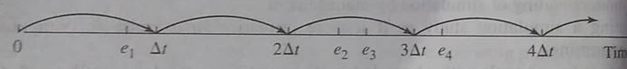

To measure the performance of a System, we estimate three quantities:
- d(n) the average delay in the queue, it gives performance as per customer POV.
- Q(n) the average of number of customer in the queue.
- B(t) the average of system busy state.

### Components Of Discrete Event System Model:
DES models shares a number of common components. There is a logical organisation for these components towards making a computer program.

The components that are found in most DES models using the next event time advanced approach are:
1) **System state:** The collection of state variables necessary to describe the system at a particular time.
2) **Simulation clock:** A variable giving the current value of simulated time.
3) **Event list:** A list contatining the event, an instantaneous occurence that changes the state of the system. 
4) **Statistical counters:** Variables used for storing statistical information about system performance.
5) **Initialisation routine:** A subprogram to initialise the simulation model at time 0
6) **Timing routine:** A subprogram that determines the next event from the event list and then advances the simulation clock to the time when that event is to occur.
7) **Event routine:** A subprogram that updates the system state when a particular type of event occurs.
8) **Library routine:** A set of subprograms used to generate random observations from probability distributions that were determined as part of the simulation model.
9) **Report generator:** A subprogram that computes estimates of the desired measures of performance and produces a report when the simulation ends.
10) **Main program:** A subprogram that invokes the timing routine to determine the next event and then transfer control to the corresponding event routine to update the system state appropirately. The main program may also check for termination and invoke the report generator when the simulation is over.

### Organisation Of Program:
1) Simulation begins at time = 0 with the main program invoking the initialization routine where the simulation clock is set to 0
2) The system state and the statistical counters are initialized and the event list is initialized.
3) After control has been returned to the main program, it invokes the timing routine to determine which type of event is most imminent.
4) If an event is the next to occur, the simulation clock is advanced to the time of occurence of that event type and control is returned to the main program.
5) Then the main program invokes event routine for ensuring that - <br> i) The system state is updated<br>ii) Statistical counters are updated.<br>iii) The times of occurence of future events are generated and added to the event list.
6) Generation of random observation from probability distribution is made to determine these future event times.
7) After all processing has been completed, a check is made to determine if the simulation should now be terminated.
8) If yes, the report generated is invoked from the main program to compute estimates of the desired measures of performance and to produce a report.
9) If not, control is passed back to the main program and the main program -> timing routing -> main program -> event routine -> termination check. Cycle is repeated until the stopping condition is eventually satisfied.<br>

## 4. Queuing System
Que - At a grocery store with one counter, customer arrive at random from 1 to 8 minutes apart (each inter-arrival time has the same probability of occurence) The service times varies from 1 to 6 minutes with the probabilities as 0.10, 0.20, 0.30, 0.25, 0.10, 0.05 respectively. Analyze the system by simulating the arrival and service of 20 customers.

| Inter-Arrival Time(mins) | Probability | Random No. (For inter arrival time)  | Service Time | Probability (%) | Random No. (for service time) |
| ------------------------ |:--------:|:--------:|:--------:|:--------:| -----:|
| 1      | 0.125 | 001 - 125 | 1 | 10 | 01 - 10 |
| 2      | 0.125 | 126 - 250 | 2 | 20 | 11 - 30 |
| 3      | 0.125 | 251 - 375 | 3 | 30 | 31 - 60 |
| 4      | 0.125 | 376 - 500 | 4 | 25 | 61 - 85 |
| 5      | 0.125 | 501 - 625 | 5 | 10 | 86 - 95 |
| 6      | 0.125 | 626 - 750 | 6 | 05 | 96 - 00 |
| 7      | 0.125 | 751 - 875 |   |    |         |
| 8      | 0.125 | 876 - 000 |   |    |         |

<br>

| Customer No. | Random digits (for inter arrival time) | Inter arrival time | Random digits (for service time) | Service time |
| ------------------------ |:--------:|:--------:|:--------:| -----:|
| 1      |       |    | 84 | 4 |
| 2      | 913   | 8  | 10 | 1 |
| 3      | 727   | 6  | 74 | 4 |
| 4      | 015   | 1  | 53 | 3 |
| 5      | 948   | 8  | 17 | 2 |
| 6      | 309   | 3  | 79 | 4 |
| 7      | 922   | 8  | 91 | 5 |
| 8      | 753   | 7  | 67 | 4 |
| 9      | 235   | 2  | 84 | 5 |
| 10     | 302   | 3  | 38 | 3 |
| 11     | 109   | 1  | 32 | 3 |
| 12     | 093   | 1  | 94 | 5 |
| 13     | 607   | 5  | 79 | 4 |
| 14     | 738   | 6  | 05 | 1 |
| 15     | 359   | 3  | 79 | 4 |
| 16     | 886   | 8  | 84 | 4 |
| 17     | 106   | 1  | 52 | 3 |
| 18     | 212   | 2  | 55 | 3 |
| 19     | 493   | 4  | 30 | 2 |
| 20     | 535   | 5  | 50 | 3 |

<br>

| Customer No. | Inter Arrival Time | Time at which customer arrives | Service Time | Time service begin | Waiting time in queue | Time service ends | Time customer spends in the system | Idle time of server |
| ------------------------ |:--------:|:--------:|:--------:|:--------:|:--------:|:--------:|:--------:| -----:|
| 1  |    | 0  | 4  | 0  | 0  | 4  | 4  | 0 |
| 2  | 8  | 8  | 1  | 8  | 0  | 9  | 1  | 4 |
| 3  | 6  | 14 | 4  | 14 | 0  | 18 | 4  | 5 |
| 4  | 1  | 15 | 3  | 18 | 3  | 21 | 6  | 0 |
| 5  | 8  | 23 | 2  | 23 | 0  | 25 | 2  | 2 |
| 6  | 3  | 26 | 4  | 26 | 0  | 30 | 4  | 1 |
| 7  | 8  | 34 | 5  | 34 | 0  | 39 | 5  | 4 |
| 8  | 7  | 41 | 4  | 41 | 0  | 45 | 4  | 2 |
| 9  | 2  | 43 | 5  | 45 | 2  | 50 | 7  | 0 |
| 10 | 3  | 46 | 3  | 50 | 4  | 53 | 7  | 0 |
| 11 | 1  | 47 | 3  | 53 | 6  | 56 | 9  | 0 |
| 12 | 1  | 48 | 5  | 56 | 8  | 61 | 13 | 0 |
| 13 | 5  | 53 | 4  | 61 | 8  | 65 | 12 | 0 |
| 14 | 6  | 59 | 1  | 65 | 6  | 66 | 7  | 0 |
| 15 | 3  | 62 | 4  | 66 | 4  | 70 | 8  | 0 |
| 16 | 8  | 70 | 4  | 70 | 0  | 74 | 4  | 0 |
| 17 | 1  | 71 | 3  | 74 | 3  | 77 | 6  | 0 |
| 18 | 2  | 73 | 3  | 77 | 4  | 81 | 7  | 0 |
| 19 | 4  | 77 | 2  | 81 | 4  | 85 | 6  | 0 |
| 20 | 5  | 83 | 3  | 85 | 3  | 88 | 6  | 0 |

<br>
Total Service Time = 67<br>
Total Waiting Time in Queue = 51<br>
Total Time Customer Spend On System = 118<br>
Total Ideal Time Of Server = 18<br>
Average Waiting Time For Customer = 51/20<br>
Probability that a customer has to wait in the queue = Total customer who wait/20 = 11/20<br>
Probability of ideal time of server = total ideal time / total run time = 18/85<br>
Average Service time = 67/20<br>
Average time between arrival = Sum of time between arrival / (No. of arrivals - 1) because 1st has no arrival<br>
Average waiting time of those who wait = 51/11<br>
Average time a customer spends in the system = 118/20<br>

## 5. Turing System
### Key Element:
1) **Customer:** It refers to anything that arrives at a facility and requires service e.g. people, trucks, airplanes, packets.
2) **Server:** It refers to any resource that provides the requested service. e.g. runways, routers, machines, etc.<br>
3) **Calling polulation:** Population comming into server. can be finite or infinite.
4) **System capacity:** Maximum number of customers allowed in the system is known as system capacity
5) **Arrival process:** Arrival may occur at scheduled arrivals such as patients to a doctor's office, airline flight arrives at an airport. The inter-arrival time may be constant or constant with small random fluctuation.

### Queue Behaviour:
It means actions of customers while in a queue, waiting for service to begin.
1) **Balking:** Customer leave when they see that the line is too long.
2) **Reneging:** Customer leave after after being in line assuming that it is moving too slowly.
3) **Jockeying:** Customer move from one queue to another if they think they have chosen a slow line.

### Queue Discipline:
The logical ordering of customers in a queue for deciding which of the customers to be chosen for service (when a server becomes free)
1) FIFO - First In First Out
2) LIFO - Last In First Out
3) SIRO - Service In Random Order
4) SPTF - Shortest Processing Time First
5) VIP - Service according to priority
6) RR - Round Robin

## 5. Simulation Of Single Server Queuing System
```
In this we will find the measures of performance and how they are basically represented in the graphical terms.
Consider a single server queuing system for which inter arrival time and service time are given.

Ai values are: 0.4, 1.2, 0.5, 1.7, 0.2, 1.6, 0.2, 1.4
Si values are: 2.0, 0.7, 0.2, 1.1, 3.7, 0.6
Stopping condition: n=6 delays in queue
When there are 6 delays in the queue mean when 5 services are over and the sizth customer comes into the queue.

Arrivals occur at time:  0.4, 1.6, 2.1, 3.8, 4.0, 5.6, 5.8, 7.2
Departure occur at time: 2.4, 3.1, 3.3, 4.9, 8.6 (Service will stop now at the arrival of 6th customer)
```
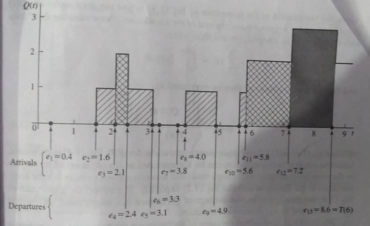<br>
Average No. of Customer In Queue = [1(0.5 + 0.7 + 0.9 + 0.2) + 2(0.3 + 1.4) + 3(1.4)] / 8.6<br>
% Utilization of server = It is calculated by a busy time function B(t)<br>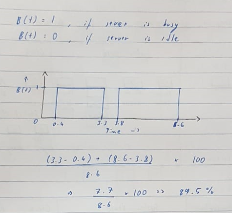<br>
Average delay in queue of n customers = All delay sum / 6<br>

## 6. Simulation Of Double Server Quering System
Consider a computer technical support center where personel take calls and provides service. The time between calls ranges from 1-4 minutes with distribution as shown in table. There are two technical support people - Able & Baker. Able is more experienced and can provide faster service then Baker. The distributions of their service times are shown. Simulate the problem for 6 customers.

| Time between arrival         | 1     | 2     | 3     | 4     |
| ---------------------------- |:-----:|:-----:|:-----:|:-----:|
| Probability                  | 0.25  | 0.40  | 0.20  | 0.15  |


(For Able)<br>

| Service Time         | 2     | 3     | 4     | 5     |
| -------------------- |:-----:|:-----:|:-----:|:-----:|
| Probability          | 0.30  | 0.28  | 0.25  | 0.17  |


(For Baker)<br>

| Service Time         | 3     | 4     | 5     | 6     |
| -------------------- |:-----:|:-----:|:-----:|:-----:|
| Probability          | 0.35  | 0.25  | 0.20  | 0.20  |

Conditions: 
- If with Able & Baker are free then the service goes to Able.
- If Able is busy then service goes to Baker.
- If both are busy then the customer waits till any one of them get's free.

Random Digits for arrival - 26, 98, 90, 26, 42<br>
Random Digits for service time - 95, 21, 51, 92, 89, 38

| Time between arrival         | Probability     | Random Number     |
| ---------------------------- |:---------------:|:-----------------:|
| 1                            | 0.25            | 01 - 25           |
| 2                            | 0.40            | 26 - 65           |
| 3                            | 0.20            | 66 - 85           |
| 4                            | 0.15            | 86 - 00           |


(For Able)<br>

| Service Time                 | Probability     | Random Number     |
| ---------------------------- |:---------------:|:-----------------:|
| 2                            | 0.30            | 01 - 30           |
| 3                            | 0.28            | 31 - 58           |
| 4                            | 0.25            | 59 - 83           |
| 5                            | 0.17            | 84 - 00           |


(For Baker)<br>

| Service Time                 | Probability     | Random Number     |
| ---------------------------- |:---------------:|:-----------------:|
| 3                            | 0.35            | 01 - 35           |
| 4                            | 0.25            | 36 - 60           |
| 5                            | 0.20            | 61 - 80           |
| 6                            | 0.20            | 81 - 00           |

| Customer  | Inter Arrival Time     | Arrival Time     | Time Service Begin (Able) | Service Time (Able) | Time Service End (Able) | Time Service Begin (Baker) | Service Time (Baker) | Time Service End (Baker) | Delay    | Time Spent in System  |
| ---- |:-------:|:-------:|:-------:|:-------:|:-------:|:-------:|:-------:|:-------:|:-------:|:-------:|
| 1    |         | 0       | 0       | 5       | 5       |         |         |         | 0       | 5       |
| 2    | 2       | 2       |         |         |         | 2       | 3       | 5       | 0       | 3       |
| 3    | 4       | 6       | 6       | 3       | 9       |         |         |         | 0       | 3       |
| 4    | 4       | 10      | 10      | 5       | 15      |         |         |         | 0       | 5       |
| 5    | 2       | 12      |         |         |         | 12      | 6       | 18      | 0       | 6       |
| 6    | 2       | 14      | 15      | 3       | 18      |         |         |         | 1       | 4       |

1) Average waiting time = 1/6
2) Probability that the customer has to wait in the queue = 1/6
3) Average service time for able = 16/6
4) Average time between arrival = 14/5
5) Average waiting time for those who wait = 1
6) Average time customer spend in system = 26/6

## 7. Computer Representation
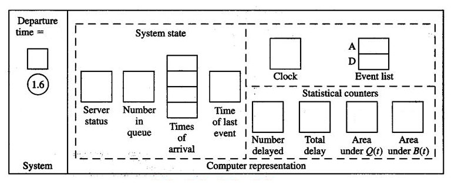<br>
Initialization Time, Arrival Time or Departure Time<br>
Server status [0 Ideal 1 Busy]<br>
Number In Queue [customers in queue]<br>
Times Of Arrival [Arrival time of customers in queue]<br>
Clock [Simulation clock]<br>
Event List [A Arrival D departure] - For initialization say here 0.4 A & Infinity D. Infinity because there's no customer yet that has to be departed so at every ideal stage it will be INF.<br>
Number Delayed [Incremented with every new customer dealt with. At it equals to n simulation stops]<br>
Area Under Q(t) [Previous Q(t) + TimeGap * Previous Number In Queue]<br>
Area Under B(t) [Previous B(t) + TimeGap * Previous Server Status]<br>

## 8. Inventory System
Perform Simulation of inventory system given daily demand is represented by random nos - 4, 3, 8, 2, 5, and the demand probability. Also given initially inventory has 4 items.<br>

| Demand         | 0     | 1     | 2     |
| -------------- |:-----:|:-----:|:-----:|
| Probability    | 0.2   | 0.5   | 0.3   |


>RDA = Random Digit Assignment

| Demand         | Probability     | Cumulative Probability     | RDA               |
| -------------- |:---------------:|:--------------------------:|:-----------------:|
| 0              | 0.2             | 0.2                        | 1 - 2             |
| 1              | 0.5             | 0.7                        | 3 - 7             |
| 2              | 0.3             | 1.0                        | 8 - 0             |


| Day         | Begin Inventory  | RDA              | Demand        | End Inventory    | Shortage     |
| ----------- |:----------------:|:----------------:|:-------------:|:----------------:|:------------:|
| 1           | 4                | 4                | 1             | 3                | 0            |
| 2           | 3                | 3                | 1             | 2                | 0            |
| 3           | 2                | 8                | 2             | 0                | 0            |
| 4           | 0                | 2                | 0             | 0                | 0            |
| 5           | 0                | 5                | 1             | 0                | 1            |

A car manufacturing company manufactures 40 cars per day. The sale of cars depends upon demand which have the following distribution.

| Sales Of Cars  | Probability     | Cumulative Probability     | RDA               |
| -------------- |:---------------:|:--------------------------:|:-----------------:|
| 37             | 0.10            | 0.10                       | 01 - 10           |
| 38             | 0.15            | 0.25                       | 11 - 25           |
| 39             | 0.20            | 0.45                       | 26 - 45           |
| 40             | 0.35            | 0.80                       | 46 - 80           |
| 41             | 0.15            | 0.95                       | 81 - 95           |
| 42             | 0.05            | 1.00                       | 96 - 00           |


The production cost and sale price of each car are 4 lacs & 5 lacs respectively. Any unsold car is to be disposed off at a loss of 2 lacs per car. There is a penalty of 1 lakh per car if the demand is not met. Estimate the profit/loss for next 10 days using the following random number - 09, 98, 64, 98, 94, 01, 78, 10, 15, 19

If the company decides to produce 39 cars per day what is the profit/loss. compare.

| Day       | Cars Produced     | RDA     | Demand      | Cars Disposed | Shortage      | Loss in disposing & penalty |
| --------- |:-----------------:|:-------:|:-----------:|:-------------:|:-------------:|:---------------------------:|
| 1         | 40                | 09      | 37          | 3             | 0             | 6                           |
| 2         | 40                | 98      | 42          | 0             | 2             | 2                           |
| 3         | 40                | 64      | 40          | 0             | 0             | 0                           |
| 4         | 40                | 98      | 42          | 0             | 2             | 2                           |
| 5         | 40                | 94      | 41          | 0             | 1             | 1                           |
| 6         | 40                | 01      | 37          | 3             | 0             | 6                           |
| 7         | 40                | 78      | 40          | 0             | 0             | 0                           |
| 8         | 40                | 10      | 37          | 3             | 0             | 6                           |
| 9         | 40                | 15      | 38          | 2             | 0             | 4                           |
| 10        | 40                | 19      | 38          | 2             | 0             | 4                           |

Profit = [Net Demand * 5] - [(40 * 10) * 4] - [Net loss] = (392 * 5) - (1600) - 31 = 329 Lacs

| Day       | Cars Produced     | RDA     | Demand      | Cars Disposed | Shortage      | Loss in disposing & penalty |
| --------- |:-----------------:|:-------:|:-----------:|:-------------:|:-------------:|:---------------------------:|
| 1         | 39                | 09      | 37          | 2             | 0             | 4                           |
| 2         | 39                | 98      | 42          | 0             | 3             | 3                           |
| 3         | 39                | 64      | 40          | 0             | 1             | 1                           |
| 4         | 39                | 98      | 42          | 0             | 3             | 3                           |
| 5         | 39                | 94      | 41          | 0             | 2             | 2                           |
| 6         | 39                | 01      | 37          | 2             | 0             | 4                           |
| 7         | 39                | 78      | 40          | 0             | 1             | 1                           |
| 8         | 39                | 10      | 37          | 2             | 0             | 4                           |
| 9         | 39                | 15      | 38          | 1             | 0             | 2                           |
| 10        | 39                | 19      | 38          | 1             | 0             | 2                           |

Profit = [Net Demand * 5] - [(39 * 10) * 4] - [Net loss] = (392 * 5) - (1560) - 26 = 374 Lacs

## 10. Sound Simulation Study
<br>
- Problem of interest is stated by the manager. Problem may not be correctly presented so an itterative process where we go back to previous step if wrong outcomes instead of a simple sequential approach. Other things like scope of model and time frame for study and lastly software for model is selected.
- Collect information on the system structure and operating procedures. Some inaccurate information may be eliminated later. Collect data to specify model parameters and input probability distributions. Start with simple model and improve it at each itteration.
- Is the conceptual model then proceed otherwise again collect data and define model.
- Program the model in languages like (C or C++) or in simulation softwares like (Arena, Extend, ProModel). Verify and Debug results.
- Make pilot run for validation in next step.
- If after testing pilot run makes the program still valid proceed otherwise re-collect the data.
- Design Experiments, Specify for each system configuration of interest - Length of each simulation, Number of independent simulation runs using different random numbers facilitates construction of confident intervals.
- Make Production Runs for use in next step
- Analyse output data
- Present conclusion of the simulation to the manager

## 11. Other Types Of Simulations
- Continuous Simulation
- Combined Discrete Continuous Simulation: Since some systems are neither completely discrete nor completely continuous. Example - Tankers carrying crude oil arrive at a singgle unloading dock, supplying a storage tank that in turn feeds a refinery through a pipeline. An unloading tanker delivers oil to storage tank at specified constant rate. Arrival of tank for unloading include closing the dock at midnight and opening the dock at 6 AM is Discrete. Wheras delivering oil at constant rate is continuous.
- Monte Carlo Simulation: Monte Carlo simulation, or probability simulation, is a technique used to understand the impact of risk and uncertainty in financial, project management, cost, and other forecasting models. There is a universal set with all possibilities and we need to sample it with suitable possibilites. In it we select a random value for each task based on the range of estimates. The model is calculated based on this random value. The result of the model is recorded, and the process is repeated.
- Spreadsheet Simulation: Above simulations if not too complex can be done in a spreadsheet too known as Spreadsheet Simulation.

## 12. Simulation Softwares
### General Purpose vs Application Oriented Simulation Packages
A general purpose simulation package can be used for any application, but might have special features for certain ones. On the other hand, an application-oriented simulation package is designed to be used for a certain class of applications such as health care or contact centers.

## 13. Generation Of Random Numbers
A simulation of any system or process in which there are inherently random components requires a method of generating or obtaining numbers that are random. For example the queuing and inventory system required interarrival time and service time. Generation of Random Number from a probability distribution on the interval [0, 1]

### Early Methods:
1) Physical
2) Lotteries
3) Mechanical - use of spinning disks, dice, cards
4) Use of electrical circuit based on randomly pulsated vacuum tubes ERNI (Electronic Random Number Indication)

### Challenges in generation of random numbers:
1) Many methods cannot reproduce previously generated streams exactly.
2) Large memory requirement or a lot of time consumption.

We can plug ERNI to computer having random numbers for simulation but the other major problem was we cannot get previously generated random number through that. So Random number is generated sequentially with a mathematical formula.

### Arithemetic Methods:
These methods are sequential and the next random number is determined by one of several of it's predeccessor according to a fixed mathematical formula.<br>
The first search arithemetic generator was mid-square method<br>
In mid-square method start with a four digit number Z<sub>0</sub> then square it and take middle 4 digits of the new 8 digit squared number. Append zeroes to the left to make it 8 digit if it's not.
<br>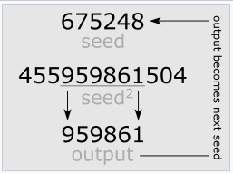<br>
Challenges To Mid Square Method:
- Not entirely random
- Entire sequence determined by Z<sub>0</sub>
- If a Z<sub>i</sub> ever reappear entire sequence will be recycled
- Arithemetic generators are sometimes called psuedo random.

**Techniques For Generating Psuedo Random Numbers:**
<br>
LCG (Linear Congrunetial Generator): It is the most common of several different methods.
- Generates a sequence of integers via the recurssion formula z<sub>i</sub> = (az<sub>i-1</sub> + c) mod m where a, c, m are carefully chosen constants.
- Specify a seed value z<sub>0</sub> to start off
- All the z<sub>i</sub> are between 0 to m-1
- Return the i<sup>th</sup> Random Number U<sub>i</sub> = z<sub>i</sub>/m
<br><br>
> Mixed or Linear LCG - If C ≠ 0 which means both multiplication and addition<br>
> Multiplicative LCG - If C = 0 which means only multiplication<br>
> Combined LCG - Value obtained as combination of multiple LCG generators<br>

### Issues With LCG
- After certain time it will further start generating the simillar numbers
- To avoid this cycling we must have maximum periods
- if m = 2<sup>b</sup> and C ≠ 0. Longest period is obtained if c is relatively prime to m and a = 1 + 4k (k is a positive integer)
- if m = 2<sup>b</sup> and C = 0. Longest period is obtained if x<sub>0</sub> is odd and a = 3 + 8k (k is a positive integer)

> x<sub>i</sub> is equivalent to z<sub>i</sub>

- Speed and efficiency are added by use of modulus m which is either a power of 2 or close to the power of two it's because computer performs modulus efficiently that way.

> 1197 mod 10<sup>2</sup> = 97<br>
> 173 mod 2<sup>6</sup> = 10101101 mod 2<sup>6</sup> = 101101 = 45

## Statistics:
A Probability distribution is a table of values showing the probabilities of various outcomes of an experiment. For example if a coin is tossed three times, the number of heads can be obtained - 0, 1, 2 or 3 times. The probability of all these distributions.

A discrete variable is a variable which can only take a countable number of values like in the above example the number of head can only take 4 values so variable is discrete.

A continuous variable is a variable where the data can take infinitely many values. Example - a variable measuring the time taken for something to be done is continuous since there are an infinite number of possible times that can be taken.

The variable is said to be random if the sum of probabilities is one.

The Probability Density function (PDF) of X tells probability of event x occuring. P(X=x) X is random variable like no. of heads P(X=0)

The cumulative distributive function (CDF) of a discrete random variable X is the function F(t) which tells the probability that X is less than or equal to t. Thus it is found by integrating PDF between minimum value of X and t. F(X) = P(X<=x)

A distributive function has the following properties:
> 0 <= F(x) <= 1 for all x

> F(x) is non decreasing [i.e. if x1 < x2 then F(x1) <= F(x2)]

> lim x->inf F(x) = 1 and lim x->-inf F(x) = 0 (Since only takes finite values)

### Mean Value: 
E(x) = SUM {all i} x<sub>i</sub>p(x<sub>i</sub>), for discrete X<br>
E(x) = INTEGRAL {-inf to inf} xf(x), for continuous X<br>
E(x<sup>n</sup>) is the nth moment.<br>
E(x<sup>n</sup>) = SUM {all i} x<sub>i</sub><sup>n</sup>p(x<sub>i</sub>) & INTEGRAL {-inf to inf} x<sup>n</sup>f(x)

### Variance: V = E(x<sup>2</sup>) - E<sup>2</sup>(x)
### Standard Deviation: √V

## Input Probability Distribution functions
### For Discrete systems:
1) Bernoulli Distribution: For experiments consisting of n trials, each can be a success or a failure i.e. xi can be 0 (failure) or 1 (success). If only two outcomes then known as bernoulli trial otherwise bernoulli distributions.<br>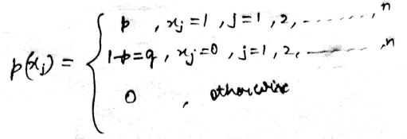<br>
Mean: p<br>
Variance: pq<br>

1) Binomial Distribution: If we have n trials. x successives are success then n-x are failures <br>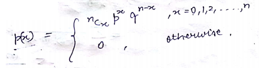<br>
Binomial Theorem: (a+b)<sup>n</sup> = {sum 0 to n} <sup>n</sup>C<sub>x</sub> a<sup>x</sup> b<sup>n-x</sup><br>
Mean: np<br>
Variance: npq<br>

3) Geometric Distribution: defined to be no. of trials to achieve first success.<br>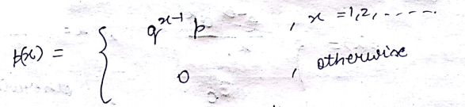<br>
Mean: 1/p<br>
Variance: q/p<sup>2</sup><br>

4) Negative Binomial: defined to be no. of trials to achieve kth success.<br>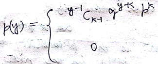<br>
Mean: k/p<br>
Variance: kq/p<sup>2</sup><br>

5) Poisson's Distribution: Rumored that it was used to model deaths cause by kicks of horses.<br>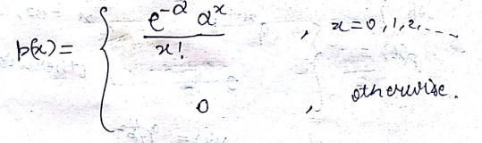<br>
Mean = Variance = α

### For Continuous systems:
1) Uniform Distribution: If PDF & CDF are<br>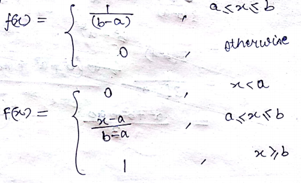<br>
Mean: (a+b)/2<br>
Variance: (b-a)<sup>2</sup>/12

2) Normal Distribution: Data symmetric about mean showing data more frequent towards mean. i.e. PDF symmetric about mean.<br>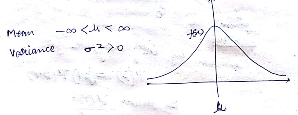<br>
f(μ-x) = f(μ+x)<br>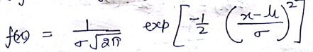<br>

3) Gamma Distribution: β(shape parameter) ϴ(scale parameter)<br>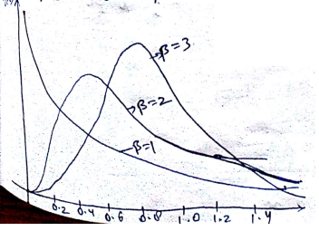<br>
Mean: 1/ϴ
Variance: 1/βϴ<sup>2</sup><br>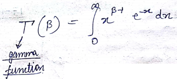<br><br>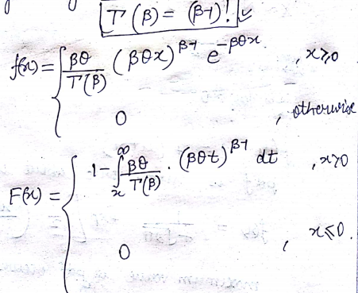<br>

4) Weibull Distribution: ν(location parameter) β(shape parameter) ϴ(scale parameter)<br>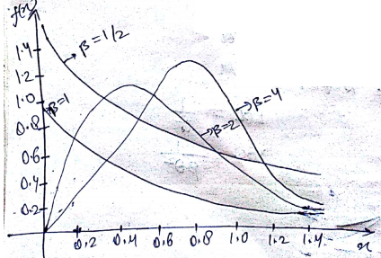<br><br>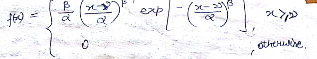<br>Put ν 0 and β 1 then Exponential Distribution<br>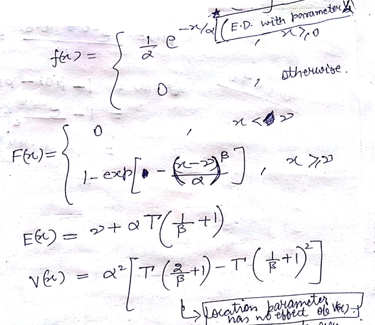

5) Triangular Distribution: <br>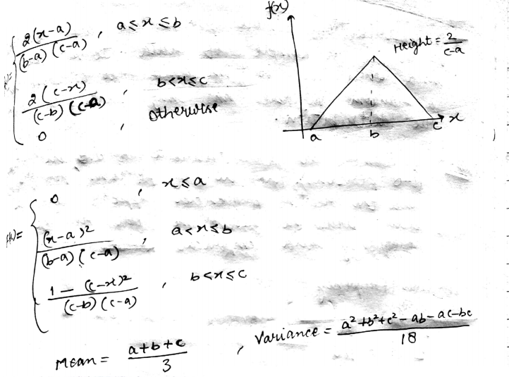

6) Emperical Distribution: A distribution whose parameter are observed values i.e. it's impossible to establish the distribution.<br>
Given arrival in groups (1-8 peoples). The no. of persons (per groups) and the relative frequencies. Draw histogram for relative frequency & emperical CDF.<br>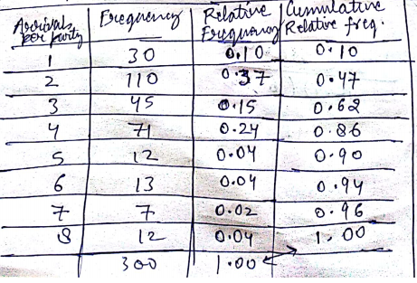<br>(first two columns given)<br>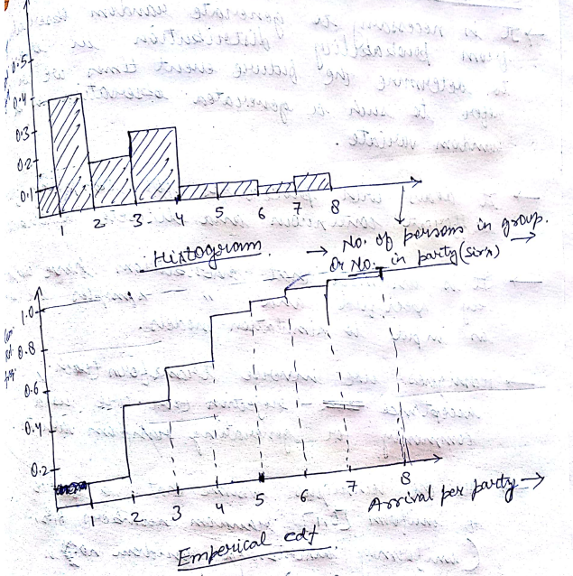<br>

## Generation Of Random Variates
1) It is necessary to generate random observations from probability distribution in order to determine the future event times we will refer to such a generated observation as random variate.
2) It deals with procedures for sampling from different continuous and discrete distributions.
3) It is assumed that distributions have completely specified and distributions samples are used as input to simulation models.
4) Techniques like inverse transform, acceptance-rejection are used commonly for generating random variates.
5) All techniques assume that a source of uniform [0, 1] random numbers (uniformly distributed random numbers are readily available)

### Inverse Transform Technique
1) Can be used to sample from discrete & continuous distributions
2) The goal is to develop random variates x1, x2.. of particular type say exponential distribution.
3) Useful when CDF i.e. F(x) is of simple form so that F<sup>-1 </sup> can be computed easily.
> Compute CDF of desired random variable

> Set F(X) = R on the range of X

> Solve above equation for X in terms of R

> Generate uniform random numbers R1, R2, R3... and then compute desired random variate using Xi = F<sup>-1</sup>Ri

<br>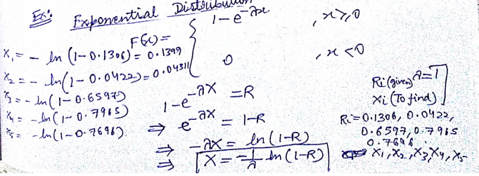<br>

### Identifying Distributions With Data
1) Input data provide the driving force for a simulation model.
2) In queuing system input data are distributions of time between arrival and service time.
> Collect data from real system of interest, requires a substantial time and resource commitment. When data is not available expert opinion and knowledge of process is must.

> Identify a probability distribution to represent the input process. With available data developing a frequency distribution or histogram.

> Choose parameters that define a distribution family when data are available. Those parameters may be estimated from data.

> Evaluate the choosen distribution and associated parameters for the goodness-of-bit using graphical method or statistical test.

### Estimation Of Parameters
> After selecting the family of distribution next step is the estimate the parameter of distribution.

> In many cases sample mean & sample variance are used to estimate the parameters of hypothesised data.

> The raw data maybe in disrete or continuous form.

> Discrete data may have to be grouped to have frequency distribution.

> Class distributions may be used.

<br>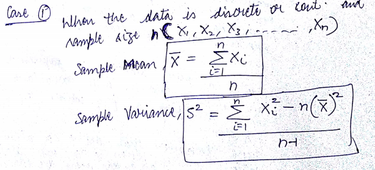<br>
<br>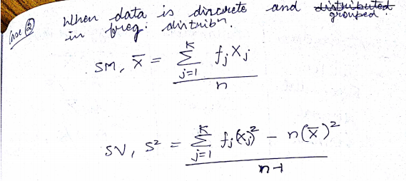<br>
<br>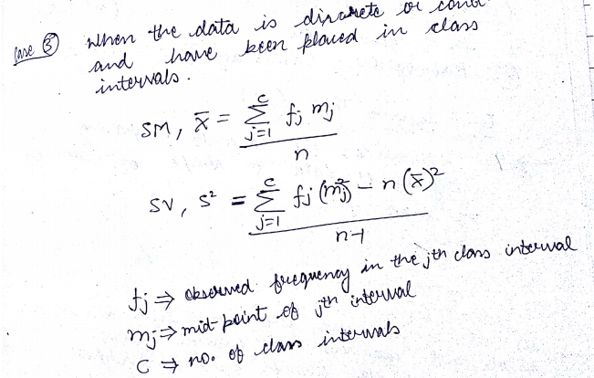<br>
<br>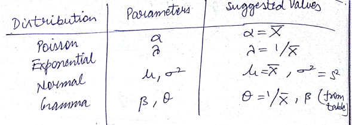<br>

## Goodness-Of-Fit Test
### Chi-Square Test (x<sup>2</sup>)
Given is a restaurant record of customer, first row contains expected percentage. Now we want to check if that expected hypothesis should be accpeted or rejected.<br>
Observed datas (Null hypothesis), in next row. Then we are counting expected as per the observed values like for monday it should be 10% so 10% of total observed customers i.e. 200<br>
First find out the Degree Of Freedom it's always 1 minus actual like for flipping coin we get head or tail so DOF is 1. Given also alpha is Significance level. Look in table for critical value corresponding to alpha and DOF. If our chi square ecxeeds critical value then we reject otherwise accepts.
<br>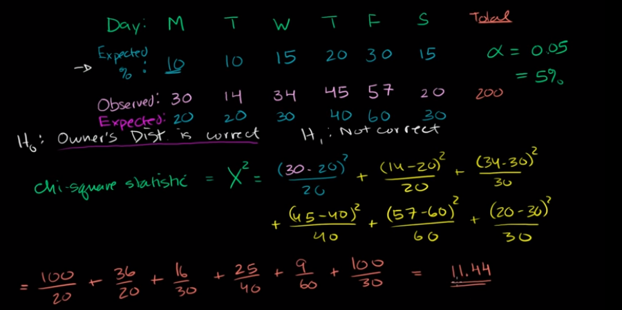<br>

### Multivariable: P(X=x, Y=y), x & y are independent if P(X, Y) = P(X) P(Y)
### Covarience: Cov(X, Y) = E(X, Y) = E(X) E(Y)
### Corelation: Cor(X, Y) = Cov(X, Y) / √Var(X) Var(Y)