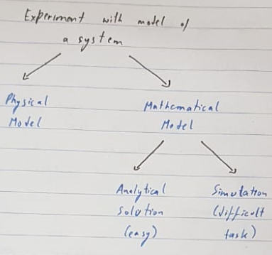
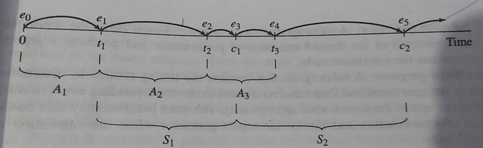
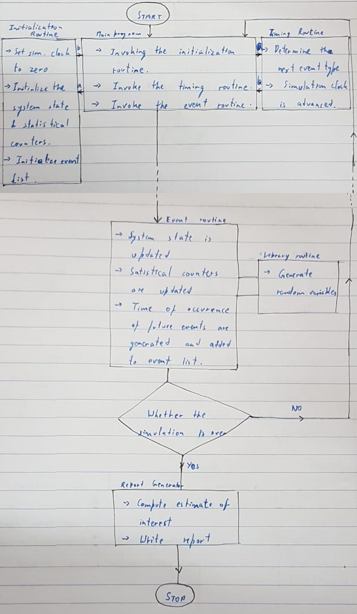
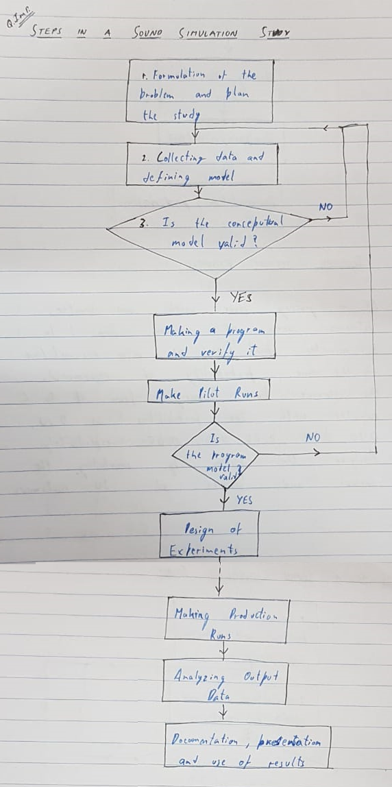

# Modelling & Simulation
## 1. Introduction
In simulation we simulate the operations of various kinds of real world facilities or processes. 
The facility or the process of interest is usually called a system and in order to study it scientifically, we often have to make a set of assumptions about how it works.  
These assumptions which usually take the form of mathematical or logical relationship constitute a model that is used to try to gain some understanding of how the corresponding system behaves.

If the relationships that compose the model are simple enough it may be possible to use mathematical method such as algebra, calculus or probablity theory to obtain exact information about the question of interest. This is call analytical solution. 
However, most real-world system are too complex to allow realistic models to be evaluated analytically and these models must be studied by the means of simulation.

In simulation, we use a computer to evaluate a model numerically and the data are gathered in order to estimate the desired true characterstics of the model.

### Application Area Of Simulation:
1. Designing and analysing manufacturing systems.
2. Evaluating military weapon system or their logical requirements,
3. Determining hardware requirements or protocols for network.
4. Determining hardware and software for computers.
5. Designing transportational systems like airports, etc.
6. Evaluating designs for service organisations such as fast food restaurants, hospitals, etc.
7. Re-engineering of buisness process.
8. Analysing supplies change.
9. Analysing mining operations.

### Advantages Of Simulation:
1. Most complex real world systems with stochastic elements cannt be accurately described by mathematical model that can be analysed analytically. Thus simulation is often the only type of investigation possible.
2. Simulation allows one to estimate the performance of an existing system under some projected set of operating conditions.
3. Alternately proposed system designs or alternately proposed policies for a single system can be provided by simulating system to see which is best for requirement.
4. In a simulation we can maintain much better control over experimental conditions.
5. Simulation allows us to study a system with a long time frame. eg. an economic system in compressed time or alternatively studying the detailed working of a system in extended time.

### Disadvantages Of Simulation:
1. Each run of stocastic simulation model produces only estimates of the model's true characterstics for a particular set of input parameters. Thus, several independent runs of the model will probably be required for input parameters to be studied. For this reason, simulation models are generally not as good at optimisation as they are of comparing a fixed number of specified alternative system designs. On the other hand, an analytical model can ofter easily produce the exact true characterstics of that model for a variety of set of input varieties.
2. Simulation models are oftern expensive and time consuming to develop.
3. Large volume of numbers produced by simulation study often creates a tendancy to place greater confidence. If a model is not a valid representaton of the system under study the simulation result, no matter how impressive they appear, will provide little useful information about the actual system.
4. Model building requires special training.
5. Simulation result may be difficult to interpret.

## 2. System
<u>**System:**</u> A system is defined as a collection of entities (people, messages, machines, servers) that act and interact together towards some end. 
<u>**Entity:**</u> Entities are object of interest in the system e.g. in the bank a customer is an entity, a server is an entity, etc. 
<u>**Attribute:**</u> Attribute are property of an entity e.g. server it may be busy or ideal. 
<u>**Activity:**</u> Activity is any process causing changes in the system e.g in the bank a customer is coming and making changes in the system. The persons who are waiting in the queue have increased by 1, When his work is done queue decrease by 1 as another person performs his task. 
<u>**State of a system:**</u> Collection of variables and their value necessary to describe the system at that time. It depends on output objectives.

### Types of system:
1) <u>**Discrete:**</u> State variables change instantaneously at seperate points in time. e.g. in a bank model state change occurs oly when a customer arrives or departs.
2) <u>**Continuous:**</u> State variables change continuous as a function of time e.g. in airplane flight state variables like position, velocity changes continiously.
> Many systems are partly discrete, partly continuous

### Different ways to study a system:
1) Experiment with actual system
2) Experiment with model of a system
  

### Classification of simulation models:
1) <u>**Static vs Dynamic:**</u> When we talk about static we are doing the study at particular time so time does not come into picture, in those cases, we are going to study the behaviour of the system at a particular time. When we talk about dynamic, it tells us the changes w.r.t time e,g, study about the behaviour of a queue from morning till noon then it's a  dynamic system.
2) <u>**Deterministic vs Stochastic:**</u> When we have something which doesn't have randomness, we can have the fixed values as result/output for the input or system state. We always get a deterministic/fixed result. When we have randomness or prababilities associated we are not sure of the outcome we can only predict that most probably 'this' is going to happen then it is stochastic simulation model.
3) <u>**Continuous vs Discrete**</u>
> Most operational models are dynamic stochastic and discrete (known as Discrete Event Simulation - DES)

## 3. Discrete Event System

### Time Advance Mechanism:
DES models are dynamic in nature hence track of the current value of simulatedtimes has to be kept as the simulation proceeds. 
Time advance mechanism advances simulated time from one value to another. 
Simulation clock gives the current value of simulated time.
There are two principle approaches - Next event time advance  Fixed increment time advance.

1) Next Event Time Advance Mechanism: In this mechanism, initialize the simulation clock to zero. Determine the time of occurence of future events from the event list. Clock advances to the next event which is executed, event execution may involve updating event list. Continue until a stopping rule is satisfied. Clock jumps from one event time to the next, periods of inactivity are ignored.  **Notations:** ti = time of arrival of ith customer. Ai = ti - ti-1 = Inter arrival between (i-1) & ith arrival of customers. Si = time that server actually spends serving ith customer. Di = Delay in queue of ith customer. Ci = ti + di + si = Time at which the customer departs after getting the service. ei = Time of occurence of ith event of any time.
2) Fixed Increment Time Advance Mechanism: With this approach the simulation clock is advanced in increments of fixed time units. After each update of the clock a check is made to determine if any event should have occured during the previous interval. In this case, we are not representing the event time at it's actual time, we are representing the event time based on the increment time. It's Δt is very small, it captures the event with more accuracy then certainly accuracy will be more but then it will increase the simulation time to a very large value. 

### Components Of Discrete Event System Model:
DES models shares a number of common components. There is a logical organisation for these components towards making a computer program.

The components that are found in mst DES models using the next event time advanced approach are:
1) **System state:** The collection of state variables necessary to describe the system at a particular time.
2) **Simulation clock:** A variable giving the current value of simulated time.
3) **Event list:** A list contatining the event, an instantaneous occurence that changes the state of the system. 
4) **Statistical counters:** Variables used for storing statistical information about system performance.
5) **Initialisation routine:** A subprogram to initialise the simulation model at time 0
6) **Timing routine:** A subprogram that determines the next event from the event list and then advances the simulation clock to the time when that event is to occur.
7) **Event routine:** A subprogram that updates the system state when a particular type of event occurs.
8) **Library routine:** A set of subprograms used to generate random observations from probability distributions that were determined as part of the simulation model.
9) **Report generator:** A subprogram that computes estimates of the desired measures of performance and produces a report when the simulation ends.
10) **Main program:** A subprogram that invokes the timing routine to determine the next event and then transfer control to the corresponding event routine to update the system state appropirately. The main program may also check for termination and invoke the report generator when the simulation is over.

### Organisation Of Program:
1) Simulation begins at time = 0 with the main program invoking the initialization routine where the simulation clock is set to 0
2) The system state and the statistical counters are initialized and the event list is initialized.
3) After control has been returned to the main program, it invokes the timing routine to determine which type of event is most imminent.
4) If an event is the next to occur, the simulation clock is advanced to the time of occurence of that event type and control is returned to the main program.
5) Then the main program invokes event routine for ensuring that -   i) The system state is updated ii) Statistical counters are updated. iii) The times of occurence of future events are generated and added to the event list.
6) Generation of random observation from probability distribution is made to determine these future event times.
7) After all processing has been completed, a check is made to determine if the simulation should now be terminated.
8) If yes, the report generated is invoked from the main program to compute estimates of the desired measures of performance and to produce a report.
9) If not, control is passed back to the main program and the main program -> timing routing -> main program -> event routine -> termination check. Cycle is repeated until the stopping condition is eventually satisfied.   