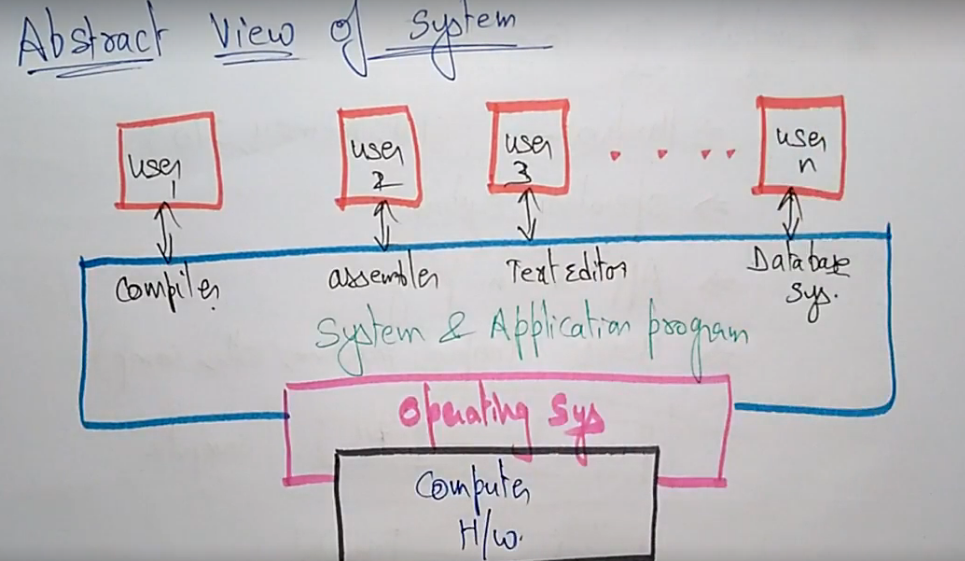
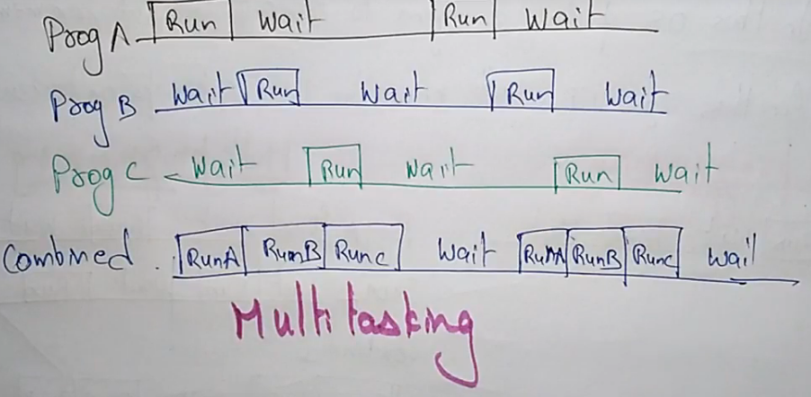
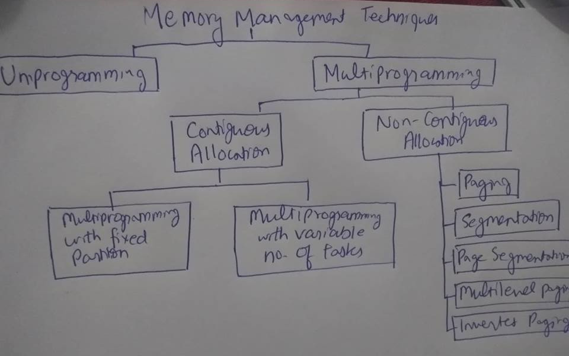
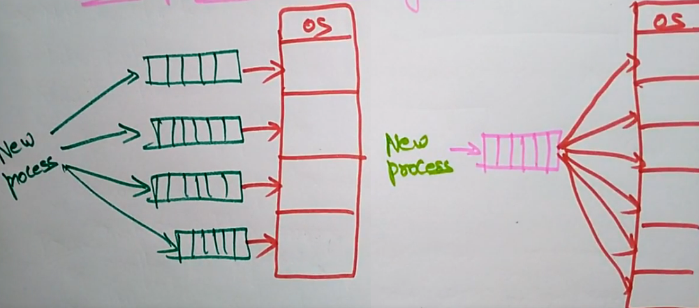
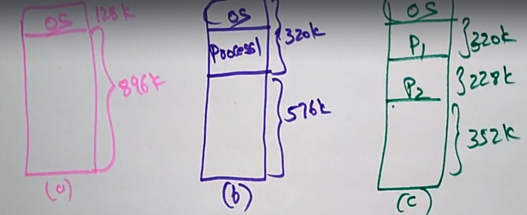

# Operating System
## 1. Overview:
OS is a software that acts as an intermediate between user of computer and computer hardwares. It controls the execution of application program. It is an interface between application and hardware.

Main objectives of an operating system is conveyance, efficiency and ability to evolve.

OS provides services like - Program development, program execution, access to I/O devices, file system access & error detection response.

Role of OS - A computer is a set of resources for movement, storage and processing data. OS is responsible for managing it.

### **Computer System Components:**
1) Hardware (CPU, Memory, I/O)
2) Operating System
3) Application Programs
4) Users (Peoples, even different machines, other computers)

  

### **Evolution Of OS:**
A major OS will evolve over time for a no. of reasons - Hardware Upgrades, New type of hardware, New services.

1) Serial Processing System: 
Used in older days. No Operating system. Program directly interacts with hardware. 
So computer runs with console with display lights, toggles, switches, simple I/O devices and printer. 
Everything happens in series one instruction after another.

2) Simple Batch System: 
Batch means set of jobs with simmilar needs. So all jobs/instruction will be batched and then performed. So no direct interaction between user and computer. 
A special program monitor manages the execution of each programs in a batch. 
There's a drawback that there's no way to prioritize program. Other drawback is since it's uniprgramming single programm at a time so devices may be Idle for a long time.

3) Multiprogramming Batch System: 
In multiprogramming multiple programs can be exected parallarly at a time. So there's less idle time for devices.
  

4) Parallel System: 
Multiple processors have direct access to shared memory which form a common address space. So it is tightly coupled. A single problem is executed by different processors hence sharing same memory hence it is designed to speed up execution of program.

5) Distributed System: 
It is collection of independent computers connected via network capable of collabrating on a task. 
These follows client-server system. There's no shared memory, various communication lines will be there so it's loosely coupled.

6) Real Time Operating System (RTOS): 
Respond to inputes immediately. The task will be completed by specific time. If time is less it's Hard RTOS otherwise Soft RTOS.

7) Time Sharing System: 
It's an extension to multiprogramming batch system. It minimizes response time in it by sharing and frequently switching jobs hence giving all response immediately.

## 2. Memory:
| Memory Hierarychy                          | 
| -------------------------------------------| 
| Hard Disk - Secondary Memory               | 
| Ram (Upto 1000 Cycles) - Main Memory       | 
| Cache (10-20 Cycles)                       | 
| Register (1 Cycle)                         | 

1 CPU cycle is equivalent 1 nano second. 
There are 3 types of cache - L1 (Upto 5 cycles), L2 (10-20 cycles), L3 (upto 100 cycles). 
Top to bottom speed (↑) size (↓) cost (↑↑) 
Registers like in 64 bit register 1 operation can handle 64 bit. 
Secondary Memory memory stores data and program that are not actively needed. 

> Moore's Law states that in every 18 months computers speeds almosts doubles.

An OS provides a memory managment system in which it performs - which process should stay or kill, how much memory will each process will have access to, where in memory will each process go.

### Memory management strategies:
1) **Fetch Strategy:** It demands the data and desides which piece of data to load next.
2) **Placement Strategy:** It decides where in main memory to place incoming data.
3) **Replacement Strategy:** It decides which data to remove from main memory to make more space.

  

In multi programming with fixed partition. Main memory is divided into static (equal or unequal) partitions at system generation time. It is simple to implement and has little overhead (computation time) But this is inefficient.
  
Here in left mutliple program queues correspond to the fixed contiguous memory allocated while in right one process queue operates on entire memory parition.

In multi programming with dynamic partition. 
  