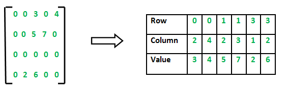
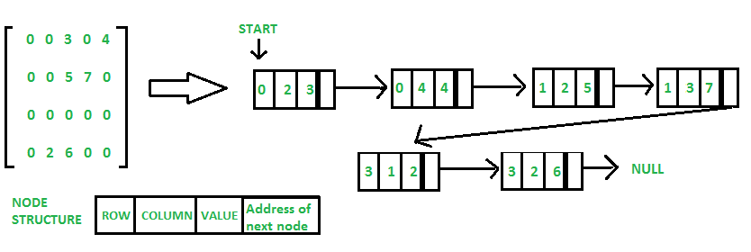
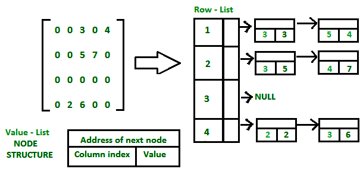
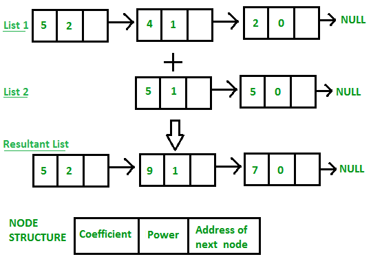
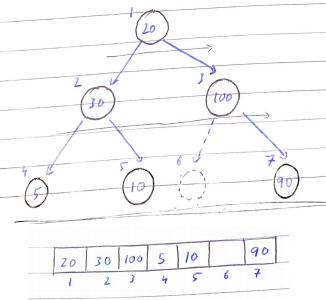
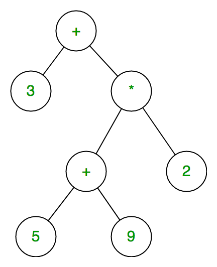

# Data Structures

> Defination, Advantages, Type - Linear, Non Linear, ADT, Difference between Algorithm & Program

## Asymptotic Analysis:
If f(n) & g(n) are two functions 
1. **Big-Oh:** f(n) = O(g(n)) if there exists c & n<sub>o</sub> such that f(n) ≤ c * g(n) ∀ n ≥ n<sub>o</sub>
2. **Big-Omega:** f(n) = Ω(g(n)) if there exists c & n<sub>o</sub> such that f(n) ≥ c * g(n) ∀ n ≥ n<sub>o</sub>
3. **Big-Theta:** f(n) = θ(g(n)) if there exists c<sub>1</sub>, c<sub>2</sub> & n<sub>o</sub> such that c<sub>1</sub> * g(n) ≤ f(n) ≤ c<sub>2</sub> * g(n) ∀ n ≥ n<sub>o</sub>

## Swap without temp variable:
```c++
x = x^y;
y = x^y;
x = x^y;
```

## Matrix Multiplication:
```c++
int m, n, p, q
cin >> m >> n;
int A[m][n];
for (int i = 0; i < m; ++i)
{
    for (int j = 0; j < n; ++j)
        cin >> A[i][j];
}
cin >> p >> q;
int B[p][q];
for (int i = 0; i < p; ++i)
{
    for (int j = 0; j < q; ++j)
        cin >> B[i][j];
}

if (n != p)
    cout << "Multiplication doesn't exists!" << endl;
else
{
    int C[m][q];
    for (int i = 0; i < m; ++i)
    {
        for (int j = 0; j < q; ++j)
        {
            int sum = 0;
            for (int k = 0; k < p; ++k)
                sum += A[i][k] * B[k][j];
            C[m][q] = sum;
        }
    }
}
```

> Array - Dynamic Array(Insertion, Traversal, Deletion, Searching), 2D Array(Row major or Column major)

Addressing in array<br>
L<sub>i</sub> = UB - LB + 1 [Array Length]<br>
E<sub>i</sub> = K<sub>i</sub> - LB [Effective Address]

m(2:8, 4:1, 6:10) find address of m[5, -1, 8]<br>
L<sub>1</sub> = 8 - 2 + 1 = 7<br>
L<sub>2</sub> = 1 - (-4) + 1 = 6<br>
L<sub>3</sub> = 10 - 6 + 1 = 5<br>
E<sub>1</sub> = 5 - 2 = 3<br>
E<sub>2</sub> = -1 - (-4) = 3<br>
E<sub>3</sub> = 8 - 6 = 2<br>
**In Row Major:**<br>
BA + W[(E<sub>1</sub>L<sub>2</sub> + E<sub>2</sub>)L<sub>3</sub> + E<sub>3</sub>]<br>
**In Column Major:**<br>
BA + W[(E<sub>3</sub>L<sub>2</sub> + E<sub>2</sub>)L<sub>1</sub> + E<sub>1</sub>]

```c++
malloc(bytes of memory)
//returns a pointer of heap memory it is simmilar to new keyword of C++
calloc(elementsCount, sizeOfEachElement)
//Systax is different in calloc but it also returns a pointer to heam memory however it also initializes it to ZERO

int* temp = (int*) malloc(sizeof(int));
int* temp = new int;
```

> String (Array, Linked List, Dynamic Array representation), Length concatinationm, substring, indexing (starting index of pattern in string)

## Digit Sum:
```c
int sum = 0;
while(num != 0)
{
    sum += num % 10;
    num /= 10;
}
```

## Stack Using Array:
```c
#define MAX 5

int stackArr[MAX], top = -1;
bool isEmpty() { return (top == -1); }
bool isFull() { return (top == MAX-1); }
void push(int val)
{
    if (isFull())
    {
        cout << "Stack is Full!" << endl;
        return;
    }
    ++top;
    stackArr[top] = val;
}
void pop()
{
    if (isEmpty())
    {
        cout << "Stack is Empty!" << endl;
        return;
    }
    --top;
}
int top()
{
    if (isEmpty())
    {
        cout << "Stack is Empty!" << endl;
        return -1;
    }
    return stackArr[top];
}
```

## Stack Using Linked List:
```c
struct Node { int data; Node* next; } *top = NULL;
bool isEmpty() { return top == NULL; }
void push(int value)
{
    Node* temp = new Node{value, NULL};
    if (top != NULL)
        temp->next = top;
    top = temp;
}
void pop()
{
    if (isEmpty())
    {
        cout << "Stack is Empty!" << endl;
        return;
    }
    temp = top;
    top = top->next;
    delete temp;
}
int top()
{
    if (isEmpty())
    {
        cout << "Stack is Empty!" << endl;
        return;
    }
    return top->data;
}
```

## GCD & LCM:<br>
> GCD (A, B) = GCD (B, A % M) BaseCase: B gets 0

> GCD (A, B) * LCM (A, B) = A * B

## Hanoi Problem:
```c
void solve(int n, char rodFrom, char rodMiddle, char rodTo)
{
    if (n == 1) cout << "Move disk " << n << " from " << rodFrom << " to " << rodTo << endl;
    solve(n-1, rodFrom, rodTo, rodMiddle);
    cout << "Move disk " << n << " from " << rodFrom << " to " << rodTo << endl
    solve(n-1, rodMiddle, rodFrom, rodTo);
}
```

## Arithemetic Expression:
```
//Infix to prefix
> Scan right to left. In the end reverse the expression. The behavior of paranthesis will also change. () will become )( during traversal

//Prefix to infix
> Scan right to left.
> If operand push on stack otherwise s1 = pop s2 = pop push (s1 operator s2) on the stack again.
> Pop the stack to get the output

//Postfix to infix
> Scan left to right.
> If operand push on stack otherwise s1 = pop s2 = pop push (s1 operator s2) on the stack again.
> Pop the stack and reverse it to get output

//Postfix to prefix
> Scan left to right.
> If operand push on stack otherwise s1 = pop s2 = pop push (operator s2 s1) on the stack again.

//Prefix to postfix
> Scan right to left.
> If operand push on stack otherwise s1 = pop s2 = pop push (s1 s2 operator) on the stack again.

//Evaluation of postfix
> Scan left to right
> If operand push on stack otherwise s1 = pop s2 = pop push evaluation of (s2 operator s1) on the stack again.

PRE-X (InPre)       R2L
S2->S1              PostPre & Eval
Reverse             InPre & PostIn
```

## Sparse Matrix:
**A. Store using a 3xN size 2D Array**
<br><br>
**B. Store using a Linked List having row, column, alue & next node**
<br><br>
**C. Store using List of Lists**
<br><br>

## Operations On Sparse Matrix:
Add, Subtract, Transpose (Simply reverse row & column values of the node), Multiply(See matrix multiplpication above newA[i][j] = A[i][k]*A[k][j] here k can be o...p) Orig matA (mxn) Orig matB(pxq)

## Polynomial Representation:
In the image polynomial: 5x<sup>2</sup> + 4x + 2 & 5x + 5 are added using linked list. Array Of Structures also maybe used.
<br><br>

> Dequeue is a special queue in which insertion & deletion can be performed both at rear or front end.

> Reversing a stack is like reversing a linked list

## Queue using Array:
```c
#define MAX 5
int qArr[MAX], front = -1, rear = -1;
bool isEmpty() { return (front == -1 && rear == -1); }
bool isFull() { return (rear == n-1); }
void enqueue(int val)
{
    if (isFull())
    {
        cout << "Queue is Full!" << endl;
        return;
    }
    if (front == -1 && rear == -1)
    {
        front = 0;
        rear = 0;
    }
    else ++rear;    //In Circular queue rear = (rear+1) % MAX;
    qArr[rear] = val;
}
void deqeue()
{
    if (isEmpty())
    {
        cout << "Queue is Empty!" << endl;
        return;
    }
    if (front == rear)
    {
        front = -1;
        rear = -1;
    }
    else ++front;   //In Circular queue front = (front+1) % MAX;
}
int front()
{
    if (isEmpty())
    {
        cout << "Queue is Empty!" << endl;
        return -1;
    }
    return qArr[front];
}
```
> Queue using linked list

## Priority Queue using Linked List (Min prior):
```c
struct Node { int data, prio; Node* next; } *root = NULL;
bool isEmpty() { return (root == NULL); }
void push(int val, int _prio)
{
    Node* newNode = new Node{val, _prio, NULL};
	if (root == NULL) root = newNode;
    else if (root->prio > newNode->prio)    //Flip sign for max prio
    {
        newNode->next = root;
        root = newNode;
    }
    else
    {
        Node* temp = root;
        //Flip sign for max prio
        while(temp->next != NULL && temp->next->prio < newNode->prio)
            temp = temp->next;
        newNode->next = temp->next;
        temp->next = newNode;
    }
}
void pop()
{
    if (isEmpty())
    {
        cout << "Queue is Empty!" << endl;
        return;
    }
    Node* temp = root;
    root = root->next;
    delete temp;
}
int peek()
{
    if (isEmpty())
    {
        cout << "Queue is Empty!" << endl;
        return -1;
    }
    return root->data;
}
```

## Priority Queue (min prio) using Doubly Linked List:
```c
struct Node { int data, prio; Node* next, prev; } *front = NULL, *rear = NULL;
bool isEmpty() { return (front == NULL && rear == NULL); }
void push(int val, int _prio)
{
    Node* newNode = new Node{ val, _prio, NULL, NULL };
    if (front == NULL && rear == NULL)
    {
        front = newNode;
        rear = newNode;
    }
    else if (newNode->prio <= front->prio)
    {
        //Front Insert
        newNode->next = front;
        front->prev = newNode->next;
        root = newNode;
    }
    else if (newNode->prio > rear->prio)
    {
        //Rear Insert
        newNode->next = NULL;
        root = newNode;
    }
    else
    {
        Node* temp = front;
        while(temp->next != NULL && temp->next->prio < newNode->prio)
            temp = temp->next;
        (temp->prev)->next = newNode;
        newNode->next = temp->next;
        newNode->prev = (temp->prev)->next;
        temp->prev = newNode->next;
    }
}
void pop()
{
    if (isEmpty())
    {
        cout << "Queue is Empty!" << endl;
        return;
    }
    Node* temp = root;
    root = root->next;
    delete temp;
}
int peek()
{
    if (isEmpty())
    {
        cout << "Queue is Empty!" << endl;
        return -1;
    }
    return root->data;
}
```

> Linked List (Singly, Doubly, Circular, Circular Doubly, Insertion at beggining-specified-end, Traversing, Searching, Deletion at beggining-specified-end, Reversing)

## Linked List reversing
```c
//Singly
void reverse()
{
    Node* cur = root, prev = NULL, next = NULL;
    while (cur != NULL)
    {
        next = cur->next;
        cur->next = prev;
        prev = cur;
        cur = next;
    }
    root = prev;
}
//Doubly (Simply reverse all pointers for every node)
void reverse()
{
    Node* cur = front, temp = NULL;
    while(cur != NULL)
    {
        temp = cur->next;
        cur->next = cur->prev;
        cur->prev = temp;
        cur = temp;
    }
    temp = front;
    front = tail;
    tail = temp;
}
```

## Linear Search:
Time: O(n)
```c++
int search(int arr[], int n, int x)
{
    for (int i = 0; i < n; ++i)
    {
        if (arr[i] == x)
            return i;
    }
    return -1;
}
```

## Binary Search:
Applies on sorted array. divides the arr to check which side it can belong then recursively checks that subarray.<br>
Time: O(logn)
```c++
int search(int arr[], int l , int r, int x)
{
    // l = 0 & r = n-1
    if (r >= l)
    {
        int mid = (l + r) / 2;
        if (arr[mid] == x)
            return mid;
        else if (arr[mid] > x)
            return search(arr, l, mid - 1, x);
        else
            return search(arr, mid + 1, r, x);
    }
    return -1;
}
```
Ternary Search is also there which is same as binary search except instead of dividing in 2 parts we divide it in 3 parts.

Binary search is better than ternary search because <br>
T(n) = T(n/2) + 2 [In Binary Search]<br>
T(n) = T(n/3) + 4 [In Ternary Search]<br>
in binary search: 2log<sub>2</sub>n complexity while in ternary search: 4log<sub>3</sub>n calculating mathematically binary search is better.

## Interpolation Search:
An Interpolation Search is an improvement over Binary Search for scenarios where the values in a sorted array are uniformly distributed.

Binary Search goes to the middle element to check. On the other hand, Interpolation Search may go to different locations according to the value of the key being searched.

Time: O(loglogn) however in case of value not in the array the time will be O(n)
```c++
int search(int arr[], int l, int r, int x)
{
    if (l <= r)
    {
        pos = left + (((double)(right - left) / (arr[right] - arr[left])) * (x - arr[left]))
        if (arr[pos] == x)
            return pos;
        else if (x > arr[pos])
            return search(arr, pos + 1, r, x);
        else
            return search(arr, l, pos - 1, x);
    }

    return -1;
}
```

## Unbounded Binary Search:
Consider that there's a monotonically increasing function f(x) with f(0) some negative value we need to find some value n for which f(n) will be the first non negative number of the function.<br>
Naive approach is linearly searching till we get number greater than 0, it will take O(n)<br>
Other approach is using Unbounded Binary Search. The idea is to proceed with f(0) then f(1) f(2) f(4) f(8) f(16) ... till f(x) every other is x2 of previous. Now f(x) is first non negative in the above exponentiated series. Now we need to apply binary search from O(x/2) to O(x) x/2 is previous term of the series.
This will give a time complexity of O(logn)

## Selection Sort
Itterate [0..n-1] find minimum element let it be at first then Itterate [1..n-1] find minimum element and so on<br>
Time: O(n<sup>2</sup>)
```c++
void sort(int arr[], int n)
{
    for (int i = 0; i < n-1; ++i)
    {
        int minIndex = i;
        for (int j = i+1; j < n; ++j)
        {
            if (arr[j] < arr[minIndex])
                minIndex = j;
        }
        swap(&arr[minIndex], &arr[i]);
    }
}
```

## Bubble Sort
<br>In bubble sort we make the max element to the right first by swapping the pair of two elements  and itterating throughout.<br>
Time: O(n<sup>2</sup>)
```c++
void sort(int arr[], int n)
{
    for (int i = 0; i < n-1; ++i)
    {
        for (int j = 0; j < n-i-1; ++j)
        {
            if (arr[j] > arr[j+1])
                swap(&arr[j], &arr[j+1]);
        }
    }
}
```

There's unstable & stable sorting: eg: 5 9 3 9 8 4 here there are duplicate item (9s) if we sort in an unstable sorting the second 9 will not come after the first 9. The relative ordering will change. **Bubble sort is stable.**

## Insertion Sort
In insertion sort we keep a partion of sorted and unsorted parts of array. initially first element is sorted and rest are unsorted. Then we take element from unsorted and insert it on sorted by traversing from right to left.
<br><u>20</u> 35 -15 7 55 1 -22     [key: 35]
<br><u>20 35</u> -15 7 55 1 -22     [key: -15]
<br><u>20 35</u> 35 7 55 1 -22     [key: -15]
<br><u>-15 20 35</u> 7 55 1 -22     [key: 7]
<br><u>-15 20 20</u> 35 55 1 -22     [key: 7]
<br><u>-15 7 20 35</u> 55 1 -22     [key: 7]
<br>...
<br>Time: O(n<sup>2</sup>)

```c++
void sort(int arr[], int n)
{
    for (int i = 1; i < n; ++i)
    {
        int key = arr[i];
        int j = i-1;
        //Iterate in sorted array checking if that element is greater than key
        while (j >= 0 && arr[j] > key)
        {
            arr[j+1] = arr[j];
            j--;
        }
        arr[j+1] = key;
    }
}
```

## Merge Sort
<br>
We use divide and conquer to divide entire array (half to then other half) into individual array. Then we merge while sorting it. Here 27 38 - 3 43 we loop through n of both these merge sets at each iteration check 27 < 3 so 3 comes first then 27 then again check 38 < 43 hence final is 3 27 38 43.
<br>Time: O(nlogn)
<br>Space: O(n)
```c++
void merge(int arr[], int l, int m, int r)
{
    //Setting temp arrays for two merges
    int n1 = m - l + 1;
    int n2 =  r - m;
    int L[n1], R[n2];
    for (i = 0; i < n1; ++i)
        L[i] = arr[l + i];
    for (j = 0; j < n2; ++j)
        R[j] = arr[m + 1+ j];

    int i = 0;  //Initial index of first subarray
    int j = 0;  //Initial index of second subarray
    int k = 1;  //Initial index of merged subarray
    while (i < n1 && j < n2)
    {
        if (L[i] <= R[j])
        {
            arr[k] = L[i];
            ++i;
        }
        else
        {
            arr[k] = R[j];
            ++j;
        }
        ++k;
    }

    while (i < n1)
    {
        arr[k] = L[i];
        ++i;
        ++k;
    }
    while (j < n2)
    {
        arr[k] = R[j];
        ++j;
        ++k;
    }
}
void sort(int arr[], int l, int r)
{
    if (l < r)
    {
        int m = (l + r) / 2;
        sort(arr, l, m);
        sort(arr, m+1, r);
        merge(arr, l, m, r);
    }
}
```

## Quick Sort
In quick sort we partition the array and make sure all elements in left subarray is smaller than all elements in right sub array. Then again we will chose a pivot and partition. Unlike merge sort all things are done inplace (constant space complexity) so no need to create temporary variables. So not large memory required.
<br>7 2 1 6 8 5 3 <u>4</u> -> 2 1 3 <u>4</u> 8 5 7 6
<br>Then we will divide and conquer left and right part
<br>Time: O(n<sup>2</sup>) worst case in average case we get O(nlogn) the worst case senerio is avoided usually by a randmised version of quick sort.
<br><br>
```c++
void partition(int& arr[], int l, int r)
{
    int pivot = arr[r];
    int x = l - 1;
    for (int i = l; i < r - 1; ++i)
    {
        if (arr[i] <= pivot)
        {
            x++;
            swap(&arr[x], &arr[i]);
        }
    }
    swap(&arr[x + 1], &arr[r]);
    return(x + 1);
}

void sort(int arr[], int l, int r)
{
    if (l < r)
    {
        int partitionIndex = partition(arr, l, r);
        sort(arr, l, partitionIndex - 1);
        sort(arr, partitionIndex + 1, r);
    }
}
```
Quick select algorithm is just like Quick Sort in this we partion based on pivot then we again recursively partition left side of pivot (If we want to select minimum of array) or right side of picot (If we want to select maximum of array).<br>
Worst case senerio for both Quick select and Quick sort can be O(N<sup>2</sup>) if we choose first element as pivot and the list is already sorted.<br>To optimize it upto linear time we need to select a good pivot which should be such that it discards half or more element with each itteration. Sometimes the values are bad that we cannot rely on any pivot approximation technique in that case it will be better if we find the median and then use it as pivot.

## Heap Sort
In heap sort the algorithm idea is to take array and build heap out of it.
<br><br>
Then depending on ascending or descending we make max or min heap this is called heapify.
<br>After heapifying top element will be max or min we swap it with last node and then delete it putting in our sorted array. Then we again do heapify
<br>We keep repeating this until heap is completely deleted.
<br>Time: Heapify takes logn time and then traversing all elements takes n so time complexity will be nlogn. However that's not the case and that is because heapify time will shorten with time as the elements will decrease making it O(n)
https://www.geeksforgeeks.org/time-complexity-of-building-a-heap/

> Sorting On Different Keys

> Tree (Root, Parent, Children, Internal Node, Siblings, Ansestors, Descendent, GrandParent, Cousin, Depth, Height), Binary Tree (Preorder, Inorder, Postorder), LinkedList Representation Of Binary Tree, Construction from PrePost-PreIn-PostIn

> Strict (Each non leaf node contains either 0 or 1 element) Complete (All levels are full except last) Perfect(All levels are full) SkewedBinaryTree(Non leaf node has only one child like linkedlist)

> Array Representation Of Complete Binary Tree - Different then heap array representation because in heap we want elements leftmost.
<br><br>

Degree of node is the maximum child it can have so in Binary Tree it's 2

To differentiate between tree and graph also we can do Total Nodes = 2(Leaves-1) for tree - Handshaking lemma<br>

In a k-ary tree where every node has either 0 or k children. L = I*(k-1) + 1<br>
L = Number of leaf node, I = Number of internal nodes i.e. nodes having k childs

## Expression Tree:
<br>
Every leaf node has operator

## Binary Search Tree:
> Inorder traversal of BST is always in ascending order
```c
struct Node{ int data; Node *left, *right; } *root = NULL;
Node* searchNode(Node* cur, int x)
{
    if (cur == NULL || cur->data == x) return cur;
    if (cur->data < x) return searchNode(cur->right, x);
    return searchNode(cur->left, x);
}
Node* insertNode(Node* cur, int value)
{
    if (cur == NULL)
    {
        cur->data = value;
        cur->left = NULL;
        cur->right = NULL;
        return cur;
    }
    else if (cur->data > value)
    {
        cur->left = insertNode(cur->left, value);
        return cur;
    }
    else
    {
        cur->right = insertNode(cur->right, value);
        return cur;
    }
}
Node* deleteNode(Node* cur, int value)
{
    if (cur == NULL) return cur;
    else if (cur->data > value)
    {
        cur->left = deleteNode(cur->left, value);
        return cur;
    }
    else if (cur->data < value)
    {
        cur->right = deleteNode(cur->right, value);
        return cur;
    }
    else
    {
        //Case 1 : leaf node
        if (cur->left == NULL && cur->right == NULL)
        {
            delete cur;
            cur = NULL;
            return cur;
        }
        //case 2 : One child
        else if (cur->left == NULL || cur->right == NULL)
        {
            Node* temp = cur;
            if (cur->left == NULL) cur->right = deleteNode(cur->right, value);
            else root->left = deleteNode(cur->left, value);
            delete temp;
            return cur;
        }
        //Case 3 : Two childrens
        else
        {
            //either find min of right subtree or max of left subtree
            Node* temp = cur->right;
            while(temp->left != NULL) temp = temp->left;
            cur->data = temp->data
            cur->right = deleteNode(cur->right, temp);
            return root;
        }
    }
}
//O(logN) or in worst case if it's skewed tree then O(N)
```