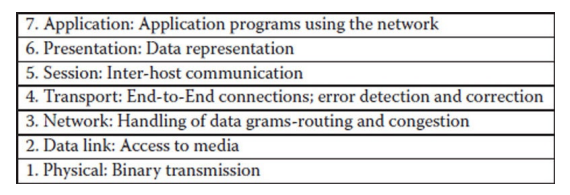
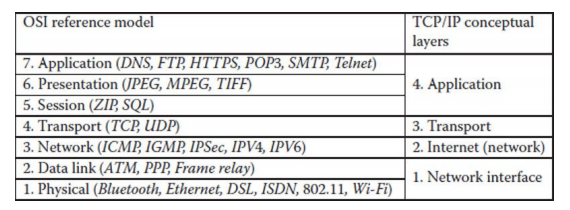
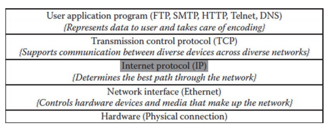
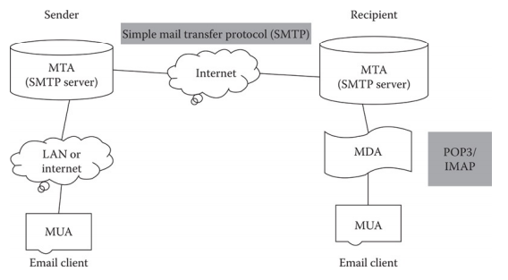
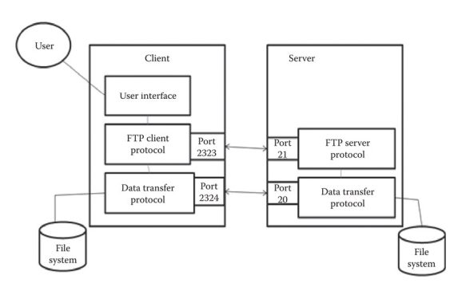
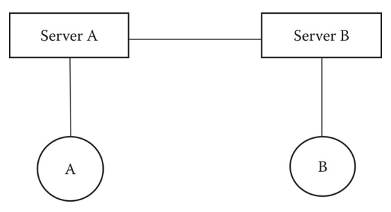
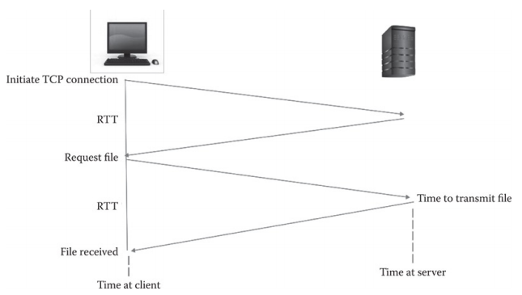
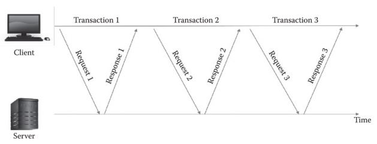
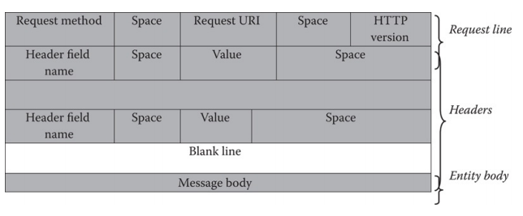
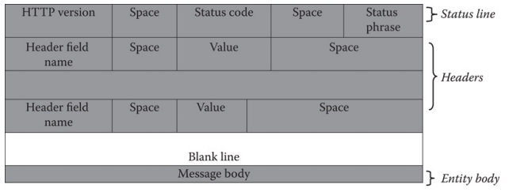

# Web Technology
## 1. INTERconnected NETwork: Internet
### History
- With gradual decrease of price of computers ability to share resources, share information and facilitate communication came in role.
- Building computer network, as a meta-network or network of networks, the Internet (INTERconnected NETwork) get promising.
- ARPANET first started as a research project (Advanced Research Project Agency Network) linking researches remotely to other computer centers allowing them to share hardware and software resources.
- Later it was renamed to the Internet.
- This inter-network operated with a technique called packet switching where digital data is transmitted in small bundles called packets.
- These packets contains the information about the address, error, error control, and the sequence in which packets are to be sent.
- The network was designed to operate without centralized control. If a portion of the network failed, the remaining working portion would still route packets from senders to receivers over alternative paths.
- ARPANET used TCP (Transmission Control Protocol) for communication.
- TCP ensured that messages were properly routed from sender to receiver.
- As internet evolved Inter as well as Intra communication came in picture so ARPA developed Internet Protocol which truely made it Network Of Networks.

### Internet: The Giant Wide Area Network (WAN)
- A network hence is connecting end-systems (hosts, PCs, workstations).
- Internetwork or Internet (INTERconnected NETwork) is an arbitary Global collection of physical networks interconnected by routers to provide some sort of host-to-host packet delivery service.

Local Area Network (LAN) is used for communicating
among computer devices, usually within an office building or home. 
Low cost and high security 
Speed: 10 Mbps to 10 Gbps

Metropolitan Area Network (MAN) is used for larger geographical area then LAN. Several block to entire city. Allows sharing of regional resources. Might be operated or owned by a single organization but typical used by many individuals and organizations. 
High cost due to fibre optics installation. 
Speed typically as high as in LAN

Wide Area Network (WAN) covers area such as country, continent or even whole world. It uses multiple LANs connected using routers, bridges or gateways which enables them to share resources.

- Transmission medium can be wired (unshielded twisted-pair cables, shielded twisted-pair cables, coaxial cables, fiber-optic cables) or wireless.
- Shape or layout of network can be point-to-point (PTP) or multi-access (ring, star, or bus)
- Network can be categorized as Client/Server network or Peer-to-Peer network (P2P) application centric architecture.
- There are 2 types of P2P network - Pure P2P network (Workgroups in Microsoft Windoes) or Hybrid P2P network (Skype, BitTorrent)
> BitTorrent is a protocol, not a provider. Saying i downloaded from bitTorrent is wrong instead file is downloaded from other individuals using BitTorrent protocol.

### Communication Over The Internet
- Two popular models - Open Systems Intercommunication (OSI) reference model and the TCP/IP model
- In OSI, Open denotes the ability to connect any two systems which supports the defined rules from reference mdel and associated standards. It divides the problem of moving information between computers over a network medium into seven smaller and more managable layers. This layer breaking reduces complexity. Each layer provides the service to layer above it in rotocol specification. Each layer communicates with the same layer's software or hardware on other computers.
  
Last 4 layers (transport, network, data link and physical) are concerned with the flow of data from end to end through network. 
Upper 3 (application, presentation, and session) are oriented towards services to the applications.
- The OSI model was generic, protocol independent. TCP/IP provided application viewpoint to the network. The OSI model conceptually defined the services, interfaces and protocols. The TCP/IP model provided its successful implementation.
  

### Protocol Layering
The Internet Protocol stack (TCP/IP Protocol Suite) is based on the divide-and-conquer 

1) Application Layer: Combines the functions of top two layers (Presentation & Application) of OSI reference model. Telnet(Remote Login), FTP (File Transfer Protocol, SMTP (Simple Mail Transfer Protocol), DNS (Domain Naming System), HTTP(HyperText Transfer Protocol).
2) Transport Layer: It is responsible for reliable source-to-destination delivery of the entire message. TCP (Transmission Control Protocol) & UDP (User Datagram Protocol). TCP is a reliable connection-oriented protocol whearas UDP is connectionless (datagram) protocol. Like in audio calls we need skip of audio packets which were failed to send instead of delay in response over destination so we use UDP instead of TCP.
3) Internet Layer: IP (Internet Protocol) it is connectionless or datagram. Data recieving is not guaranteed. It may be out of order or damaged or duplicated.
4) Link Layer: To communicate on a directly connected network. It specifies how to organize data into frames and how to deliver a fram over a network.
5) Physical Layer: Defines rules by which bits are passed from one system to another on physical communication medium.
  
This is also an Hourglass model. IP which is most important protocol is waist of horglass.

### Internet Addressing
IP Address is a 32 bits (four 8-bit fields) unique global address for a network interface. xxx.xxx.xxx.xxx (0-255 since 255 is max 8-bit binary number). 
IP Address has prefix (identifies the physical network to which the host is attached) & suffix (identifies a specific computer host/node on network).

URL (Uniform Resource Locators) specifies the Internet address of a file stored on a host computer (server) connected to the Internet. URLs are translated into numeric addresses using DNS which is an application-layer service.
>protocol://domain name /path/filename

Recently, URL is now considered to be a subset of URI (Uniform Resource Identifier). It's a string of characters used to identify a name or a resource on the Internet and is recognized as a more general form of URL. URI has - URN (Uniform Resource Name) & URL. 
URNs identifies a resource by a unique & persistent name. It usually starts with the prefix urn: URNs can be ideas and conecpts. They are not restricted to identifying documents. When URN does represent a document it can be translated into a URL by a "resolver". The document can be then downloaded. For example: urn: isbn: 0451450523 to identify a book by its ISBN number.

### Internet Configuration
ISP (Internet Service Provider) provides Internet access. The ISP, in turn may connect to a large network such as NSP (Network Service Provider). They together acts like an Internet Backbone. The backbones carry Internet traffic around the world and meet at NAPs (Network Access Points). 
Internet backbone is a collection of routers (worldwide). NAP is a router that connects multiple backbones (sometimes referred as peers). POP (Point Of Presence) is a machine that is connected to the Internet. ISP provides dial-up or direct access to POPs.

1) Dial-up access: Dial-Up Connections works over an ordinary phone line using analog modems establishing the Point-to-Point Protocol (PPP). Mostly computers comes equipped with analog modems so no additionla hardware required.
2) High-speed access: Also known as the broadband connection compises - DSL (Digital Suscriber Line), ISDN (Integrated Services Digital Network) Lines, Leased Line, and Cable Internet Connections. DSL is family of all-digital high-speed lines that use normal phone wires with special modems. ISDN lines are also like DSL all-digital high-speed you need an ISDN adapter. DSL is mostly common in US wheras in Europe ISDN. A leased line provides point-to-point high-speed typically used by an organization. DSS (Digital Satellite Systems) or direct broadcast satellite is a method by which Internet content is downloaded to a satellite dish and then transmitted directly from your dish to the user's PC.
3) Wireless access

### Web Browser
The primary function of a browser is to identify the URL and bring the information resource to user. To identify a web pages' exact location, a web browser relies on a URL. Other basic functions:
- Interpret HTTML markup and present documents visually.
- Support hyperlinks.
- Use HTML form and the HTML protocol to send & recieve requests.
- Maintain cookies (name-value pairs) stored on client computers by a web application and send all cookies back to a website.

### Internet Organizations
No one actually owns the Internet, and no single person or organization controls the Internet in its entirety. It is more of a concept. A number of loosely coupled organizations are concernet with governing the development of the Internet.
- Internet Society (ISOC) : It is concerned with long-term coordination of the Internet development.
- Internet Engineering Task Force (IETF): It's mission is providing high quality technical documents for improving Internet's quality and performance.
- Internet Research Task Force (IRTF): Conducts research on protocols, applications, architecture, and technology.
- World Wide Web Consortium (W3C): It develops web technology standards.

### Cyber Ethics
- Communicating, sharing and contributing to e-society in a positive manner.
- To be respectful and courteous in communication (do not use rude or offensive language).
- Avoide harming others (do not spread pictures, viruses, gossip, information about others, do not use others' usernames and passwords i.e. do not impersonate others and do not trespass in other's files)
- Sharing network resources, being honest and trustworthy.
- Honor proporty rights and copyrights, and giving proper credit for intellectual property.

## 2. Internet Applications
### Electronic Mail (Email)
Email is a method of sending a message from a user at a computer to a recipient on another computer. Email system is based on a store-and-forward model in which email computer server system accept, forward, deliver and store messages on behalf of users, who only need to connect to the email server.

When an email is sent the message is routed from server t server all the way to recipient's mail server tasked with MTA (Mail Transport Agent) to the recipient's MTA. MTAs communicate using SMTP. The recipient's MTA then delivers the email to the incoming mail server called MDA (Mail Delivery Agent) which stores the email as it waits for the user to accept it. Protocols for retrieval from MDA - POP3 (Post Office Protocol) and IMAP (Internet Message Access Protocol). MTAs act like a post office while MDA as mailboxes which stores mail until recipient check the box. This means that it is not necessary for recipient to be connected in order for them to be sent email. MDA is protected by username and password. MAU (Mail User Agent) a software for mail retrieving such as - Outlook, Gmail (web interface not software).
  
- SMTP is a client-server protocol. It allows reliable data transfer built on top of TCP. It is a push protocol where the sending server pushes the file to the receiving server rather than waiting for the receiver to request it. It is synchronous as the sender awaits a response before issuing next command. It has three phrases of transfer - Handshaking, Transfer of messages, and closure.
- POP does not handles mails in seperate folders for spam and important ones MAU does it. Most even deletes the mail from server once transferred to recipient. It is poor in handling multiple-client access like from phone, laptop. It has high network bandwidth overhead and it transfers all the email messages, often well before they are read.
- IMAP keep mail on server where user can keep or delete them. Multiple client can connect to mailbox at once. Enables server side searches i.e. search on server before downloading message.

### File Transfer
Application layer protocol, connection-oriented based on client-server architecture that relies on TCP for transferring files or copying it from sender to reciever machine. Problems dealt are two system may use different file system or different directory structure all these problems FTP solve.
  
We need FTP client software and FTP server with it's username and password. 
FTP uses TCP ports for all communications between server and user.
1) COMMAND Port: This is the main TCP port created when a session is connected. It is used for passing commands and replies.
2) DATA Port: Each time when files or directories are transffered between server and client, a random TCP data connection is established and data transfer commences over the connection. Once data transfer is complete the connection is closed. Subsequent data connection are establised and termination as required. Data connections are never left open.

Transfer modes-
1) Active Mode: The client issues a PORT command to the server signalling that it will "actively" provide an IP and port number to open the Data Connection back to the client.
2) Passive Mode: The client issues a PASV command to indicate that it will wait "passively" for the server to supply IP and port number after which the client will create a Data Connection to the server.

### Real-Time User Communication
Voice Over Internet Protocol (VoIP) application layer protocol in TCP/IP protocol stack. Voice first converted into digital data which is then organized into small packets. These packets are stamped with the destination IP address and routed over the Internet. After recieving packets are recombined and converted digitally to the speaker. Like XBOX Voice, Skype. 
Computers, even landlines with ISP connection can do VoIP calls. 
Basic components in VoIP are - Phones (End point device), Gateways (Allows non VoIP analog device to communicate), Application Servers, Gatekeeps (Maps phone numbers to IP addresses and grant permission for call setup), Call agents (Handles call routing and setup). 
DSP (Digital Signal Processors) are used by devices to perform alaog-to-digital and digital-to-analog conversion.

**IRCs (Internet Relay Chat):** 
Most popular text based interactive service using TCP/IP on the Internet. It allows text messages exchange in real time. It is multi-user, multi-channel teleconferencing system. It works in client/server architecture. The entire process is - Locating client, relaying message, channel hosting and management.
  
Architecural Issues Of Internet Relay Chat:
- Scalibility: This protocol does not scale sufficiently well when used in large arena because all the servers maintain information about all other servers and clients.
- Reliability: As the only network configuration allowed for IRC servers is that of a spanning tree, each link between two servers is an obvious and quite serious point of failure.
- Network Congestion
- Privacy

### Remote Login
Telnet (TErminal NETwork) The Telnet protocol offers a user the possibility to connect and log on to any other host in the network from the user's own computer by offering a remote log-in capability. For the connections, Telnet uses the TCP protocol. The user intereacts with Telnet client which is a terminal accepting any keystrokes from keyboard and interpreting them displaying output. 
Network Originated and Terminated at the NVT (Network Virtual Terminal) it host both ends so that neither has to store the data. Telnet has set of options and these options can be negotiated through a simple protocol inside the Telnet. The negotiation protocol contains commands DO, WILL, WON'T, DON'T 
Telnet does not download or upload like FTP.

### Usenet (USErNETwork)
It is like mailing lists, it is also a way of sharing information. It is a collection of special interest groups, called newsgroups. Each newsgroup is devoted to a certain topic. Under each newsgroup, there are many messages called news articles. NNTP (Network News Transfer Protocol) is used for posting, distributing, retriving USENET news articles among news servers.

## 3. World Wide Web
WWW (World Wide Web) is often confused with the Internet. Web is a large transformable-information construct. It is a service, an application of the Internet. It provides a hypertext-hypermedia interface to information resources on the Internet. 
Web is a set of technologies that allow information on the Internet to be linked together through the use of links, or connections, in documents. The language used to write these documents with links is HTML (Hypertext Markup Language). 
Normal way of say reading is linearly it's a common text while in Hypertext it allows in a nonlinear fashion as it contains links to other file (audio, text) or page. 
The Web is a client-server system. Web browsers act as clients, making requests to web servers.

### Web Page
It is a document that can be displayed in a web browser. Webpages can be either static or dynamic. Static means the page is constant or unchanging while dynamic means the page changes. Therefore, static web pages contain the same pre-built content each time the page is loaded, while the content of dynamic web pages can be generated on the fly. Stamdard HTML pages are static. Dynamic on the other hand contain server-side code such as PHP, ASP that allows the server to generate unique content each time the page is loaded. For example the server might display current date and time. Many dynamic pages use server-side code to access database information, which enables the web page content to be generated from information stored in a database. The dynamic page request is addressed by a two-level response system that includes a web server and an application server. The web server's primary job is to display the site content while the application server is in charge of the logic, the interaction between the user and displayed content.

### Web Site
A website is a collection of web pages that are under one domain. A webpage can be accessed by one URL and it can also be generated on the fly.

### Web Application
While websites can be primarily infomormational a Web Application (or Web Apps) allow the user to perform actions. A web app is a client-server software application for which the client runs in a web browser.

### Web Service
A web application is an application that is accessed through a web browser running on client machine, whereas a web service is a system of software that allows different machines to interact with each other through a network. A web service does not necessarily have a UI. Example like Paypal.

### Web Architecture
Architecture can be two-tier client-server architecture, three-tier or multitier. Each tier is a platform (client or server) with unique responsibility. More tier means more scalability but also expensive.

### World Wide Web Challenges
- Abundance: With phenomenal growth of web volume is very high. The web is noisy.
- Web search results usually have low precision and recall.
- Heterogeneity: data online is all type table, image, etc. hence unstructured
- Duplication

## 4. Hypertext Transfer Protocol (HTTP)
Websites interacts with webservers with a simple application level protocol called HTTP which runs on top of TCP/IP. HTTP is a client-server protocol that defines how messages are formatted and transmitted and what action web servers and browser should take in response to various commands.

It uses a request/response paradigm. It is a pull protocol the client pulls information from server instead of server pushing information down to the client. HTTP is also a stateless protocol i.e. each request-response exchange is treated independently. It is also media independent any kind of data can be sent with it. 
Initially HTTP 0.9 came which was simple protocol for raw data transfer across the Internet. Then HTTP 1.0 and later HTTP 1.1. HTTP 2.0 was released in 2015 it recieved critism allowing binary instead of textual, allowed push from server unlike pull and has some encryption issues too.

### Non-Persistent HTTP
Non-Persistent connection is in which only one object can be sent over a TCP connection. HTTP 1.0/1.1 use this. Two RTT (Round Trip Time) time taken to send a small packet to travel from client to server and back:
- One RTT to initiate TCP connection
- Second for HTTP request and first few bytes of HTTP response to return
- Rest of the time is taken in transmitting the file.
Non-persistent HTTP causes OS overhead hence many browsers open parallel TCP connections to fetch response.
> Total Time for 10 objects = 10 * 2 = 20 RTT
  

### Persistent HTTP
To over non-persistent came persistent connection through which multiple objects can be sent over a single TCP conenction between server and client. 
Client initiates a TCP connection to server (Handshake) Server accepts and acknowledges. Client sends HTTP request to which server responds.
> Total Time for 10 objects = 1 * 1 + 10 = 11 RTT
  

### Communication
- Handshaking: For opening a TCP connection, the user on client side inputs the URL containing address. Web browser ask DNS for IP address of the URL. Then a connection is established.
- Client Request
- Server Response
- Closing (Optional)

### Request Message
  
- Request Method: GET, HEAD(Return header of response), POST, PUT(Store the body of response for future GET request), DELETE(Respond no file for future requests), TRACE(Request server to return a copy of complete HTTP request), OPTIONS(Returns options available for URL), CONNECT(It is used to convert a request connection into transparent TCP/IP tunnel. It is usually done to facilitate SSL Secured Socket Layer encryption), COPY, MOVE
- Request-URI: It identifies the resource for which the request needs to be applied.
- HTTP Version: 1.1 is used nowadays
- Headers: They are a form of message metadata. Enlighted way of it's usage makes application sophisticated by maintaining sessions, control authentications, etc. Header name is not case sensitive. Three types of headers -  
**General Headers:** Provides information about the message and do not describe the body. Used for like time purpose or indicating if connection is closed. 
**Request Headers:** Provides additional informations to request data like data format, output format, etc. 
**Entity Headers:** Contains information about body in case request message has no body. Like content type, length, etc.
- Message Body

### Response Message
  
- Status Line: It consists three parts - HTTP version, status code, status phrase.
> **1xx series (Informational)** - Represents provisional responses 100 (continue) - server recieved initial part now want other 101 (switching) - server switching protocol 102 (processing)

> 2xx series (Success) - Indicates that the client's request are recieved, understood and accepted successfully. 201 (created) 202 (accepted)

> 3xx series (Re-directional) - Indicates additional actions must be taken like HEAD or GET method by user. 301 (moved permanently) 302 (found)

> 4xx series (Client error) 400 (bad reques) 401 (unauthorized) - The request has failed to authorized 403 (forbidden) - Request is valid but server is refusing 404 (not found) 408 (request timeout) 415 (unsupported media type)

> 5xx series (Server error) 500 (Internal Server Error) 501 (Not Implemented) 502 (Bad Gateway) 503 (Service Unabailable) 504 (Gateway timeout) 505 (HTTP version not supported) 511 (Network authentication required).

### Hypertext Transfer Protocol Secure (HTTPS)
It provides secure connection. It is not a protocol but it is just the result of combination of HTTP and SSL/TLS (Secure Socket Layer/Transport Layer Security) protocol. It sends and recieves everything in the encrypted form, adding the element of safety.
- It verifies that you are directly to the server that you think you are talking to.
- Ensuring that only the server can read what you send it, and only you can read what it sends back.

### Cookies
HTTP is stateless protocol. Cookies (name value pair) are an application-based solution provide state retention over a stateless protocol. They are small piece of information that are sent in response from the webserver to the client. Cookies are the simplest technique used for storing client state. It cannot be a software means cannot be programmed hence cannot contain viruses. However it can be used by spyware to track user's browsing activites. They are stored on client's computer and have a lifespan and are destroyed after that. Cookies are browser specific.

Creating a cookie is simple after recieving an HTTP request, a server can send a Set-Cookie header with the response.
>Set-Cookie: <cookie-name>=<cookie-value>

Cookies types - Session Cookie, Persistent or tracing cookie, Secure Cookie (When HTTPS connection encrypted cookies are secure), Zombie Cookie (Ther are automatically recreated after the deletion)

### Cache
Fetching something over the network is both slow and expensive. Large response require roundtrips between the client and server. Ability to cache as result provides reuse previously fetch resource. It can reduce network latency.
- Browser Cache
- Intermediary Caching Proxies (Web Proxies): Any server in between the client and your infrastructure can cache certain content as desired.
- Reverse Cache: Server Infrastructure can implement it's own cache for backend services.

A web proxy is the most commonly used caching service. A proxy is an application program or a computer system that behaves like an intermediary between servers and clients looking for services from these servers. To access a resource, a client sends the request to proxy instead of the original web server. The proxy in turn searches for the resource in its cache. If the resource is found, it is delivered to the client. Otherwise it contacts the specified server and gets the resource puts that resource in local cache and finally returns it to the client.

**Cache Consistency:** It maintains that the cached copies are updated.
- Pull method: In this mechanism, each web page cached is assigned a time-to-serve field, which indicates the time of storing the web page in the cache. An expiration time is also maintained if time expires a fresh copy is maintained.
- Push method: In this method the web server is assigned the responsibility of making all cached copies consistent with the server copy. Advantage of this is modification only happens when server is modified hence no wastage but it provides load to the server.

## 5. Evolution Of Web
### Web 1.0
It was defined as a system of interlinked, hypertext documents accessed via the Internet. It was static and somewhat monodirectional model with websites publishing the information for anyone at any time. This early Web was primarily informational in nature offering an online presence for resources, allowing the retrieving of relevant information, and reading it. It was one person or organization pushing content out to many people via websites and e-mail newsletters as a one-way communication.

### Web 2.0
Internet was reimagined as a generic exchange platform, where any user becomes a content provider. Web 2.0 also known as Read-Write Collabrative Web. Technologies like - comments, blogs and wikis.
> RSS Feeds (Rich Site Summary) is a tool with Web 2.0 that allows users to access updates to online content in a standardized computer-readable format.
1) Blogging: It allows sharing thoughts to the world. Weblog (personal journal or newsletter), Blogger (someone who writes blog), Blogosphere (online community of bloggers and their writings), Permalink (permanent link: these are static link say for an article the URL can be dynamic with dynamic factors on it that may change we don't want that it will not be good for search engine ranking or for our blogs cite so we provide permalink), Blog-roll(Online community that a blogger targets or finds interesting) Example: Blogger, Wordpress
2) Social Networking Sites
3) Podcasts: It is basically just an audio (or video) file however difference is when new podcasts are released its automatically delivered to the suscriber's device. Podcatcher software is used for delivery.
4) Wikis
5) Micro-blogging: It is the practice of posting small pieces of digital content which could be text, pictures, links, short videos or other media on the Internet. Microblogging enables user to write brief messages. Example - Twitter.
6) Social Bookmarking: It is a way to store, organize, search, manage and share collections of websites. Users save links to websites. These bookmarks are usually public and can be shared among a group. Example - Digg, Technorati.
7) E-portfolios

### Web 3.0
Currently most of web content is suitable for human use. The Web now has a huge amount of decentralized data which can be accessed by various simple and standardized methods. Though this decentralized data is primarily machine accessible. It should also be made machine understandable. Web 3.0 is also known as the semantic web. According to W3C Sementaic Web provides a common framework that allows data to be shared and reused across application, enterprise and community boundaries. 
The core of Semantic Web Technologies includes four components - metadata (it is machine processable), ontologies (It adds meanings to make data machine understandable), Logic modules (For interface mechanism) and finally software agents (to accomplish intelligent tasks).

Metadata captures part of the meaning of data. We annotate the natural language of web content explicitly with semantic metadata. The semantic metadata encodes the meaning(semantics) of the content, which can be interpreted by machines.

### Big Data
It is defined as high-volume, high-velocity & high-varity of information assets that demand cost-effective, innovation forms of information processing for enhanced insight and decision making. Like - Social Network data, Buisness Data, IOT (Internet Of Things) Data generated by other machines to communicate.