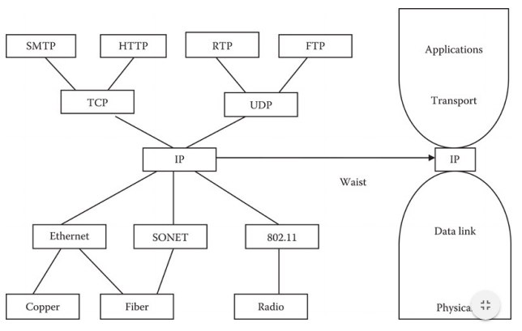
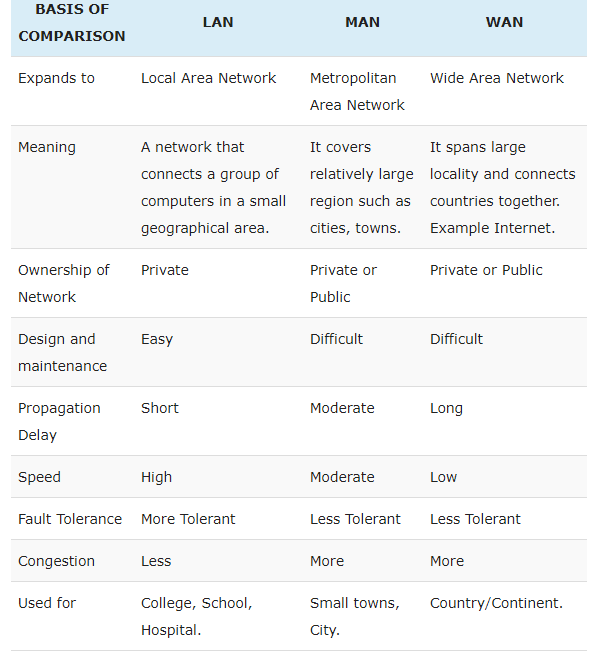
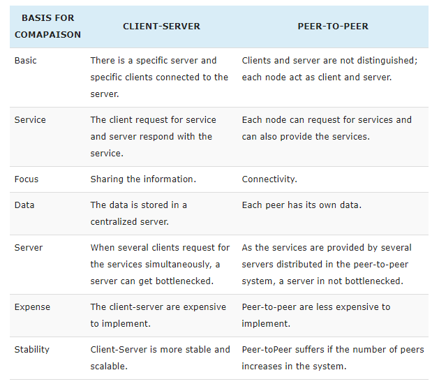
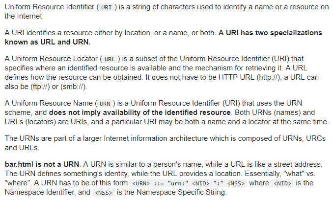

## Chapter 1
### Que 1 - Answer the following:
1) <u>**MAN**</u> network is optimized for a larger geographical area than a LAN, ranging from several blocks of buildings to entire cities, typically covering an area ranging from 5 to 50 km diametrically.
2) In the Internet Protocol stack <u>**Internet layer**</u> is responsible for reliable source-to-destination delivery of the entire message.
3) BitTorrent is an example of <u>**hybrid P2P**</u> of network architecture.
4) <u>**IP Address**</u> is a 32-bit logical address, composed of four 8-bit fields, called octets.
5) <u>**ISP**</u> offers Internet accounts to configure the network connections either by using a dial-up access, high-speed access or wireless access.
6) <u>**Web Browser**</u> is a software program that retrieves, presents, and traverses information resources on the web.
7) W3C is the acronym for <u>**World Wide Web Consortium**</u>.
8) <u>**Cyber Ethics**</u> refers to the code of responsible behavior on the Internet.
9) <u>**IAB (Internet Architecture Board)**</u>  develops standards for the Internet.
10) URL consists of three parts. They are protocol, domain name & path

### What is the “Hourglass” Architecture of the Internet?
  

### Differentiate between the following
1) LAN, WAN, MAN   
2) Client/Server & P2P Architecture   
3) URI, URN, URL   

## Chapter 2
### Que 1 - Answer the following:
1) <u>**MTA**</u> communicate with one another using the protocol SMTP.
2) When the MUA is a program installed on the user’s system, it is called an <u>**email client**</u>.
3) <u>**Simple Mail Transfer Protocol and Mail Access Protocol: Post Office Protocol and Internet Message Access Protocol**</u> are two primary mail access protocols.
4) <u>**Pretty Good Protocol**</u> is a protocol which encrypts the emails end-to-end and only the addressee is able to decrypt it, thus excluding any possibility of interception.
5) <u>**FTP**</u> is a standard mechanism provided by TCP/IP for copying a file from one host to another.
6) <u>**ASCII mode**</u> FTP connection mode is used exclusively to transfer text and HTML
7) <u>**VoIP**</u> protocol allows Internet telephony.
8) Telnet is an acronym for <u>**TErminaL NETwork**</u>
9) <u>**NNTP**</u> protocol is used in transferring news articles between news clients and news server.
10) <u>**W3C**</u> is responsible for standardizing protocols improving interoperability, and further enhancing the capabilities of the Web.

## Chapter 3
### Que 1 - Answer the following:
1) The web relies on three components: <u>**HTTP, HTML, URL**</u>
2) “Web of nodes” refers to <u>**first**</u> generation of the web.
3) <u>**Web page**</u> is a document displayed in the web browser.
4) <u>**Dynamic**</u> web pages are built on the fly.
5) <u>**Web Application**</u> is a client-server software application in which the client runs in a web browser allowing the user to perform actions.

## Chapter 4
1) HTTP request and response messages are human readable <u>**TRUE**</u>
2) 